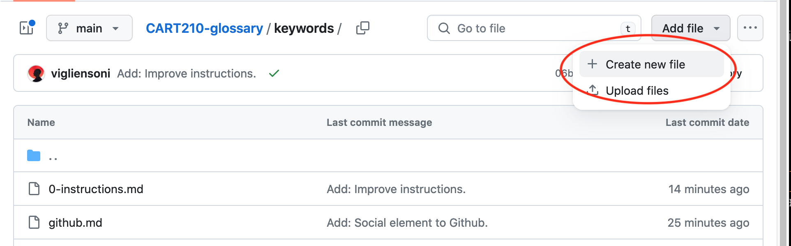
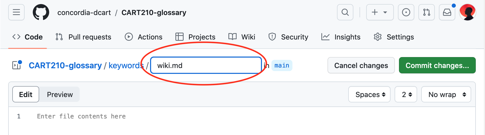
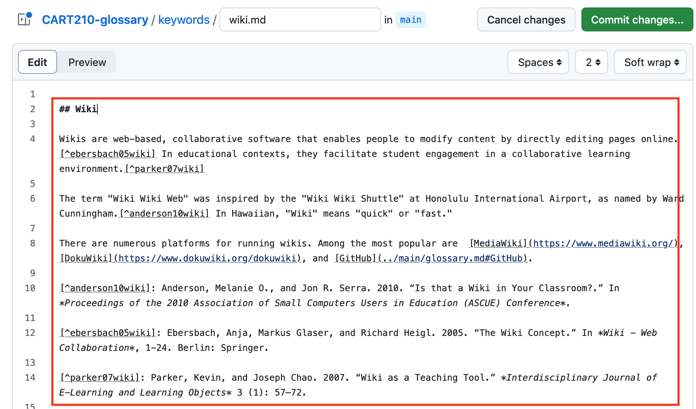
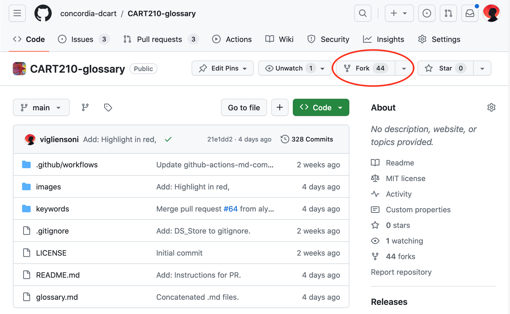
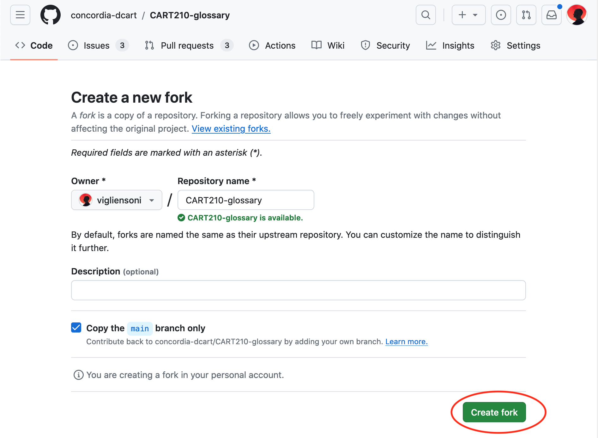
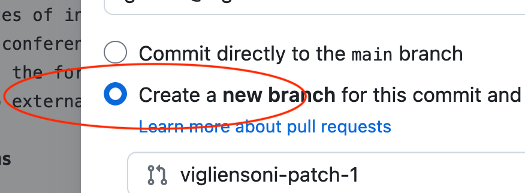
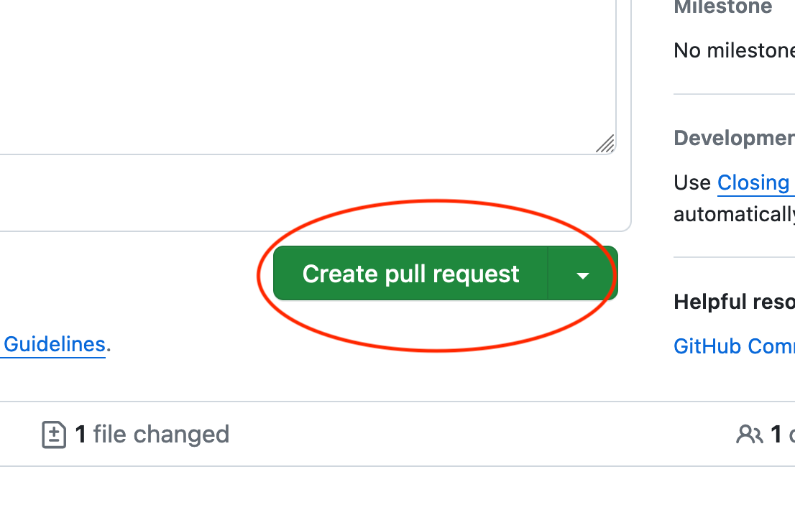

# CART210 New media glossary
This is the repository for the collaborative glossary of the New Media Theory(ies), Art, and Practice class.

>[!IMPORTANT]
> ## [Check the glossary here](./glossary.md):point_left:

The glossary is constantly improved by the CART210 community throughout the term, with three sprint deadlines.


Each student must:

- define the concept in their own words, with precision and conciseness
- cite their sources of information in strict Chicago author-year format. Three references minimum per entry, and two of them must be from academic sources (i.e., book, article, or conference paper). Add your bibliographic entry at the end of the list, in the right alphabetic order.
- provide links in the form of internal references to other terms in the glossary
- provide links to external references in the form of HTTP links

## Adding new terms

- add the terms chosen as individual files inside the `keywords` folder of this repository
- if using the GitHub UI, contributors can create new files as shown in the image



- name each keyword file in lowercase and use the file extension `.md` (Markdown), as shown below



- add the details of the term they are working on using [strict Markdown syntax](https://docs.github.com/en/get-started/writing-on-github/getting-started-with-writing-and-formatting-on-github/basic-writing-and-formatting-syntax). The keyword title should be in Heading 2 (`## The term`) and the rest in plain markdown
- citations must be added in the same markdown file, as shown below



>[!IMPORTANT]
> To commit changes, each contributor will create a pull request using the [GitHub](../main/glossary.md#GitHub) web-based interface. Contributors who know how to interact with [GitHub](../main/glossary.md#GitHub) using other environments (e.g., CLI or IDE), can also use those.

When committing your changes, add a meaningful message (e.g., ”Fix: Typo in the description.”, ”Add: New definition from Steyerl, H. (2016).”)

## Adding images

- To add images to the repo you must fork the repository into your own account:



and then, 



- Once you have a fork of the repo in your account, you have full control of your copy
- add images to the `images` folder of this repository


>[!IMPORTANT]
> To commit changes, each contributor will create a pull request using the [GitHub](../main/glossary.md#GitHub) web-based interface. Contributors who know how to interact with [GitHub](../main/glossary.md#GitHub) using other environments (e.g., CLI or IDE), can also use those.

When committing your changes, add a meaningful message (e.g., ”Add: Visual collage for virtuality.”

## Submitting pull request

By default, you don't have access to make changes to the `main` branch of this repository. Therefore, when doing a commit you must choose `Create a new branch for this commit` as seen in the image:





And then, `Create  a pull request` to the main branch of this repository:




## Rendering your image in the glossary

So far, you have just uploaded your image to the repository. To be displayed, the image has to be linked from your keyword file.

For example, if I want to display the image I made for the keyword `virtual-environment`, I will add the following line to the file `virtual-environment.md` located inside the `keywords` folder:

``````

> [!NOTE]  
> Please note that the relative link above does not indicate the previous folder (as in `../images`). This is correct. GitHub considers the root folder of the repository by default. You may not see the file in your keyword file, but it will render fine in the glossary file.


That link will display this image:


Background image taken from [^reschke07wallpaper]

[^reschke07wallpaper]: Reschke, Michael. 2007. “800x600 Wallpaper Blue Sky.png.” Wikimedia Commons. December 27. https://commons.wikimedia.org/wiki/File:800x600_Wallpaper_Blue_Sky.png.


## Creating connections to other entries in the repository

To create links to other entries you have to create a hyperlink using the Markdown format. Use relative linking for this. 

For example, if you want to create links for the entries `Github`, `Wiki`, and `Affordance`, you add the following Markdown syntax:

```
[GitHub](../main/glossary.md#GitHub), [Wiki](../main/glossary.md#wiki), [Affordance](../main/glossary.md#affordance)
```

That code will be rendered as:

[GitHub](../main/glossary.md#GitHub), [Wiki](../main/glossary.md#wiki), [Affordance](../main/glossary.md#affordance)


