# Glossary of keywords related to new media.

The following list of keywords related to new media is constantly updated by the CART210 community throughout the term.

Each student is responsible for choosing and maintaining a set of three keywords. You will research about, define, and exemplify these terms. Your task involves improving the concepts throughout the term. 

For each keyword, cite at least three references. Ensure that at least two of these are from **academic sources**, such as journal articles, books, or conference papers. Citations must follow the Chicago author-year format.

>[!IMPORTANT]
To make your contributions and suggest changes, follow the instructions in the repository's [README](https://github.com/concordia-dcart/CART210-glossary/blob/main/README.md) file.

---
## Agency 

Agency seems to have two meanings. On one hand, it refers simply to an organized body of people working for or under a larger form of institution, such as a governmental or political institution. On the other hand is a meaning deep rooted in philosophy and anthropology. Laura Ahearn in the Journal of Linguistic Anthropology explains that;

 “what scholars mean by it can differ considerably from common usages of the word. When I did a keyword search in our university library catalogue for agency [...] the system returned 24,728 matches (among these were result about) travel agencies, the central Intelligence Agency, social service agencies [...] few, if any, of these books use agency in the way scholars do: as a way to talk about the human capacity to act.” [^ahearn99anthropology]

This ‘scholarly’ use of the word, as Ahearn puts it, is most complex as it is often associated with conversations discussing the validity of agency, and whether it is something that humans possess. In fact, the study of history is entirely underpinned by the notion of human agency, which is the ability that humans have to intentionally shape our world.[^nash05nature]

The notion of agency in the scholarly sense is especially important in the fields surrounding the study of technology from an anthropological perspective. Human agency, that of the individual using said technology, is often put into question. The ever-changing cultural significance of social media and developing technologies has ever-changing positive and negative effects on the feeling of agency of the individual. 

For example, the self is targeted in many forms of online media. Even character customization, often featured in many online spaces, games and even social media, targets the representation of the self and, in turn, affects the perception of personal agency the user has. It is explained that; “Agency means that the user feels relevant as an actor. Customization allows the individual user to feel unique and distinct. [...] customization is the most seductive aspect of modern online media because it is always related to an aspect of the self.”[^utz08mediated]

As well, agency often is brought up in anthropological discussions surrounding the internet and the massive flood of customized, constant advertising that comes with it. The discussion spills into the wider societal issue of consumerist culture as is explained by Rebekah Willet in Consumer Citizens Online: Structure, agency, and gender in online participation; “I am seeking to explore the relationships between the structures of consumerism (and wider societal discourses) and the agency (the capacity to think and act freely) of the young consumer/producer.”[^willet08consumer]

[^ahearn99anthropology]: Ahearn, Laura M.  1999. “Agency.” *Journal of Linguistic Anthropology* 9, no. 1/2 12–15. http://www.jstor.org/stable/43102414.

[^nash05nature]: Nash, Linda. 2005. *“The Agency of Nature or the Nature of Agency?” Environmental History* 10, no. 1 67–69. http://www.jstor.org/stable/3985846. 

[^utz08mediated]: Utz, Sonja, Martin Tanis, and Susan B. Barnes. 2008. *Mediated interpersonal communication*. Edited by Elly A. Konijn. Vol. 270. New York, NY: Routledge.

[^willet08consumer]: Willett, Rebekah. 2008. *Consumer citizens online: Structure, agency, and gender in online participation*. MacArthur Foundation Digital Media and Learning Initiative.

## AI 

Artificial Intelligence (AI), encompasses a wide range of techniques that allow machines to mimic human cognitive abilities like learning, reasoning, and problem-solving. Coined by Stanford Professor John McCarthy in 1955, he defined AI as “the science and engineering of making intelligent machines”. [^manning] Previous iterations include Alan Turing’s Turing test, conducted in 1950, followed by the first chatbot ELIZA in the 1960s, the IBM deep blue computer chess game in 1977, Apple’s Siri in 2011 and OpenAI in 2015. [^saha]

Andrew C. Staugaard adds to the definition of AI as being the “mechanization, or duplication, of the human thought process”. [^staugaard] The use of Machine Learning algorithms has helped us expand our toolset to include a series of three learning processes; Supervised Learning (using labelled data to predict diversity), Unsupervised Learning (analyzing unlabelled data to learn what is not initially apparent), and Reinforcement Learning (a feedback dependant process which must be reprimanded when predicting incorrect outputs). [^saha] 

Deep Learning is a concept in which the computer simulates human processes to analyze, think and learn, requiring vast amounts of data to train correctly. [^saha] These two subsets of AI use high performance algorithms and multilayer neural networks to solve complex problems. [^ghosh] These can lead to innovations in medicine, technology, and integration into the social sector. 

In the context of new media, we can see these advancements as productive tools for creativity, enabling automation of processes, customization of dynamic workflows, and advanced data analysis. We can draw connections to how algorithms function on social media platforms, performing tasks adapted to individual preferences, such as curating personalized content based on likes, predicting trends and behaviors to engage the viewer in more sophisticated ways. From this point of view, AI becomes an active participant in the process, optimizing interactions to align with individuals in more meaningful ways.

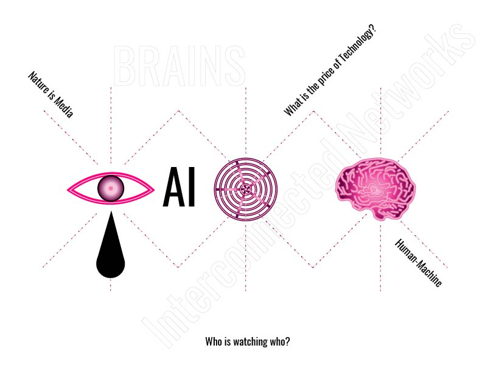

[^manning]: Manning, Christopher. 2022. _AI Definitions_. Version 1.2. Stanford, CA: Institute for HAI, Stanford University. https://hai.stanford.edu/sites/default/files/2020-09/AI-Definitions-HAI.pdf.

[^saha]: Saha, Dibbyo. n.d. _"A Brief Introduction to Artificial Intelligence: What is AI and How Is It Going to Shape the Future?"_ Ryerson University. 

[^staugaard]: Staugaard, A. C. 1987. _Robotics and AI: An Introduction to Applied Machine Intelligence_. Englewood Cliffs, NJ: Prentice Hall.

[^ghosh]: Ghosh, Moumita & Arunachalam, Thirugnanam. 2021. _Introduction to Artificial Intelligence_. 10.1007/978-981-16-0415-7_2. 

## Analytics

Analytics refers to “the systematic computational analysis of data or statistics.”[^analyticsoxford] In new media, analytics involves the collection, measurement, and interpretation of digital interactions such as user engagement on websites, social media platforms, and streaming services to understand audience behavior and optimize content strategies.[^dong24study]

Digital platforms rely on analytics to personalize content, optimize marketing campaigns, and improve user engagement. By analyzing trends in user behavior, media companies can refine their strategies to increase audience retention and monetization[^dong24study]. Cultural analytics, as conceptualized by Lev Manovich, extends these principles to the study of digital culture, using computational techniques to analyze large-scale patterns in visual and other forms of media.[^manovich17cultural]

Contemporary analytics practices are deeply integrated into digital media technologies. Data analytics tools track user interactions, providing insights that influence content recommendation systems, targeted advertising, and search engine rankings. Platforms such as Google Analytics and social media insights dashboards help businesses and creators measure the impact of their content and refine their strategies accordingly.[^dong24study] In cultural analytics, computational methods allow researchers to examine trends in digital culture, such as the evolution of user-generated content to influence changes in interaction design across social media platforms.[^manovich17cultural]

Analytics profoundly impacts digital culture by shaping how content is created, distributed, and consumed. Algorithm-driven recommendations influence media consumption habits, raising concerns about data privacy, surveillance, and algorithmic bias.[^dong24study] Additionally, cultural analytics offers new ways to study digital culture, allowing researchers to map the evolution of aesthetic and social trends at an unprecedented scale.[^manovich17cultural]

[^analyticsoxford]: “Analytics.” n.d. In _New Oxford American Dictionary_. Apple Dictionary. 
[^dong24study]: Dong, Jiaqi. 2024. “A Study on the Application of Data Analytics in New Media Communication.” _Media and Communication Research_ 5 (3). https://doi.org/10.23977/mediacr.2024.050314. 
[^manovich17cultural]: Manovich, Lev. 2017. “Cultural Analytics, Social Computing and Digital Humanities.” In _Amsterdam University Press eBooks_, 55–68. https://doi.org/10.25969/mediarep/12514.

## API

API short for Application Programming Interface is as described as "interface that is defined in terms of a set of functions and procedures and enables a program [...] within an application."[^simon] Simon and Jean explain how using an API allows existing or new business capability from across a network with it being an on-demand service for usage from multitudes of applications and software.

API are varied and have different concepts to it, in the text “A Systematic Review of API Evolution Literature” as an example “when the concept of information was first coined by Parnas in 1972, it was based on interfaces among modules, which today would be called API’s” [^Lamothe]

API is valuable for business due to its ability to connect many people to communicated, share data between each other with ease. The book "API Architecture" explains very clearly how "Now, think about these entities that are run by software. Industrial production processes are controlled by software. Machines, cars and many consumer products contain software.[...] APIs provide a possibility to connect these separate software entities"[^Biehl] and with the use of APIs, it allows it to connect between separate software entities.

An API when it comes to new media is significant as it can allow the user to be able to reach a lot of people across the world when the API is used by other people through the internet. When it comes new media, if an artist wants to reach more people to view and support their work, they will purchase and use an API service to reach other people globally.

____________________________________________________________________________________________________________________________________________________________________________________
[^simon]: Simon, Jean Paul. 2021. “APIs, the Glue Under the Hood. Looking for the ‘API Economy.’” Digital Policy Regulation and Governance 23 (5): 489–508. @article https://doi.org/10.1108/dprg-10-2020-0147.
[^Lamothe]:Lamothe, Maxime, Yann-Gaël Guéhéneuc, and Weiyi Shang. 2021. *“A Systematic Review of API Evolution Literature.”* ACM Computing Surveys 54 (8): 1–36.8. @article https://dl.acm.org/doi/pdf/10.1145/3470133
[^Biehl]: Beihl, Matthias. 2015. "_API architecture: The Big Picture for Building APIs_".API-University Series, Volume 2.CreateSpace Independent Publishing Platform. @book https://books.google.ca/books?id=6D64DwAAQBAJ&lpg=PA15&ots=zb5N9tMh6r&dq=%22api%20%22%20&lr&pg=PA15#v=onepage&q=%22api%20%22&f=false

## AR

Augmented Reality (AR) integrates digital content into the real world, engaging multiple senses. Unlike Virtual Reality (VR), which immerses users in a fully computer-generated environment, AR blends virtual elements with real-world settings, enhancing how users perceive and interact with their surroundings.[^Pesce21AR] AR is highly relevant to new media because it transforms digital content into interactive, engaging experiences. By merging physical and digital environments, AR creates new ways for users to connect, explore, and engage with their surroundings in real time.

The fundamental concept of AR lies in the combination of two sources of information—real and digital—merged into a single viewing space. Although AR may seem like a recent technological development, its history dates back to 1892 with Pepper’s Ghost, a stage illusion that is considered a precursor to AR. This technique involved projecting images into the real world, creating the illusion of objects existing in physical space.

In 1962, Ivan Sutherland created the first modern VR system, which projected computer-generated images onto the real world using a head-mounted display.[^Peddie23AR] Over time, AR technology continued to evolve, and with the rise of devices like smartphones and tablets, it became far more accessible. Through apps on these devices, users can now interact with virtual objects or use AR for purposes such as navigation, gaming, and shopping. This marked a significant step in AR’s integration into everyday life.

A key feature of AR is its ability to allow users to see and interact with their physical environment while experiencing digital enhancements. According to the book VR/AR: Foundations and Methods of Extended Realities, Wolfgang Broll suggests that there are three main types of AR: Video See-Through AR, Optical See-Through AR, and Projection-Based AR.[^Doerner22AR] (Although there is no official classification system, this is one of the ways to categorize them.) In Video See-Through AR, the real world is captured by a video camera, and the image is superimposed with virtual content before being displayed on an output device. Optical See-Through AR, on the other hand, allows users to directly view the real world through an optical device, with virtual content overlaid in real-time. Lastly, Projection-Based AR applies virtual content directly onto objects in the real environment using projection mapping.

As AR technology continues to evolve, the possibilities for how it can be applied expand, making it an exciting field to watch. While we cannot predict exactly how AR will develop in the future, one potential direction is the merging of AR with VR to create a hybrid experience known as mixed reality. This convergence may offer even more immersive and interactive experiences, further blurring the lines between the digital and physical worlds.

[^Pesce21AR]: Pesce, Mark. 2021. Augmented Reality : Unboxing Tech’s next Big Thing. Cambridge, UK: Polity Press.

[^Peddie23AR]: Peddie. Jon. 2023. _Augmented Reality: where we will all live. Second edition. Cham: Springer.

[^Doerner22AR]: Doerner, Ralf, Wolfgang Broll, Paul Grimm, and Bernhard Jung, eds. 2022. Virtual and Augmented Reality (VR/AR): Foundations and Methods of Extended Realities (XR). Cham Switzerland: Springer.

## Avatar
The term ‘avatar’ is not a new concept. According to the Myriam Webster dictionary, it comes from the Sanskrit word referring to a deity's descent or incarnation on earth, and later evolved to refer to any embodiment or personification of an idea, entity or philosophy. [^MiramWebster01Defintion] However, more recently, the first thing that comes to mind when we hear the word avatar is closer to B. Coleman’s definition in her book *Hello Avatar*, where she describes them as “a computer-generated figure controlled by a person via a computer. It is often a graphical representation of a person with which one can interact in real time” .[^Coleman]
	Coleman, however, expands further on her definition, adding that the avatar also "includes the many modes of representation we employ that make up the different roles we play and places we go".[^Coleman]  Jerry Liu explains is his article “From Sci Fi to Commercialization: The Rise of Digital Avatars,” that the idea of an avatar is not just referencing the self, but also “digital influencers” and “digital celebrities”, including examples such as 1990s band *The Gorillaz*, international digital superstar Hatsune Miku and AI created influencers such as Lil Miquella.[^Liu]
	Avatar, then, is not only referring now to the way one chooses to represent oneself within a game world, but is quickly evolving to also encompass entire personalities and independent characters divorced from any real life person. Yet, despite them existing in the digital world, they are not free from human scrutiny and bias. In a real-world experiment, the behaviour of multiple individuals and avatars were observed, the results being that "Participants assigned to more attractive avatars were more intimate with confederates in a self-disclosure and interpersonal distance task than participants assigned to less attractive avatars. Participants assigned to taller avatars behaved more confidently in a negotiation task than participants assigned to shorter avatars."[^PanSteed01]
	As technology grows and evolves within new media spaces, the definition of what is simply an ‘avatar’ and what is an entirely new entity (in the case of AI influencers, for example) become blurred. The question of what is ‘real’ identity within digital spaces will only continue to become more and more complex. 
	
	
[^MiramWebster01Defintion]: “Avatar Definition & Meaning.” Merriam-Webster. Accessed February 1, 2025. https://www.merriam-webster.com/dictionary/avatar.
[^Coleman]: Coleman, Beth. 2011. *Hello Avatar: Rise of the Networked Generation.* Cambridge, MA: MIT Press.
[^Liu]: Lu, Jerry. 2019. “From Sci Fi to Commercialization: The Rise of Digital Avatars.” Medium. https://medium.com/hackernoon/from-sci-fi-to-commercialization-the-rise-of-digital-avatars-ea164495c377.
[^PanSteed01]:Pan, Ye, and Anthony Steed.December 14, 2017. “The Impact of Self-Avatars on Trust and Collaboration in Shared Virtual Environments.” PLOS ONE 12, no. 12. https://doi.org/10.1371/journal.pone.0189078. 

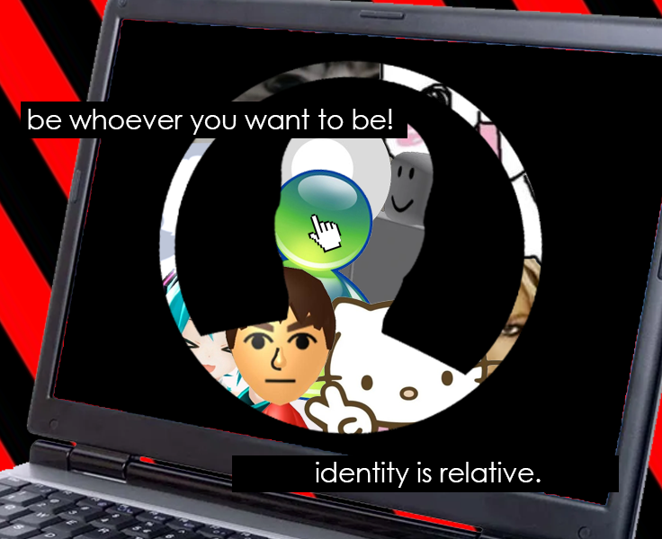

## Blog
A blog, short for "weblog," is an online platform where individuals or groups publish content in reverse chronological order.
Blogs combine written entries, multimedia, and hyperlinks, serving as a medium for personal expression, journalism, marketing, and community engagement. 
The term "weblog" was coined by Jorn Barger in 1997 to describe his site, Robot Wisdom, which curated links and commentary.
It was humorously shortened to "blog" by Peter Merholz in 1999, and the term gained widespread adoption.
Initially created by web enthusiasts, blogs now feature contributions from experienced professionals and amateurs sharing insights and experiences. [^rebecca2weblog]

Blogs play a vital role in shaping new media by serving as accessible platforms for information sharing and communication.
They democratize content creation, enabling individuals to bypass traditional media gatekeepers, such as publishers and editors, and share their insights and experiences directly with a global audience.
This open nature fosters a participatory culture, allowing readers to engage with content through comments, shares, and links, creating a dynamic dialogue between authors and their audience.
**Blogs blur the lines between public and private spheres, creating a unique space for personal expression and public discourse**.[^herring5weblog] 
Furthermore, blogs are essential for mass communication in today's fast-paced digital landscape, providing quick access to varied information, from personal opinions to expert analysis.
They have evolved from simple link-sharing platforms to comprehensive tools for self-publishing and community building, highlighting their integral role in the evolution of new media.
In essence, blogs are foundational to the modern information ecosystem, shaping how knowledge is produced, shared, and consumed.[^miller4weblog]

Over the years blogs have evolved into diverse formats, including microblogs (Twitter), vlogs (video blogs), and corporate blogs. They are integrated into content marketing strategies and social media ecosystems.
Blogs paved the way for user-generated content platforms like YouTube and Instagram, which rely on similar participation and community-building principles.
Some of the most notable blogging platforms include [HuffPost](https://www.huffpost.com/) (formerly The Huffington Post), which evolved from a blog into a major news outlet. [Boing Boing](https://boingboing.net/) stands out as an influential technology and culture blog, while [Gizmodo](https://gizmodo.com/) has become a leading source for gadgets and tech news.

[^inspo] [^china] [^recipe] [^clic] [^pixel] [^etoys] [^sara] [^web] [^julia]

[^rebecca2weblog]: Blood, Rebecca. 2000. "Weblogs: A History and Perspective". http://www.rebeccablood.net/essays/weblog_history.html.
[^herring5weblog]: Herring, Susan C., Lois Ann Scheidt, Elijah Wright, and Sabrina Bonus. 2005. “Weblogs as a Bridging Genre.” Information Technology & People 18 (2): 142–71. https://doi.org/10.1108/09593840510601513.
[^inspo]: n.d. "inspo". Pinterest. https://www.pinterest.com/pin/185843922118184755.
[^julia]: Julie. 2017. "Vintage Recipes Bread and Rolls." The Old Design Shop. http://olddesignshop.com/2017/11/vintage-recipes-bread-and-rolls/.
[^miller4weblog]: Miller, Carolyn R., and Dawn Shepherd. 2004. _"Blogging as Social Action: A Genre Analysis of the Weblog."_ Into the Blogosphere: Rhetoric, Community, and Culture of Weblogs. https://conservancy.umn.edu/items/6065cb61-5392-4cee-8d2a-11199caeba6e.
[^china]: n.d. "China Daily Design". Pinterest. https://www.pinterest.com/pin/2322237300626423.
[^recipe]: n.d. "Vintage Recipe Cards: Pumpkin Bread". Pinterest. https://www.pinterest.com/pin/374924737748790719.
[^clic]: n.d. "Clic png! ^^". Pinterest. https://www.pinterest.com/pin/904308800178971812/.
[^pixel]: n.d. "Pixel Mouse Icon". Pinterest. https://www.pinterest.com/pin/35325178321625125/.
[^etoys]: KB Holdings, LLC. 2002. "eToys - Where Great Ideas Come to You!." eToys.  https://web.archive.org/web/20020601072752/http://www.etoys.com/etoys/index.html.
[^sara]: Sara. 2019. "TRAVEL GUIDE: From Kyoto to Tokyo." Collage Vintage. http://www.bloglovin.com/blogs/collage-vintage-3891721/travel-guide-from-kyoto-to-tokyo-6751281949.
[^web]: Web Design Museum. n.d. "iQVC in 2001." Web Design Museum. https://www.webdesignmuseum.org/all-websites/iqvc-in-2001.

 

## Brain Interfaces

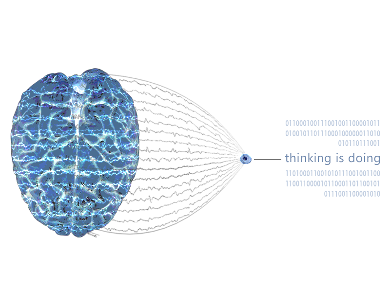
Image taken from these sources[^brain][^waves][^eeg].

Brain Interfaces, also often referred to as Brain-Computer Interfaces (BCI), are devices that measure brain activity and translate it into control signals for machines (such as computers) to execute tasks[^gentle2010]. In other words, BCI allow for a brain and a machine to directly communicate [^interface2022]. Using BCI, the execution of a task requires no movement or usage of muscles. 

Brain-Computer Interfaces first rely on measuring brain activity. This is achieved by using methods that detect the electrical signals generated in specific regions of the brain by networks of neurons communicating with each other when a person performs a given cognitive task.  A non-invasive method of doing this is electroencephalography (EEG), which refers to reading brain activity by using electrodes placed on the scalp [^gentle2010]. Other more invasive methods exist, such as surgically implanted electrodes that are either placed on the surface of the cortex or penetrate brain tissue [^gentle2010]. 

For the machine to be able to ''understand'' what intent the brain activity is trying to convey, the recorded signals need to be processed. It is important to note that different cognitive tasks generate distinct discernable and classifiable brain activity patterns. For instance, sensorimotor rhythms, a distinct type of brain waves, have characteristic features like frequency and amplitude[^gentle2010]. After some filtering out of possible artefacts and noise, the principal features of the signals are extracted. Once the BCI has properly processed and categorized the pattern, it can find the associated command and execute the task. 

Brain Interfaces were first developed to aid individuals facing motor issues[^interface2022]. Tasks like being able to move in a space or communicating with others can become inhibited by various neurodegenerative diseases. For example, Amyotrophic lateral sclerosis (ALS), a disease which affects neurons controlling motor ability, can result in Locked-In syndrome (being physically paralyzed but cognitively sound)[^gentle2010]. BCI gives an opportunity for these people to utilize their brain as an extension of their physical body. They get to interact with the world regardless of their ability. This technology has great potential in the medical field by making communication and movement more accessible.

This technology also has applications in the field of new media art. In fact, one of the earliest applications of BCI was in American composer Alvin Lucier's ''Music for Solo Performer'', where Lucier's alpha brain waves, detected by an EEG headset, activate various percussive instruments[^autodesk2018][^interface2022]. Lucier's BCI was developed by scientist Edmond Dewan; a great example of science and art collaboration! Another example is the performance ''Dual Brains'' by artists Eva Lee and Aaron Trocola, in which the two wear connected EEG headsets and generate sounds and visuals based on their mental states; what is demonstrated is the result their empathic interactions (hand holding, proximity)[^autodesk2018]. In this sense, Brain-Computer Interfaces exert a dual function. They serve as innovative tools to give shape to the formal characteristics of a piece and they act as a new, expansive conceptual framework that artists can explore by creating pieces about related subjects like accessibility, imagination or embodiment.

[^gentle2010]: Graimann, Bernhard et al. 2010. "Brain-Computer Interfaces: A Gentle Introduction". In *Brain-Computer Interfaces:  Revolutionizing Human-Computer Interaction*, edited by Bernhard Graimann et al. Springer.
[^interface2022]:Dehais, Frédéric and Fabien Lotte. 2022. "Brain-computer interfaces". In *Dictionnaire du numérique*, edited by Marie Cegarra-Cauli et al. ISTE Editions. 
[^autodesk2018]: Dorfman, Peter. 2018. "2 heads -and a Brain-Computer Interface- are making waves in the art world." Autodesk. Last modified May 22, 2018.  https://www.autodesk.com/design-make/articles/brain-computer-interface 
[^brain]: Unknown Author, Unknown year. "2-25161_human-brain-png-svg-free-human-brain.png". PNGKey. Unknown date. https://www.pngkey.com/png/detail/2-25161_human-brain-png-svg-free-human-brain.png
[^waves]: Sirven, Joseph I. and Steven C. Schachter, 2013. "infect_2-s_0.gif". Epilepsy Foundation. August 22nd. https://www.epilepsy.com/sites/default/files/inline-images/infect_2_s_0.gif
[^eeg]: Unknown Author, 2016. "eeg-2.jpg". AdaFruit Blog. August 31st. https://cdn-blog.adafruit.com/uploads/2016/08/eeg-2.jpg 

## Commons 

Commons is a general term that refers to a resource shared by a group of people. These resources can range from small, localized systems (e.g., a family refrigerator) to community-level resources (e.g., sidewalks, playgrounds, libraries) and extend to global or transboundary systems (e.g., the deep seas, the atmosphere, the Internet, and scientific knowledge). The commons can be well-bounded (e.g., a community park or library), transboundary (e.g., the Danube River, migrating wildlife, the Internet), or without clear boundaries (e.g., knowledge, the ozone layer). [^hessOstrom]

The salient characteristic of commons, as opposed to property, is that no single person has exclusive control over the use and disposition of any particular resource in the commons. Instead, resources governed by commons may be used or disposed of by anyone among some (more or less well-defined) number of persons, under rules that may range from “anything goes” to quite crisply articulated formal rules that are effectively enforced. [^benkler]

The term “commons” originates from the English legal term for common land, historically used to describe shared agricultural or grazing lands. The modern conceptualization of the commons was popularized by ecologist Garrett Hardin in his 1968 article, [*The Tragedy of the Commons*](https://doi.org/10.1126/science.162.3859.1243). [^hardin] Hardin’s work highlighted the challenges of managing shared resources, sparking widespread academic and practical interest in the topic. Prior to Hardin’s article, references to “the commons,” “common pool resources,” or “common property” were rare in academic literature. [^laerhovenOstrom]

If we link this concept of the commons to new media, we can notice how the commons is now a foundational element to the philosophy of open-source software, crowdsourced projects, and decentralized technologies. All of these systems are based on emphasizing shared resources and collective governance to contribute to community resilience and prefigure better futures. [^smith] [Wikis](#wiki) are one of the most popular types of digital commons. An example of this would be [Wikipedia](https://www.wikipedia.org/), which is a digital encyclopedia that relies on a collective of editors to modify or add information. [OpenStreetMap](https://www.openstreetmap.org/) is another similar concept that provides crowdsourced geographic data. 

[^hessOstrom]: Hess, Charlotte, and Elinor Ostrom. 2007. *Understanding Knowledge as a Commons: From Theory to Practice.* MIT Press. 
[^benkler]: Benkler, Yochai. 2006. *The Wealth of Networks: How Social Production Transforms Markets and Freedom*. Yale University Press. 
[^hardin]: Hardin, Garrett. 1968. “The Tragedy of the Commons.” *Science* 162 (3859): 1243–1248. https://doi.org/10.1126/science.162.3859.1243.
[^laerhovenOstrom]: Laerhoven, Frank Van, and Elinor Ostrom. 2007. “Traditions and Trends in the Study of the Commons.” *International Journal of the Commons* 1 (1): 3–28. https://doi.org/10.18352/ijc.76.
[^smith]: Smith, E.T.  2024. "Practising Commoning." *The Commons Social Change Library*. Accessed January 29, 2025. https://commonslibrary.org/practising-commoning/#Introducing_%E2%80%98Commoning

## Compression 

Compression is a word used in many domains and can be summed up as “the act of pressing something into a smaller space or putting pressure on it from different sides until it gets smaller”. [^CambridgeDictionary] 
In the new media space, it is more commonly known as data compression which can be defined as “the process of converting a source data into a smaller sized version of it”. [^Salomon02]
While there are many ways to compress data, they can be categorized as either [lossy](../main/glossary.md#lossy) or [lossless](../main/glossary.md#lossless). 

While it is impossible to give credit to a specific individual, 
an early example of compression can be attributed to Samuel Morse and the Morse code when he decided to “assign shorter codes for the most common letters in the English alphabet, 
such as ‘A' and ‘E’, to help transmit messages quickly”. [^Sayood02]

Compression is important in media spaces as it helps to solve two major problems,
the first being the need for storage space and the second is to allow users to share and view content rapidly. [^Salomon02]

Data compression is becoming more and more relevant in the tech industry as the rise of [Artificial-Intelligence](../main/glossary.md#artificial-intelligence)  services requires faster and more efficient ways to be able to transmit images and data. [^Tsukuba24] 
As such, new algorithms are being developed and published like the “Universal Adaptive Stream-Based Entropy Coding” system to aid in this issue [^Shinichi24].

Compression is also present in current-day media through short-form content such as TikTok and Instagram Reels as well as TV and movie scenes length decreasing over time. 
This includes content on YouTube containing jump cuts and the removal of silent pauses during speech. 
This type of compression could be linked to the lowered attention span that our society is currently facing with the increase in the amount of content available 
due to having more space or from the short content duration format. [^Mills23]

[^CambridgeDictionary]: Compression | English meaning - Cambridge dictionary, accessed February 2. 2025. https://dictionary.cambridge.org/dictionary/english/compression.

[^Salomon02]: Salomon, David. 2002. *"Data compression."* Springer US: 2. https://vyomaonline.com/studymaterial/uploads/pdf/2020/12/06_ed4b65ab7f178238646aa579cd516806.pdf

[^Sayood02]: Sayood, Khalid. 2002. *"Data Compression."* Encyclopedia of Information Systems 1 (2002): 423-444. https://www.csd.uoc.gr/~hy438/lectures/Sayood-DataCompression.pdf

[^Tsukuba24]: University of Tsukuba. 2024. *“New Tech Boosts Real-Time Data Compression for AI.”* Techxplore. https://techxplore.com/news/2024-08-tech-boosts-real-compression-ai.html.

[^Shinichi24]: Yamagiwa, Shinichi and T. Kato. 2024. *"Universal Adaptive Stream-Based Entropy Coding."* in IEEE Access. vol 12. https://ieeexplore.ieee.org/document/10599517

[^Mills23]: Mills, Kim. 2023. *“Why Our Attention Spans Are Shrinking, with Gloria Mark, Phd.”* American Psychological Association. https://www.apa.org/news/podcasts/speaking-of-psychology/attention-spans. 

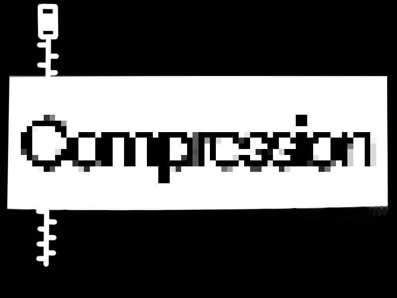

## Computer

[^computer1][^computer2][^computer3]

### Historical Summary and Definition

"Computer" is first and foremost is a word that gets its origins from the latin word "Computare", roughly translated as "to calculate", or perhaps "someone who computes". 
The word started being widely recognized some time around the 1600's, and was used comfortably to describe human mathematicians of that era. [^rojas_hashagen_2002_first]

It was also around this time that different tools that could help with computing would start to appear, for example William Oughtred's slide rule, a mechanical analog device primarily used for multiplication, division, roots, logarithms, and trigonometry.
This word however, would see a paradigm shift of its use around the turn of the 17th - 18th century, as a computation moved towards mechanics and automation. 
In 1822, Charles Babbage would complete one of his inventions, announcing it as the "Difference Engine", 	designed to compute and print mathematical tables via automated mechanial calculations. [^garfinkel_grunspan_2019_abacus]

This invention could be the described as the precursor to the idea of the "Analytical Engine", largly known as the first mechanical computer ever made, though Babbage would never complete or build the machine as he envisioned it, passing in 1871.
The 19th century brought a series of groundbreaking innovations in the world of computation, paving the way for more modern computers. 
An important development came in the late 19th century with Herman Hollerith’s punched card machine.
The punched card machine used cards to automate the process of tabulating census data, which was a great leap in data management.
The machine functioned by reading the punched holes in the cards using electrical sensors, processing the data through internal mechanics, and finally outputting the results on a printout. [^pugh_heide_2013_card]

Opening the doors to greater computation power, the late 19th century also brought with it great advancements to our understanding of what we know now to be digital computing technology.
In 1936, Alan Turing created the "Turing Machine", a hypothetical computational model that was meant to answer the question of whether certain mathematical tasks could be computed.
His machine consisted of a long strip of tape with seperated symbols that were meant to store data, as well as a "head" that would move both left and right down the tape, being able to read, write, and make decisions in accordance to the tape.
Today the child of this idea is known as binary and widely used as part of the the basis of all of our programming knowledge. [^mol_2024_turing]

In a similar, if more physical sense, John Von Neumann created the "Von Neumann Architecture" in 1945. 
This was the model for a computer's organization that now forms the basis of most modern computers, acting as our introductions to the concept of CPU's (Central Processing Unit), RAM (Random-Access Memory), Input / Output Devices, and of course storing commands using memory. [^o'regan_2018_neumann]

### Relation to New Media and Modern Definition

As the idea of a computer became more widely known, understood, and of course used, it became engrained in nearly every bit of our culture.
The term "computer" is incredibly significant to new media because it has been cemented as a foundational concept to the way we interact with, and produce media today.
This term has never been just about the device itself but is instead a vehicle for technologies that create and transform data into interactive experiences.

For a grand majority of the modern peoples, their media, whether focused on education or entertainment, is the shared data we find on the internet.
In this case, computers act as our access to said data, allowing us to take, make, and change its form.
While a simple instrument would allow us to access a specific, or perhaps on some occasions numerous, forms of art, the computer allows us to access and transform a whole new world of information in an unimaginable number of ways. [^kay_1991_computers]

Graphic Design, Video Editing, Web Development, Social Entertainment Environments, and finally in great deal AI, all have computers to thank for their existence and continued development.
Our ability to govern, communicate, and collaberate has been increased significantly with this rise in technological understanding, and the ability to "compute" is no doubt what lead us to that understanding.

Paradigmatic examples of the use of computers that we often take for granted are Social Media Platforms, Streaming Services, and Video Games.
In conclusion, the computer is not only central to the production of new media but also to its constantly ongoing distribution.

[^rojas_hashagen_2002_first]: Rojas, Raul, and Ulf Hashagen. 2002. _Classifications of Computing Machines. In The First Computers: History and Architectures_, pp. 1-2. MA: MIT Press.
[^garfinkel_grunspan_2019_abacus]: Garfinkel, Simson L., and Rachel H. Grunspan. 2019. _The Computer Book: From the Abacus to Artificial Intelligence, 250 Milestones in the History of Computer Science_, Union Square & Co.
[^pugh_heide_2013_card]: Pugh, Emerson W., and Lars Heide. 2013. _Early punched card equipment: 1880-1951 [Scanning Our Past]_, pp. 546-552. IEEE.
[^mol_2024_turing]: Mol, Liesbeth D., Edward N. Zalta, and Uri Nodelman. 2024. _The Stanford Encyclopedia of Philosophy (Winter 2024 Edition)_, Metaphysics Research Lab, Stanford University.
[^o'regan_2018_neumann]: O'Regan, Gerard. 2018. _The Innovation in Computing Companion: A Compendium of Select, Pivotal Inventions_, Springer Nature Switzerland.
[^kay_1991_computers]: Kay, Alan C. 1991. _Communications, Computers and Networks: How to Work, Play and Thrive in Cyberspace_, pp. 138-149. Scientific American.
[^computer1]: Triponez, Nao. 2018. _Shallow Focus Photography of Macbook_.
[^computer2]: Hasanbekava, Dziana. 2021. _Serious man writing in notebook at table during work_.
[^computer3]: Unknown. 2021. _Calculator on Black Surface_. Kindel Media.

## Crowdsourcing

### Definition
Crowdsourcing can be defined by the process of collecting work, data, and opinions from a big, often anonymous group, typically through the Internet. [^hargrave24crowdsourcing] It diverges from traditional outsourcing because the task is assigned to an undefined crowd instead of a pre-selected person or group. [^lebraty13crowdsourcing] 

### Significance in New Media
Since it uses cooperation and collective intelligence, crowdsourcing is essential to new media. It allows for large-scale collaborations to be possible, enabling users to provide resources, labor or knowledge without centralized control. It is used by digital platforms for previously untenable data collection, innovation, and problem solving. [^halton24wisdom]

However, many ethical concerns have been raised, especially in relation to power imbalances and labor exploitation. According to Du et al. (2024)[^du24ethical] many online workers perform microtasks with minimal protection, low wages and limited worker rights. Despite its issues, crowdsourcing continues to shape digital culture by fostering decentralization and user-driven innovation. 

### Relation to Current Technologies and Media Practices 
Crowdsourcing is widely used across digital media and technological landscapes:
- **Scientific Research & Problem-Solving:** Foldit enables gamers to assist scientists in protein folding research, accelerating discoveries that traditional methods struggle with. [^lebraty13crowdsourcing]
- **AI & Data Labeling:** Services like ReCAPTCHA use human input to improve machine learning models by digitizing text and training algorithms.[^halton24wisdom]
- **Content Creation & Curation:** Wikipedia relies on crowdsourced knowledge, while platforms like Fiverr and 99designs offer freelance creative work.[^lebraty13crowdsourcing]
- **Business & Innovation:** Companies like LEGO leverage user-generated ideas for new product designs, and crowdfunding platforms such as Kickstarter enable community-driven funding for creative projects[^halton24wisdom]

### Brief History
One of the first uses of crowdsourcing was used in 1714. After losing 5 navy vessels and many lives, the British government offered a prize of £20,000 (£3 million today) if someone could find a way to accurately measure longitude while at sea. John Harrison created the H1 Marine Timekeeper to solve that problem.[^lebraty13crowdsourcing]

Crowdsourcing was used many times after that all over the world but the term was finally coined by Jeff Howe in 2006 while he was presenting an article about how the internet was being used to outsource jobs to the general population or “crowd”. The article was titled “The Rise of Crowdsourcing” and was published in June 2006 by Wired.[^howe06rise]

Modern digital crowdsourcing was pioneered by Luis von Ahn, the creator of ReCAPTCHA and Duolingo, which leverage human input for AI training and translation.[^halton24wisdom] Today, crowdsourcing is used in so many different ways and is a fundamental part of many industries and will continue to play an important role in our world as it evolves further.

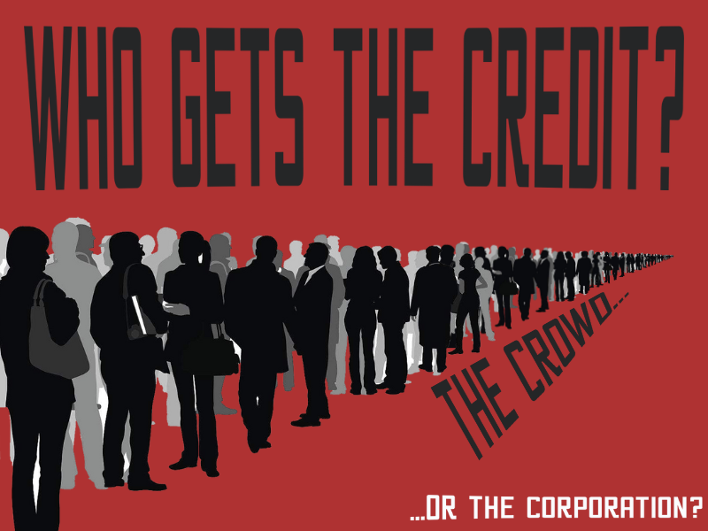

[^hargrave24crowdsourcing]: Hargrave, Marshall. 2024. “Crowdsourcing: Definition, How It Works, Types, and Examples.” Investopedia. October 17, 2024. https://www.investopedia.com/terms/c/crowdsourcing.asp.
[^lebraty13crowdsourcing]: Lebraty, Jean-Fabrice, and Katia Lobre-Lebraty. 2013. _Crowdsourcing : One Step Beyond._ Hoboken, NJ: Wiley. http://site.ebrary.com/id/10756811. 
[^halton24wisdom]: Halton, Clay. 2024. “Wisdom of Crowds: Definition, Theory, and Examples.” Investopedia. August 1, 2024. https://www.investopedia.com/terms/w/wisdom-crowds.asp#:~:text=Wisdom%20of%20crowds%20refers%20to,collectively%20smarter%20than%20individual%20experts. 
[^du24ethical]: Du, Shuili, Mayowa T. Babalola, Premilla D’Cruz, Edina Dóci, Lucia Garcia-Lorenzo, Louise Hassan, Gazi Islam, Alexander Newman, Ernesto Noronha, and Suzanne van Gils. 2024. “The Ethical, Societal, and Global Implications of Crowdsourcing Research.” Journal of Business Ethics 193 (1): 1–16. https://doi.org/10.1007/s10551-023-05604-9.
[^howe06rise]: Howe, Jeff. 2006. “The Rise of Crowdsourcing.” Wired, June 1, 2006. https://www.wired.com/2006/06/crowds/.

## CSS

### Intro

The Cascading Style Sheets, or CSS for short, is one of the core components of building a website, alongside HTML (Hypertext Markup Language) and JavaScript (JS). Together, these three technologies are often referred to as "the cornerstone of the World Wide Web."[^ebersbach01css]

CSS is the language used for styling HTML documents. It defines the visual appearance of HTML on various devices, such as screens, printers, or other display mediums.[^ebersbach02css] In other words, CSS is responsible for handling visuals like text color, background styles, buttons, user interface elements, and much more. These features are present on virtually all modern websites. It also enables interactive effects, such as hover states on buttons or cards, and optimizes visuals for different screen sizes—from small smartphones to large desktop monitors. Many people compare CSS to the skin on the HTML skeleton,[^ebersbach03css] or, as I like to say, the sweet icing on the cake.

### A Brief History of CSS

The concept of CSS emerged in the early 1990s to address the limitations of early web design. At that time, the web was primarily built with HTML for structure, and visual design capabilities were quite limited. The goal was to create a system that separated content (HTML) from presentation (CSS), allowing for more visually appealing websites.

In 1994, Håkon Wium Lie, a Norwegian web pioneer, and Bert Bos, a Dutch programmer, proposed the idea of CSS. Their specification introduced the idea of separating HTML as the structure for web content and CSS as the language for styling and formatting that content. This foundational idea became a critical step in the evolution of web design.[^ebersbach04css]

The first official CSS specification, CSS1, was published by the World Wide Web Consortium (W3C) in 1996, laying the foundation for modern web development with basic text colors, fonts and backgrounds. In 1998, CSS2 introduced new features, such as the "position" property for improved control over webpage layout and support for media types to optimize designs for different devices. In 2011, CSS2.1 was released, providing greater stability, improved browser compatibility, and enhanced accessibility across most browsers (except Internet Explorer).Currently, we use CSS3, which introduced a modular specification approach. This version brought transformative features like animations, gradients, flexbox, and many more tools for modern web design. Looking ahead, CSS4 is under development, with goals to enhance web design capabilities further, including responsive design improvements, advanced typography options, and a more robust grid system.[^ebersbach04css]

### How to apply CSS in HTML

As established, CSS is used for formatting the visual presentation of HTML. Here’s a visual example of how CSS is set up:  
[^ebersbach05css]

#### Let's break it down

- We start with the **selector**, which in this case is `h1`. In our CSS, we are modifying the `h1` selector from our HTML.
- Next, we define a **declaration block**, which contains the styles we want to apply to the selected element.
- A **property** refers to the specific style we want to modify (e.g., `color`, `background`, `width`).
- A **value** is the specific setting applied to a property (e.g., `color: red; background: yellow; width: 10px`).

In the visual example, we are applying styles to our `h1` selector. The declaration block sets the text color to red and the background color to yellow.[^ebersbach05css]

In order to stylized our website, we must make a connection between both HTML and CSS.
[^ebersbach06css]

This image represents the external method of linking a CSS file to an HTML file to style the website. This method is easier to manage when handling CSS declarations. *(You can also apply CSS internally, but it tends to be messier.)*

[^ebersbach01css]: Wikipedia. 2025. "CSS." Last modified January 21, 2025. https://en.wikipedia.org/wiki/CSS
[^ebersbach02css]: W3Schools, "CSS Introduction," accessed January 21, 2025, https://www.w3schools.com/css/css_intro.asp
[^ebersbach03css]: Nology Team, "HTML, CSS, and JavaScript: The Anatomy of a Website," last modified February 6, 2020, accessed January 21, 2025, https://nology.io/news/html-css-and-javascript-the-anatomy-of-a-website/
[^ebersbach04css]: Anupama Ra. "History of CSS: The Evolution of Web Design." AlmaBetter. Accessed January 28, 2025. https://www.almabetter.com/bytes/articles/history-of-css
[^ebersbach05css]: Eric Meyer and Estelle Weyl, CSS: The Definitive Guide (Sebastopol, CA: O'Reilly Media, 2023), 3
[^ebersbach06css]: Keith J. Grant, CSS in Depth, 2nd ed. (Shelter Island, NY: Manning Publications, 2023), 6.

BONUS: Last fall session, I created a website to help both students and curious learners learn the basics of CSS and HTML: https://hybrid.concordia.ca/hu_sia/GG-Web_developer/

## Other keywords that conects:
#### [Check the HTML here](./html.md)
#### [Check the PHP here](./php.md)

## Cyberculture

Cyberculture is a broad social and cultural movement shaped by the growth and spread of advanced digital technologies. It includes various social groups, forms of communication, and cultural practices that reflect how technology is transforming society. Cyberculture views technology as both a force for change and a tool for empowerment, fostering new types of influence, virtual spaces, and authentic digital experiences. Through online communities, digital interactions, and shared narratives, cyberculture redefines how people engage with technology and one another in an increasingly connected world.[^macek]

Cyberculture emerged in the 1960s at the Massachusetts Institute of Technology as a term describing the evolving relationship between computers and networks. It gained prominence with William Gibson's 1984 novel Neuromancer, which was closely tied to the cyberpunk subculture. Initially linked to hackers and digital avant-garde communities in the 1980s, it became more established in the 1990s with the rise of the internet, evolving into a broader sociocultural and political movement that shapes new digital behaviors and practices.[^vicenteamaral]

As digital technologies continue to advance, cyberculture evolves, reshaping how people interact with cultural content. The concept of cultural interfaces highlights how computers present and structure media, drawing from influences like cinema, print, and human-computer interaction.[^manovich] As media shifts away from physical formats, digital interfaces adapt, blending familiar elements from traditional culture with new ways of navigating and experiencing information. The rise of hyperlinking in the 1990s further transformed cyberculture by encouraging non-linear, decentralized structures, challenging traditional hierarchies in media.[^vicenteamaral] These changes illustrate the ongoing interplay between technology and culture, shaping the way digital experiences are created and understood.

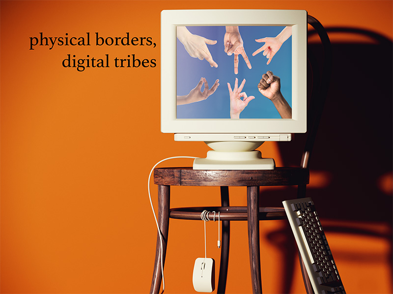

[^macek]: Macek, Jakub. 2005. "Defining Cyberculture." In Defining Cyberculture, 19. Translated by Monika Metyková and Jakub Macek. https://www.academia.edu/460099

[^manovich]: Manovich, Lev. 2002. The Language of New Media. Leonardo. Cambridge, Mass.: MIT Press. ISBN: 9780262632553.

[^vicenteamaral]: Vicente, Paulo Nuno, and Inês Amaral. 2020. "Cyberculture." In The SAGE International Encyclopedia of Mass Media and Society, edited by Debra L. Merskin, 430-432. Thousand Oaks: SAGE Publications, Inc., https://doi.org/10.4135/9781483375519.n171.

## Cybersecurity in the Context of New Media

### Definition and Significance in New Media

Cybersecurity refers to the practice of protecting digital systems, networks, and data from cyber threats, including hacking, data breaches, and malware attacks. In the context of new media, cybersecurity is crucial for maintaining the integrity, privacy, and security of digital communication, social media platforms, and online transactions. As media consumption and interaction shift towards digital spaces, the need for robust cybersecurity measures has intensified to prevent unauthorized access and ensure user trust.

### Historical Origins

The concept of cybersecurity dates back to the early days of computing in the 1960s and 1970s when researchers at the Advanced Research Projects Agency (ARPA) began studying network security. The development of the ARPANET, the precursor to the internet, exposed vulnerabilities that necessitated protective measures [^schneier2020]. In the 1980s, the emergence of computer viruses and worms, such as the Morris Worm (1988), underscored the need for cybersecurity frameworks [^anderson2021]. The rise of the internet in the 1990s further propelled cybersecurity research, leading to encryption techniques, firewalls, and cybersecurity legislation.

### Technological Significance

Cybersecurity is integral to modern technologies such as cloud computing, artificial intelligence (AI), and blockchain. Encryption methods, such as RSA and AES, provide data confidentiality, while machine learning algorithms enhance threat detection [^gordon2022]. The proliferation of Internet of Things (IoT) devices has also increased the attack surface, requiring advanced cybersecurity protocols to prevent unauthorized data access.

### Influence on Digital Culture & Society

Cybersecurity affects various aspects of digital culture, including online privacy, digital rights, and national security. The rise of cyber warfare and state-sponsored attacks has influenced geopolitical relations, as seen in cases like the 2016 U.S. presidential election cyber interference. Social media platforms implement cybersecurity measures to combat misinformation, identity theft, and data exploitation [^singer2014]. Additionally, businesses and governments enforce cybersecurity compliance through regulations such as the General Data Protection Regulation (GDPR) and the California Consumer Privacy Act (CCPA).

### Paradigmatic Examples

Several high-profile cybersecurity incidents illustrate its impact on new media:

* The 2013 Yahoo data breach exposed over 3 billion user accounts, highlighting the risks of inadequate security protocols.
* The 2017 Equifax breach compromised sensitive information of 147 million individuals, prompting stricter cybersecurity regulations.
* The WannaCry ransomware attack in 2017 affected systems worldwide, emphasizing the importance of timely software updates and security patches.

### Key Figures and Groups

Cybersecurity research and policy development have been shaped by key individuals and organizations, including:

* Clifford Stoll – Author of *The Cuckoo’s Egg*, who uncovered an early case of cyber espionage.
* Kevin Mitnick – Former hacker turned security consultant, whose exploits revealed major system vulnerabilities.
* The National Institute of Standards and Technology (NIST) – Developed widely adopted cybersecurity frameworks.
* The Electronic Frontier Foundation (EFF) – Advocates for digital rights and online security.

### Internal References

Cybersecurity intersects with related concepts such as Data Privacy, Encryption, and Cyber Warfare.

### External References

* [National Institute of Standards and Technology (NIST) Cybersecurity Framework](https://www.nist.gov/cyberframework)
* [Electronic Frontier Foundation (EFF) Cybersecurity Advocacy](https://www.eff.org/issues/security)
* [U.S. Department of Homeland Security Cybersecurity Resources](https://www.cisa.gov/cybersecurity)

### Bibliography

[^anderson2021]: Anderson, Ross. 2021. *Security Engineering: A Guide to Building Dependable Distributed Systems*. 3rd ed. Hoboken: Wiley.

[^gordon2022]: Gordon, Lawrence A., Martin P. Loeb, and Lei Zhou. 2022. "The Economics of Cybersecurity: A Survey of the Literature." *Journal of Cybersecurity* 8 (1): 1-15.

[^schneier2020]: Schneier, Bruce. 2020. *Click Here to Kill Everybody: Security and Survival in a Hyper-Connected World*. New York: W.W. Norton.

[^singer2014]: Singer, Peter W., and Allan Friedman. 2014. *Cybersecurity and Cyberwar: What Everyone Needs to Know*. New York: Oxford University Press.

## Cyberspace

It is a space where computers can interact with each other and share their data and content with each other. A reality that is computer generated, computer accessed and virtual. It is the place we are in during our communications through computers. It is a complete virtualisation of our physical world. [^bauwens94cyberspace]

The term ‘cyberspace’ was first used by William Gibson in 1982 when he used it to describe a computer generated virtual reality. ‘Cyber’ is related to ‘cyborg’ which describes humans connecting to machines. It is an artificial reality, another world. Networks and the Internet are examples of what we might consider a cyberspace. [^fourkas04cyberspace]

A global domain of interdependent networks of information systems infrastructures like the internet. It is a complex network environment formed by the connection of all these systems and technology devices. What exists in cyberspace doesn’t have physical form. It is made and accessed only through computers and their connections. [^nist12information]

Cyberspace is new representation of the physical world. It contains its own new ecosystem and media. This interlinked web of computers holds the space for new media to exist and permeate.

[^bauwens94cyberspace]: Bauwens, Michel. 1994. “What Is Cyberspace?” *Computers in Libraries* 14 (4): 42–48. 

[^fourkas04cyberspace]: Fourkas, Vassilys. 2004. "What Is Cyberspace." *Media Development* 3: 6-7.

[^nist12information]: “NIST: Information Security” *NIST.gov*. Last modified September, 2012. https://nvlpubs.nist.gov/nistpubs/Legacy/SP/nistspecialpublication800-30r1.pdf 

Image credits:
- Drew Williams, *Macbook Pro*, photograph, Pexels, July 2019, https://www.pexels.com/photo/macbook-pro-2657669/.
- fauxels, *Photo of people doing handshakes*, photograph, Pexels, November 2019, https://www.pexels.com/photo/photo-of-people-doing-handshakes-3183197/

## DNS

DNS stands for Domain Name System. It was invented by Paul Mockapetris in 1983. [^cocoran11branding]

Each computer and server have their own IP address, a series of numbers, similar to how houses have addresses for their locations. 
To be able to connect to another computer through the internet, it was required to know the IP address. An IP address is a series of 
numbers that would point to the location of the site, similar to how our home addresses tell us where we are geographically.

In the past, to find this specific number, a `hosts.txt` file had a table with the name of the host linked to their IP address. 
However, this file had to be updated every time a new “location” was created. With the rise of the Internet, it quickly fell behind. [^cocoran11branding]
To fix this issue, Paul Mockapetris invented the domain name system. 
This system takes domain names and translates them into IP addresses for the browser to use. [^cloudflare25DNS] The system is divided into different categories and levels to help organization and navigation.
While most top-level domains categorize sites by geographical location, they also have a few to signify the site’s purpose. For example, “ca” is for canadian sites, “com” is for commercial sites and “org” is for non-profit organizations.
You could also add subdomains for even more specificity. They just have to be separated by a dot. Example: https://library.concordia.ca/
The “.ca” part is the top-level domain and there’s the subdomain “.concordia”.
This helps connect sites to each other and signify relationships between different pages. [^cocoran11branding]

The creation of the DNS led to a much more accessible Internet. Rather than having to remember and type long strings of numbers to reach other sites, 
users could now use words that are much easier to remember and in most cases shorter to type out. 
This made the Internet more appealing and accessible to the masses which led to an even bigger influx of users. [^cocoran11branding]

Without the DNS, new media that uses the online world as it’s main platform to be shared or diffused may not have been as accessible. The domain name, or name used to find a website has become an important part of that site’s identity. Websites are recognized by their domain names.
The DNS also paved the way for the World Wide Web and helped the Internet become what it is today. [^veaandreubonastre19origins]

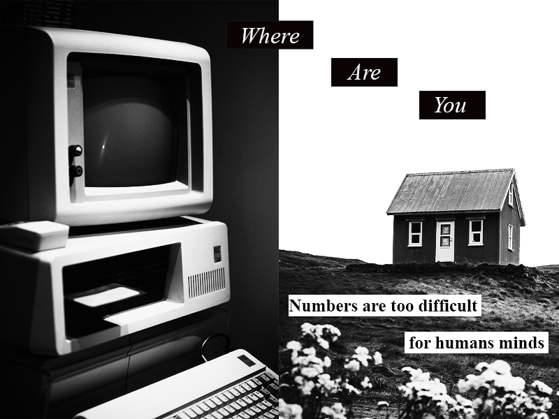
Computer image (left) from : 
[bert b](https://unsplash.com/@bertsz?utm_content=creditCopyText&utm_medium=referral&utm_source=unsplash) on [Unsplash](https://unsplash.com/photos/white-macintosh-computer-Zd6PL6PSW5E?utm_content=creditCopyText&utm_medium=referral&utm_source=unsplash) 

House image (right) from: 
[Luke Stackpoole](https://unsplash.com/@withluke?utm_content=creditCopyText&utm_medium=referral&utm_source=unsplash) on [Unsplash](https://unsplash.com/photos/red-and-white-house-surround-green-grass-field-eWqOgJ-lfiI?utm_content=creditCopyText&utm_medium=referral&utm_source=unsplash)

[^cocoran11branding]: Cocoran, Ian. 2011. _The Art of Digital Branding. Rev. ed._ New York: Allworth Press.
[^cloudflare25DNS]: Cloudflare. 2025. What is DNS| How DNS works.
[^veaandreubonastre19origins]: Bonastre, Oscar M., and Andreu Vea. 2019. “Origins of the Domain Name System.” _IEEE Annals of the History of Computing_ 41 (2): 48–60. https://doi.org/10.1109/MAHC.2019.2913116.

## E-Commerce

E-commerce (electronic commerce) is a term for buying and selling stuff through the internet. The increase of e-commerce over the years has been helped a lot by the increase of digital 
payment systems that have secure transactions and logistics networks. E-commerce’s significance in new media is shown by how it has completely changed the normal ways that the retail 
systems managed by allowing businesses to reach everyone everywhere on a global scale, without the need for a physical place. It allows for digital technologies like phones and computers 
to provide people with more convenience, variety, and better pricing. The large amount of popularity for e-commerce has also started to bring the use of new media marketing strategies, 
like social media advertising and influencer partnerships, to attract and keep customers. 

E-commerce’s relation to current technologies in the modern world is seen through the different platforms combining technologies like artificial intelligence (AI) and machine learning 
with their e-commerce stores, to give the users a more personalized shopping experience, like having recommend products based off of what they have been browsing. Additionally, 
live commerce was created as a combination of live streaming and online shopping, which has came out as a new trend to give a more interactive and immersive shopping experience. [^sciencedirect.com] 
The increase of mobile apps have also improved the accessibility by allowing users to shop anytime and anywhere. 

The historical origins of e-commerce are rooted back to when the development of Electronic Data Interchange (EDI) in the 1960s were created, which then allowed for businesses 
to exchange docunemnts and files like purchases that happen nowadays through the internet, getting rid of the need for paper. [^britannica.com] In 1979, Michael Aldrich lead the way for 
this kind of work by attaching a television to a transaction processing computer through a telephone line, which brought about the idea of teleshopping.[^researchgate.net] The 1990s were 
when the World Wide Web and the advancements in internet security like Secure Socket Layers (SSL), allowed online retail platforms to start making a name for themselves.

E-commerce’s influence on contemporary digital culture and society has greatly changed the user’s behaviors by changing their preferences towards online shopping because of its convenience and often 
has lower prices. It also has influenced the gig businesses, with platforms like Etsy that allows people to monetize their crafts.On top of this, e-commerce has changed the supply chain’s 
way of being by making the need for fast and effiecent delivery systems and warehousing solutions very important.

### Paradigmatic Examples:
- Amazon: Founded by Jeff Bezos in 1994, Amazon started as an online bookstore and has evolved into the world's largest e-commerce platform.
- Alibaba: Established by Jack Ma in 1999, Alibaba is a Chinese multinational conglomerate specializing in e-commerce, retail, and technology.
- eBay: Launched in 1995 by Pierre Omidyar, eBay is an online auction and shopping website where individuals and businesses buy and sell a large variety of goods and services worldwide.

[^sciencedirect.com]: S Chen, A.M Degeratu, A Enders, V Katros, C Zott. “_E-Commerce and the Retail Process: A Review._” Journal of Retailing and Consumer Services, December 17, 2002. (https://www.sciencedirect.com/science/article/pii/S0969698902000620). 
[^researchgate.net]: Tian, Yan. “_(PDF) History of e-Commerce._” ResearchGate, January 2007. (https://www.researchgate.net/publication/314408412_History_of_E-Commerce). 
[^britannica.com]: Zwass, Vladimir. “_E-commerce | Definition, History, Types, Examples, & Facts._” Encyclopædia Britannica, December 17, 2024. [https://www.britannica.com/money/e-commerce].

## Facial Recognition 

Facial recognition is a biometric technology that identifies or verifies individuals by analyzing facial features. It captures and processes facial data to convert it into a digital format for comparison using specialized algorithms.[^zhao03face]

The development of facial recognition dates to the 1960s when computational techniques for feature extraction were first explored.[^adjabi20past] One of the breakthroughs came with the introduction of "Eigenfaces", which applied principal component analysis (PCA) to improve recognition efficiency.[^adjabi20past] Over time, facial recognition methods have evolved into three major categories: holistic matching methods, feature-based methods, and hybrid methods.[^zhao03face] The integration of artificial intelligence (AI), particularly deep learning and convolutional neural networks (CNNs), continues to improve the accuracy and speed of facial recognition systems,[^adjabi20past] which makes them crucial in contemporary applications such as smartphones and social media platforms.

Early facial recognition methods, like Principal Component Analysis (PCA) and Local Binary Patterns (LBP), faced challenges such as lighting variations, changes in pose, and occlusions.[^jafri09survey] These issues are now addressed by more advanced techniques like 3D facial recognition (which captures depth information for more accurate results), video-based recognition (which tracks facial motion across frames), and Infrared (IR) recognition (which contributes to better performance in low-light conditions). However, challenges persist, such as misidentification, motion blur, and the impact of accessories like eyeglasses.[^jafri09survey]

Today, facial recognition technology is widely used in security, authentication, and law enforcement. Governments and private companies employ it for border control, criminal investigations, and user authentication in smartphones and banking applications.[^jafri09survey] Facial recognition also lies in new media practices. For example, video indexing (labeling faces in video),[^jafri09survey] and Apple’s iPhone Face ID (enhancing security and user experience). However, its widespread adoption has raised privacy and ethical concerns, especially regarding personal privacy, mass surveillance, and algorithmic bias.[^raji20saving] Issues such as misidentification and discriminatory outcomes have led to increased scrutiny and regulatory measures to ensure responsible use.[^smith20ethical] As technology advances, efforts are being made to improve facial recognition accuracy while addressing privacy and ethical concerns.

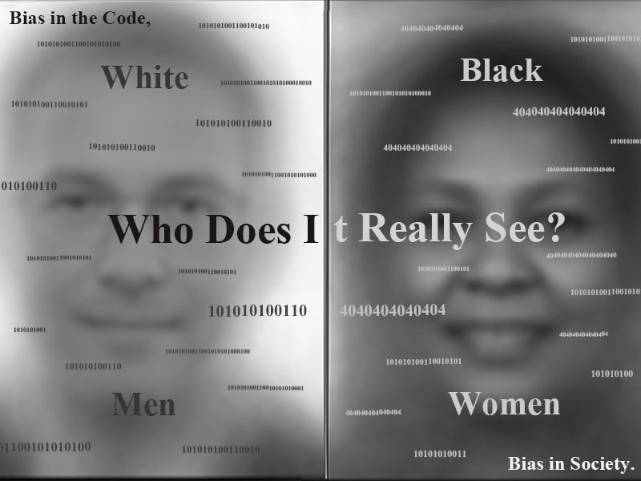 

Background image taken from[^buolamwini18gender]

[^zhao03face]: Zhao, Wenyi, Rama Chellappa, P. Jonathon Phillips, and Azriel Rosenfeld. 2003. "Face recognition: A literature survey." _ACM computing surveys (CSUR)_ 35, no. 4 : 399-458.https://dl.acm.org/doi/abs/10.1145/954339.954342?casa_token=NbvTsfTR4YgAAAAA:v5ygUeXDYzUq6-5A-1j-3SNsrVFQNntIBnss8bkaB5K4MCBGn4LiDMU6AtVX0TP0XVGQDwCBhLJORQ

[^adjabi20past]: Adjabi, Insaf, Abdeldjalil Ouahabi, Amir Benzaoui, and Abdelmalik Taleb-Ahmed. 2020. "Past, present, and future of face recognition: A review." _Electronics_ 9, no. 8 : 1188. https://doi.org/10.3390/electronics9081188

[^jafri09survey]: Jafri, Rabia, and Hamid R. Arabnia. 2009. "A survey of face recognition techniques." _journal of information processing systems_ 5, no. 2 : 41-68. https://koreascience.kr/article/JAKO200920237949770.page

[^raji20saving]: Raji, Inioluwa Deborah, Timnit Gebru, Margaret Mitchell, Joy Buolamwini, Joonseok Lee, and Emily Denton. 2020.  "Saving face: Investigating the ethical concerns of facial recognition auditing." In _Proceedings of the AAAI/ACM Conference on AI, Ethics, and Society_, pp. 145-151. https://dl.acm.org/doi/abs/10.1145/3375627.3375820 

[^smith20ethical]: Smith, Marcus, and Seumas Miller. 2022. "The ethical application of biometric facial recognition technology." _Ai & Society_ 37, no. 1 : 167-175. https://link.springer.com/article/10.1007/S00146-021-01199-9

[^buolamwini18gender]: Buolamwini, Joy, and Timnit Gebru. 2018. "Gender shades: Intersectional accuracy disparities in commercial gender classification." In _Conference on fairness, accountability and transparency_, pp. 77-91. PMLR.

## Git

Git is a free and open-source distributed version control system designed to handle everything from small to very large projects with speed and efficiency. It allows multiple developers to work on a project simultaneously without interfering with each other's contributions.[^chacon14progit]

Git was created by Linus Torvalds in 2005. The name ”Git” is British slang for a foolish or worthless person, which Torvalds humorously acknowledged, stating, “I'm an egotistical bastard, and I name all my projects after myself. First 'Linux', now 'git'.”[^torvalds05kernel]

In new media studies, Git is significant because it facilitates collaborative content creation and management. Its distributed nature allows creators from various locations to contribute to a project, promoting decentralized and collaborative workflows. This aligns with the principles of new media, which emphasize participatory culture and collective intelligence.[^jenkins06convergence]

Git underpins many modern development workflows and platforms. Services like [GitHub](../main/glossary.md#github), GitLab, and Bitbucket build upon Git to provide hosting, collaboration tools, and project management features. These platforms are integral to open-source projects, content management systems, and even digital art collaborations, reflecting Git's broad applicability in current media practices.

A paradigmatic example of Git use is the Linux Kernel Development. Git was initially developed by Linus Torvalds for managing the Linux kernel's source code. The original thread for defining the protocol is [still available](https://lkml.org/lkml/2005/4/6/121).

[^chacon14progit]: Chacon, Scott, and Ben Straub. 2014. _Pro Git_. 2nd ed. New York: Apress.

[^jenkins06convergence]: Jenkins, Henry. 2006. _Convergence Culture: Where Old and New Media Collide_. New York: New York University Press.

[^torvalds05kernel]: Torvalds, Linus. 2005. "Re: Kernel SCM saga..." _Linux Kernel Mailing List (LKML)_. April 7. https://lkml.org/lkml/2005/4/7/11.

## GitHub
GitHub is a web-based platform for version control and collaboration using Git,[^github24wikis] allowing users to manage and share code in various repositories and offering wikis for documentation and collaborative editing. GitHub employs Git software, offering distributed version control, access control, bug tracking, feature requests, task management, continuous integration, and project [wikis](../main/glossary.md#wiki).[^kinsta24what]

As of 2020, GitHub is the most important platform for collaborative Free/Libre Open Source Software (FLOSS) development, with 31 million user accounts and over 100 million code repositories.[^zoller20topology] FLOSS development is associated with the idea of commons-based peer production, presenting it as a different approach to creating goods and services compared to traditional market or hierarchical methods. It is seen as a method for producing without the usual power imbalances.

GitHub's development process is distributed, allowing developers to collaborate, discuss, and comment on code from various locations. This platform generates a wealth of textual, numerical, and collaborative data, making it a prime source for software engineering research.[^seker20open]

[^seker20open]: Seker, Abdulkadir, Banu Diri, Halil Arslan, and Mehmet Fatih Amasyalı. 2020. “Open Source Software Development Challenges: A Systematic Literature Review on GitHub.” In _International Journal of Open Source Software and Processes (IJOSSP)_ 11, no. 4: 1-26. 

[^zoller20topology]: Zöller, Nikolas, Jonathan H. Morgan, and Tobias Schröder. 2020. “A Topology of Groups: What GitHub Can Tell Us about Online Collaboration.” In _Technological Forecasting and Social Change_ 161: 120291​.

[^github24wikis]: GitHub Docs. 2024. “About wikis.” Accessed January 2. https://docs.github.com/en/communities/documenting-your-project-with-wikis/about-wikis.

[^kinsta24what]: Kinsta. 2024. ”What Is GitHub? A Beginner's Introduction to GitHub.” Accessed January 2. https://kinsta.com/knowledgebase/what-is-github/.

## GUI

### Intro
GUI (Graphical User Interface) is a way for users to interact and communicate with computers. Unlik the Command Line Interface(CLI), the GUI does not display code details. Instead, it facilitates human-computer interaction in a more intuitive way by using window, icons, menus, buttons, drop-down lists, dialog boxes, and more.[^Wendy11Graphcal] For beginners, since the GUI provides visual feedback and confirmation for every action and eliminates the need to learn specific commands and syntax, the learning curve is shallower[^Shardeum23What]

### History
Vannevar Bush's 1945 paper, "As We May Think," seems to have had a significant influence on the prototype of the GUI. The paper introduced the concept of an electronic device called Memex, which integrated an electronic desktop similar to today’s GUI.[^Vannevar45As] In 1973, Xerox PARC developed the first GUI system, which included the pop-up menus, icons, and the desktop metaphor of the graphical user interface.[^Wayne98Computer] Subsequently, the GUI continued to evolve. In 1984, Apple's release of the Macintosh popularized GUI-based personal computers, laying the foundation for modern GUIs. In 1985, Microsoft launched its first GUI-based operating system. In 2007, Apple's iPhone introduced multi-touch technology, revolutionizing GUI design for mobile device.
Today, GUI has evolved to offer a wide range of functionalities to meet users' operational needs across various devices and applications. All operating systems, software applications, and websites now have their own GUIs. GUI has a significant impact on enhancing accessibility, user experience, and productivity.[^priya24Evolution]

### Example 
[^XeroxWiki74]
Xerox_Star_8010 GUI

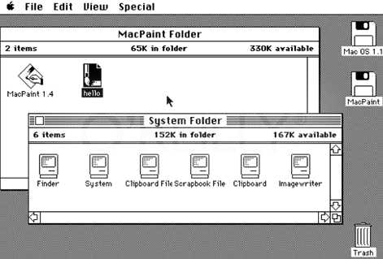[^MacintoshZednet84]
Macintosh GUI

[^WindowWiki85]
Windows1.0 GUI

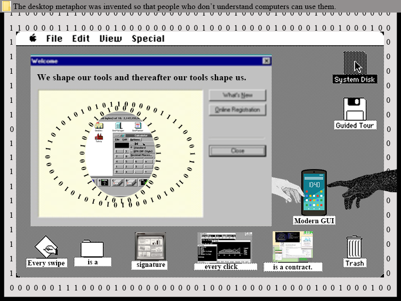

[^Wendy11Graphcal]: Wendy L Martinez, "Graphical user interfaces" in *Wiley Interdisciplinary Reviews: Computational Statistics*, v3n2(March/April 2011): 119-133, https://wires-onlinelibrary-wiley-com.lib-ezproxy.concordia.ca/doi/epdf/10.1002/wics.150.

[^Shardeum23What]: Shardeum Content Team, "GUI (Graphical User Interface) vs. CLI (Command-Line Interface)," *shardeum* July 23, 2023, "5.1 GUI vs. CLI," accessed January 29, 2025, https://shardeum.org/blog/gui-vs-cli/.

[^Vannevar45As]: Bush, Vannevar. "As We May Think", *The Atlantic Monthly*, July 1945. https://www.theatlantic.com/magazine/archive/1945/07/as-we-may-think/303881/.

[^Wayne98Computer]: Blinn, James E. "16.1 Xerox PARC" in *Computer Graphics and Computer Animation: A Retrospective Overview*. New York: ACM Press, 1998. 

[^priya24Evolution]: Priya Patel. "The Evolution and Impact of Graphical User Interfaces (GUIs)", *Medium* January 21, 2024, accessed January 29, 2025, https://medium.com/@learning3601/in-the-vast-landscape-of-digital-interaction-the-graphical-user-interface-gui-stands-as-the-3c0b8dcca51c.

[^XeroxWiki74]:Wikipedia. 2025. *Xerox Star* Last modified January 4, 2025. https://en.wikipedia.org/wiki/Xerox_Star.

[^MacintoshZednet84]:Zdnet. 2525. *The Mac at 25: GUI battles in business* Last modified January 23, 2009. https://www.zdnet.com/article/the-mac-at-25-gui-battles-in-business/.

[^WindowWiki85]: Wikipedia. 2025. *Windows 1.0* Last modified January 26, 2025. https://en.wikipedia.org/wiki/Windows_1.0.
## Hashtag

The Hashtag functions as a navigational tool that allows you to instantly search for publications on topics of interest. It also serves as a powerful tool for marketing promotion in the
social network of a product or service.[^budnik19dynamic] A hashtag typically consists of a string of characters preceded by the pound symbol.[^caleffi15word] It most commonly used as a method of sorting between various topics or categories within social media platforms. 

The person who invented and popularized the usage of the hashtag is credited to social designer Chris Messina, who produced the first ever hashtag on the social media platform Twitter (now X) in 2007. His first usage of it was when he posted a tweet reading: “how do you feel
about using # (pound) for groups. As in #barcamp?”.[^caleffi15word] However, the hashtag has also appeared during the 1990s in the messaging service IRC (Internet Relay Chat) for marking message topics, similar to the modern day usage.[^budnik19dynamic]

Within new media studies, the hashtag plays a very important role. Hashtags are now used in a number of ways, very often as a contextual aside to comment on, give more
depth to, or somehow emphasize what has been said. It is a reliable method for looking up specific posts or terms and has been utilized as an effective method of advertising and promotion.[^caleffi15word]

The hashtag has a profound impact on our society today, especially with the continuous rise of social media. Many social media platforms such as Twitter and Instagram have pushed the usage of the hashtag into mainstream digital advertising. Not only is the hashtag a tool, it represents an integral element of contemporary communication.[^rauschnabel19motivate]

[^budnik19dynamic]: Budnik, Ekaterina, Violetta Gaputina, and Vera Boguslavskaya. 2019. "Dynamic of hashtag functions development in new media: Hashtag as an identificational mark of digital communication in social networks." _In Proceedings of the XI International Scientific Conference Communicative Strategies of the Information Society_ 1-5. Accessed January 29, 2025.
[^caleffi15word]: Caleffi, Paola-Maria. 2015. "The 'Hashtag': A new word or a new rule?" _SKASE journal of theoretical linguistics_ 12 (2): 46-69. Accessed January 29, 2025.
[^rauschnabel19motivate]: Rauschnabel, Philipp A., Pavica Sheldon, and Erna Herzfeldt. 2019. "What motivates users to hashtag on social media?." _Psychology & Marketing_ 36 (5): 473-488. Accessed January 29, 2025.

## HTTPS

**HTTPS (Hypertext Transfer Protocol Secure)** is an extension of **HTTP (Hypertext Transfer Protocol)** that uses encryption to secure data exchanged between a user's browser and a web server. Through **SSL/TLS** protocols, it ensures data confidentiality, integrity, and authentication.

**Netscape** developed HTTPS in 1994 to secure online transactions for its browser. Initially, it used **SSL (Secure Sockets Layer)** for encryption. Over time, SSL was replaced by **TLS (Transport Layer Security)**, a more secure and efficient protocol. HTTPS became essential as online commerce and sensitive data exchanges grew, gaining widespread adoption in the 2000s and now a standard for safe browsing.

---

### **The Importance of HTTPS in New Media**

In the digital age, new media has transformed how information is shared, consumed, and created. Securing data transmission from social media platforms to online journalism and e-commerce has become crucial. HTTPS (HyperText Transfer Protocol Secure) is a key technology enabling secure online communication. HTTPS plays a significant role in ensuring privacy, security, and trust in new media, making it an essential standard for modern websites and online interactions.

First and foremost, HTTPS provides encryption, protecting user data from cyber threats such as hacking, phishing, and eavesdropping. Unlike HTTP, which transmits data in plain text, HTTPS uses SSL/TLS encryption to safeguard sensitive information. This is particularly vital in new media environments where personal data, login credentials, and payment details are frequently exchanged. Users engaging with social media, news sites, or digital content platforms benefit from this added layer of security.

Additionally, HTTPS enhances trust and credibility. In an era of misinformation and cybersecurity threats, users are more cautious about which websites they interact with. A website with HTTPS displays a padlock icon in the browser, signalling that it is secure and trustworthy. Search engines like Google also prioritize HTTPS-enabled sites in rankings, reinforcing its importance for content creators, businesses, and media organizations looking to reach wider audiences.

Moreover, HTTPS is widely used across various new media platforms. Social networks, video streaming services, blogs, forums, and e-commerce websites rely on HTTPS to ensure safe user experiences. Secure communication is particularly crucial for online journalism and digital activism, where protecting the integrity of information and sources is paramount.

In conclusion, HTTPS is an indispensable component of new media, providing security, trust, and improved visibility for online platforms. As the digital landscape evolves, ensuring secure communication will remain fundamental to engaging with new media safely and effectively.

[^hellegren17crypto]: Hellegren, Z. Isadora. 2017. “A History of Crypto-Discourse: Encryption as a Site of Struggles to Define Internet Freedom.” _Internet Histories_ 1 (4): 285–311. https://doi.org/10.1080/24701475.2017.1387466.  

[^fuchs11newmedia]: Fuchs, Christian. 2011. “New Media, Web 2.0 and Surveillance.” _Sociology Compass_ 5 (2): 134–47. https://doi.org/10.1111/j.1751-9020.2010.00354.x.  

[^wikipedia25https]: Wikipedia. 2025. “HTTPS.” _Wikipedia_, January 24, 2025. https://en.wikipedia.org/w/index.php?title=HTTPS&oldid=1271559473.  

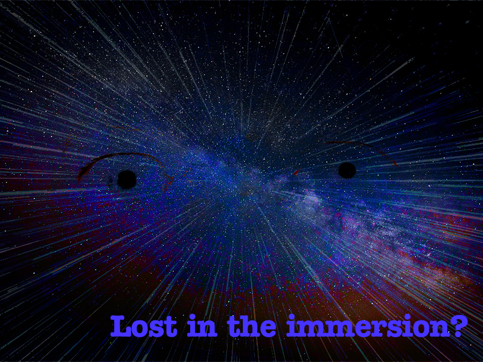

## Information Overload

Information overload occurs when the volume of information surpasses an individual's capacity to process it, leading to decision fatigue, stress, and reduced productivity [^arnold2023]. The phenomenon has intensified with digital technologies, which generate vast amounts of data through emails, social media, and online platforms [^cazaly2021]. However, information overload is not a singular concept; research has distinguished between **information overload**—excessive data—and **interaction overload**, which stems from excessive communication and digital engagement [^he2020]. Both contribute to cognitive strain and reduced efficiency in decision-making [^he2020].  

Futurist **Alvin Toffler** popularized the term in *Future Shock* (1970), describing the overwhelming effects of excessive information [^sbaffi2020]. However, concerns over information excess date back to ancient Rome, with scholars lamenting the abundance of books [^sbaffi2020]. Earlier studies highlighted that while information availability was initially seen as beneficial, exceeding a cognitive threshold leads to a decline in productivity and comprehension [^noyes1995].  

### Impact on New Media  

Information overload is critical in new media, influencing digital consumption and cognitive well-being. Contributing factors include:  

- **Technological Expansion** – The rapid flow of information via search engines and social media overwhelms users [^cazaly2021].  
- **Algorithmic Amplification** – Personalized content recommendations create endless streams of information, reducing attention spans [^cazaly2021].  
- **Multitasking Culture** – Workplaces demand constant information processing, increasing cognitive strain [^sbaffi2020].  
- **Psychological Effects** – Linked to stress, anxiety, and burnout, particularly in high-stakes fields like healthcare [^arnold2023].  
- **Communication Overload** – The rise of collaborative tools and constant messaging (e.g., emails, chats, notifications) has made interaction overload a distinct form of information burden, disrupting concentration and reducing efficiency [^he2020].  

### Managing Information Overload  

- **Cognitive Filtering** – Prioritizing essential information while limiting distractions [^cazaly2021].  
- **Digital Minimalism** – Reducing notifications and structured content consumption [^cazaly2021].  
- **AI Tools** – Utilizing technology to filter and summarize information [^arnold2023].  
- **Organizational Policies** – Streamlining workplace communication to avoid excess data flow [^arnold2023].  
- **Cognitive Load Management** – Studies show that excessive information processing can lead to information fatigue; reducing unnecessary data exposure can improve retention and engagement [^noyes1995].  

### Examples  

- **Healthcare** – Physicians face information overload from patient records, research, and administrative updates, leading to fatigue [^sbaffi2020].  
- **Social Media** – Continuous streams of news and advertisements contribute to cognitive exhaustion [^cazaly2021].  
- **Enterprise Decision-Making** – Studies have found that managers and employees experiencing high information overload often make slower or suboptimal business decisions due to excessive data processing requirements [^he2020].

## Image

[^arnold2023]: Arnold, Miriam, Mascha Goldschmitt, and Thomas Rigotti. 2023. "Dealing with Information Overload: A Comprehensive Review." *Frontiers in Psychology* 14: 1122200. https://doi.org/10.3389/fpsyg.2023.1122200.  

[^sbaffi2020]: Sbaffi, Laura, James Walton, John Blenkinsopp, and Graham Walton. 2020. "Information Overload in Emergency Medicine Physicians: A Multisite Case Study Exploring the Causes, Impact, and Solutions." *Journal of Medical Internet Research* 22 (7): e19126. https://doi.org/10.2196/19126.  

[^cazaly2021]: Cazaly, Lynne. 2021. "How to Save Yourself from Information Overload." *Harvard Business Review*. https://hbr.org/2021/09/how-to-save-yourself-from-information-overload.  

[^he2020]: He, Tingting. 2020. "Information Overload and Interaction Overload as Two Separate Attributes of Information Overload Syndrome." *Journal of Enterprising Culture* 28 (3): 263–279. https://doi.org/10.1142/S0218495821500114.  

[^noyes1995]: Noyes, J. M., and P. J. Thomas. 1995. “Information Overload: An Overview.” *IEEE Colloquium on Information Overload*.  

## Network Security  

Network security refers to the set of technologies, policies, and practices designed to protect digital communications, data integrity, and confidentiality from cyber threats. With the increasing reliance on interconnected systems, securing networks has become a critical concern for individuals, businesses, and governments. Effective network security involves multiple layers of defense to protect infrastructure, detect threats, and mitigate attacks [^huang2010].  

### Core Principles of Network Security  

Several fundamental principles guide the implementation of network security:  

- **Confidentiality** – Ensuring that sensitive data is accessible only to authorized individuals. Encryption techniques such as the **Advanced Encryption Standard (AES)** help safeguard data from unauthorized access [^zhao2024].  
- **Integrity** – Protecting information from unauthorized modification or tampering. Cryptographic hash functions and digital signatures ensure that data remains unaltered during transmission [^maasaoui2022].  
- **Availability** – Maintaining reliable access to network resources. Protection against **Distributed Denial of Service (DDoS)** attacks ensures that network services remain operational even under heavy cyber threats [^cheng2010].  

### Key Network Security Technologies  

Network security employs various technologies to protect systems and data, including:  

- **Firewalls** – Acting as a barrier between trusted and untrusted networks, firewalls filter incoming and outgoing traffic based on predefined security rules [^huang2010].  
- **Intrusion Detection and Prevention Systems (IDPS)** – These systems monitor network traffic for suspicious activities, alert administrators, and take preventive actions when necessary [^zhao2024].  
- **Virtual Private Networks (VPNs)** – Encrypting data transmissions over public networks to enhance privacy and security, especially in remote work environments [^maasaoui2022].  
- **Zero Trust Security** – A modern security approach where no entity—internal or external—is trusted by default, requiring continuous authentication and verification of users and devices [^cheng2010].  

### Challenges and Emerging Threats  

As network security evolves, new threats continue to emerge, requiring constant adaptation. Some of the most pressing challenges include:  

- **Ransomware and Malware** – Malicious software that encrypts or steals data, often demanding payment for its release [^zhao2024].  
- **Phishing Attacks** – Social engineering techniques used to trick users into revealing sensitive information, such as login credentials [^maasaoui2022].  
- **5G and IoT Vulnerabilities** – The expansion of **Internet of Things (IoT)** devices and **5G networks** introduces new attack vectors that require advanced security measures [^cheng2010].  

### Examples  

- **The WannaCry Ransomware Attack (2017)** – Exploited a vulnerability in Windows operating systems, affecting thousands of organizations globally, including healthcare and financial sectors [^maasaoui2022].  
- **SolarWinds Supply Chain Attack (2020)** – A sophisticated attack compromising enterprise networks by injecting malicious code into software updates [^cheng2010].  
- **DDoS Attack on GitHub (2018)** – One of the largest recorded DDoS attacks, which peaked at 1.35 terabits per second, demonstrating the need for robust network security defenses [^zhao2024].  

### References  

[^huang2010]: Huang, Scott C.-H., David MacCallum, and Ding-Zhu Du. 2010. *Network Security*. New York: Springer.  
[^zhao2024]: Zhao, Dongmei, Guoqing Ji, Yiling Zhang, Xunzheng Han, and Shuiguang Zeng. 2024. “A Network Security Situation Prediction Method Based on SSA-GResNeSt.” *IEEE Transactions on Network and Service Management* 21 (3): 3498–3509.  
[^maasaoui2022]: Maasaoui, Zineb, Anfal Hathah, Hasnae Bilil, Van Sy Mai, Abdella Battou, and Ahmed Ibath. 2022. “Network Security Traffic Analysis Platform - Design and Validation.” *IEEE International Conference on Computer Systems and Applications*.  
[^cheng2010]: Cheng, X., and S.C.-H. Huang. 2010. “Security Protocols and Cryptography in Network Security.” *Springer Science+Business Media*.  

## The Internet

The Internet is a vast, decentralized network of interconnected computers that enables global communication, information sharing, and digital interaction. It is built on a foundation of standardized communication protocols, primarily the **Transmission Control Protocol/Internet Protocol (TCP/IP)**, which ensures the seamless exchange of data across diverse systems [^clark1988]. The Internet evolved from early research initiatives, notably the **ARPANET**, developed in the late 1960s to facilitate communication between academic and military institutions [^leiner2009]. Over time, it expanded into a ubiquitous infrastructure supporting a wide range of applications, from web browsing to cloud computing.  

### Core Architectural Principles  

The Internet's success is largely attributed to key design principles that have shaped its evolution:  

- **Packet-Switching** – Instead of relying on a dedicated communication channel, data is broken into packets that travel independently across the network before being reassembled at the destination. This ensures efficiency and fault tolerance [^abbate1999].  
- **End-to-End Principle** – The network itself remains simple, while intelligence and complexity are handled at the edges (i.e., the devices communicating over the network). This principle fosters flexibility and innovation by allowing new applications to be built without requiring changes to the core infrastructure [^saltzer1984].  
- **Layered Architecture** – The Internet is structured into multiple layers, including the physical, network, transport, and application layers. Each layer performs a specific function, enabling interoperability and scalability [^clark1988].  

### Impact on Society  

The Internet has transformed nearly every aspect of modern life, serving as the foundation for digital economies, communication platforms, and knowledge dissemination. Some key societal impacts include:  

- **Information Access** – With search engines and online databases, knowledge is more accessible than ever, revolutionizing education, research, and journalism [^leiner2009].  
- **Digital Communication** – Email, instant messaging, and social media have reshaped interpersonal and mass communication, making global interaction instantaneous and ubiquitous [^abbate1999].  
- **E-commerce & Digital Markets** – Online marketplaces such as Amazon, Alibaba, and Shopify have disrupted traditional commerce, enabling businesses of all sizes to reach global audiences [^leiner2009].  
- **Cloud Computing & Big Data** – The Internet supports vast computational and storage infrastructures, driving advancements in artificial intelligence, automation, and data analytics [^clark1988].  

### Challenges and Future Considerations  

Despite its benefits, the Internet faces significant challenges, including:  

- **Security & Privacy Risks** – Cyber threats, including hacking, data breaches, and surveillance, raise concerns about online safety and digital rights [^clark1988].  
- **Digital Divide** – While the Internet connects billions of people, disparities in access persist, particularly in developing regions with limited infrastructure [^abbate1999].  
- **Decentralization vs. Control** – Governments and corporations influence how the Internet operates, leading to debates over net neutrality, censorship, and monopolization [^saltzer1984].  

### Examples  

- **The World Wide Web** – Invented by Tim Berners-Lee in 1989, the Web is an application of the Internet that enables hyperlinked content, forming the foundation of modern websites and digital services [^leiner2009].  
- **Streaming & Social Media** – Platforms like Netflix, YouTube, and Twitter leverage Internet infrastructure to provide on-demand content and real-time interactions, shaping digital culture [^abbate1999].  
- **Blockchain & Decentralized Networks** – Emerging technologies like blockchain operate on Internet protocols to enable secure, transparent transactions without central authorities [^clark1988].  

### References  
### References  

[^clark1988]: Clark, David D. 1988. "The Design Philosophy of the DARPA Internet Protocols." *ACM SIGCOMM Computer Communication Review* 18 (4): 106–114.  
[^saltzer1984]: Saltzer, Jerome H., David P. Reed, and David D. Clark. 1984. "End-to-End Arguments in System Design." *ACM Transactions on Computer Systems* 2 (4): 277–288.  
[^abbate1999]: Abbate, Janet. 1999. *Inventing the Internet*. Cambridge, MA: MIT Press.  
[^leiner2009]: Leiner, Barry M., Vinton G. Cerf, David D. Clark, Robert E. Kahn, Leonard Kleinrock, Daniel C. Lynch, Jon Postel, Larry G. Roberts, and Stephen Wolff. 2009. "A Brief History of the Internet." *ACM SIGCOMM Computer Communication Review* 39 (5): 22–31. https://doi.org/10.1145/1629607.1629613.  

## Iteration
Iteration refers to the repeated execution of tasks or procedures derived from the Latin word *iteratio*, meaning "repetition".[^etymologyIteration] In design and engineering, it involves the ongoing process of revisiting a set of steps or operations with the intent of refining and improving a product, system, or idea.[^NormanEverydayDesign]
In New media, this practice is essential for fostering continuous development, innovation, and a responsive approach to user needs.

Historically, iteration has been integral to programming and has significant applications in mathematics, engineering, and design.
It became a cornerstone of computer programming in the mid-20th century with the introduction of loops in languages like **FORTRAN** and **ALGOL**, facilitating efficient task repetition crucial for early computational processes.[^johnBackusFotron]

The importance of iterative processes spans various fields, particularly in software development, user experience design, and artificial intelligence. 
Agile methodologies in software development emphasize iterative cycles or sprints, allowing for continuous improvement based on user feedback.[^cohn2006] 
In user experience design, iterative processes are employed to optimize digital interfaces, ensuring they meet diverse user needs.[^NormanEverydayDesign] 
In the field of AI, the iterative training of machine learning models increases accuracy as algorithms learn from more data over time.[^goodfellow2016] 
These methods shape contemporary digital culture, which is evident in social media platforms that encourage creativity through the remixing and adapting of content, fostering collaboration. 
In gaming, iterative design enables developers to refine gameplay and respond to player feedback through updates and new content.[^juul2005] 
Social media algorithms utilize iterative processes to continuously enhance and curate content based on user interactions, significantly influencing the online experience.

Notable examples that highlight the use of iteration include platforms like **TikTok** and **YouTube**, which use iteration to analyze user behavior and refine content recommendations. This ensures user feeds remain engaging, keeping users returning.
In **video games**, iteration is crucial for development. Designers release updates and patches based on player feedback and analytics, improving gameplay, balancing mechanics, and adding features that resonate with the community.
Similarly, software updates on our phones are a prime example of iteration. Companies like **Apple** and **Google** release regular updates to fix bugs, enhance security, and introduce new features, ensuring devices remain functional and up-to-date.

[^etymologyIteration]: Douglas Harper. 2018. Etymology of "Iteration" on Etymonline. October 19. Accessed March 7, 2025. https://www.etymonline.com/word/iteration.
[^NormanEverydayDesign]: Norman, Don. 2013. _The Design of Everyday Things: Revised and Expanded Edition_. New York: Basic Books. Chapter 6, "Design Thinking".
[^johnBackusFotron]: Backus, John. 1978. "The Early History of FORTRAN." ACM SIGPLAN Notices 13 (8): 165–180. https://doi.org/10.1145/359576.359579.
[^cohn2006]: Cohn, Mike. 2006. Agile Estimating and Planning. Upper Saddle River, NJ: Prentice Hall.
[^goodfellow2016]: Goodfellow, Ian, Yoshua Bengio, and Aaron Courville. 2016. _Deep Learning_. Cambridge, MA: MIT Press.
[^juul2005]: Juul, Jesper. 2005. Half-Real: Video Games between Real Rules and Fictional Worlds. Cambridge, MA: MIT Press.

## Linux

***Linux*** is the name attributed to a collection of operating systems built on top the Linux kernel[^economist01authentic]. Linus Torvalds started developing the kernel in 1991[^steven11twenty] with the express purpose of creating an [open-source](/keywords/open-source.md) clone of [Unix](/keywords/unix.md). After being commonly packaged with GNU[^stallman25gnu], Linux quickly grew in size and user base currently making up 4% of all personal desktop operating systems in the world[^statcounter25desktop].

Thousands of versions of Linux exist [^atea25distrowatch], commonly referred to as Distros (distributions). Some popular Distros include; [Ubuntu](https://ubuntu.com/download), [Debian](https://www.debian.org/), [Mint](https://www.linuxmint.com/), [Fedora](https://fedoraproject.org/), [Arch](https://archlinux.org/), [Gentoo](https://www.gentoo.org/), and [NixOS](https://nixos.org/). Each distribution comes with individual suites of software usually built on the GNU library which has led to the name GNU/Linux[^stallman21linux] being a more widely adopted then simply Linux. These suites include Window Managers/Desktop Environments, package managers, and more.

Due to Linux's offered freedom, Linux has become a common tool among creatives. From the Raspberri PI engineers, to the young Chromebook students, anyone with a computer can have immediate access to a multitude of complex and usable tools. Linux is more then a tool, it is a community of like minded thinkers who share a passion for freedom of expression. Linux is **the** public paintbrush, the one to seperate user from state and enterprise. It is pure technological freedom, which infinite modubility[^rankin05linux]. 

---

[^economist01authentic]: "Authentic hero; Computer technology; Linus Torvalds and Linux." *The Economist*, January 27, 2001, 3. _Gale OneFile: CPI.Q_ (accessed February 3, 2025). https://link-gale-com.lib-ezproxy.concordia.ca/apps/doc/A69842147/CPI?u=concordi_main&sid=bookmark-CPI&xid=0078b28d.
[^steven11twenty]: Steven Vaughan-Nichols, “Twenty Years of Linux According to Linus Torvalds,” *ZDNET*, April 13th 2011, (accessed February 2, 2025). https://www.zdnet.com/article/twenty-years-of-linux-according-to-linus-torvalds/.
[^stallman25gnu]: Stallman, Richard. 2021. “*GNU/Linux FAQ - GNU Project - Free Software Foundation*”, accessed February 2, 2025, https://www.gnu.org/gnu/gnu-linux-faq.html.
[^statcounter25desktop]: “*Desktop Operating System Market Share Worldwide*”, StatCounter Global Stats, accessed February 2, 2025, https://gs.statcounter.com/os-market-share/desktop/worldwide.
[^atea25distrowatch]: “*DistroWatch.Com: Put the Fun Back into Computing. Use Linux, BSD.*”, Atea Ataroa Limited, accessed February 2, 2025, https://distrowatch.com/.
[^stallman21linux]: Stallman, Richard. “*Linux and GNU - GNU Project - Free Software Foundation*”, accessed February 2, 2025, https://www.gnu.org/gnu/linux-and-gnu.html.
[^rankin05linux]: Rankin, Kyle. *Linux Multimedia Hacks*. 1st ed. Sebastopol, Calif.: O’Reilly, 2005. http://books.google.com/books?id=oZpQAAAAMAAJ.

## Middleware

Middleware is a type of software that can best be viewed as a layer between different systems and the outcome of their collaboration. Examples of these different systems are applications, databases, and operating systems. Examples of the outcomes of these systems’ collaboration are single sign-on (SSO) and API management. In other words, it simplifies the integration between various components to provide efficient and reliable services. [^1citation]

Middleware first made its appearance in a 1968 NATO Software Engineering report. Originally, the term designated the software that sat between application programs and service routines.[^2citation] Then, in the 1980s and 1990s, the exponential growth of the internet led to new middleware technologies being designed to support distributed systems. Today, middleware continues to be a term used to describe a wide range of services that are essential for building complex applications that are distributed.

By far, the most important role of middleware is in cloud computing. The foundation for modern cloud-native architecture is middleware. It allows developers to safely and efficiently scale applications across hybrid environments. The main advantage of middleware is that it creates reliable core application features rather than handling complex system interactions that are error prone. The main disadvantage is that the initial setup and maintenance of middleware systems can be complex.[^3citation]

In the 21st century, computing continues to evolve, thus the role of middleware is more important than ever. Done properly, middleware is a vital service that enable applications to communicate an across a wide range of platforms. Incorrectly chosen, middleware can slow down the process by producing bottleneck issues.[^4citation]

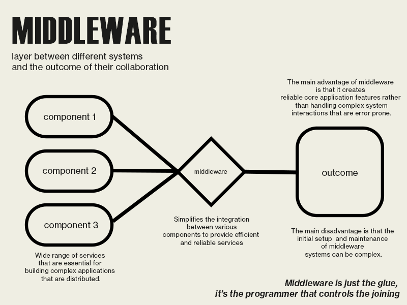

[^1citation]: Fersi, G. 2015. "Middleware for Internet of Things: A Study." In _2015 International Conference on Distributed Computing in Sensor Systems_, 230-235. Fortaleza, Brazil: IEEE. https://doi.org/10.1109/DCOSS.2015.43.
[^2citation]: Naur, Peter, and Brian Randell, eds. 2001. _Report on a Conference Sponsored by the NATO Science Committee: NATO Software Engineering Conference 1968. Garmisch, Germany: NATO, 1969_. Edited and reformatted by Robert M. McClure, Arizona.
[^3citation]: Youngblood, G. Michael. 2004. "Middleware." In _Handbook of Computer Networks and Distributed Systems: Middleware_, edited by Diane J. Cook and Sajal K. Das, 101-127. Hoboken, NJ: Wiley.
[^4citation]:Daily Mail. 2018. "Hawaii Man Gets Trapped in Gap Between Two Buildings." _Daily Mail_, March 21, 2018. https://www.dailymail.co.uk/news/article-5542715/Hawaii-man-gets-trapped-gap-two-buildings.html.

## MP3

MP3 (MPEG-1 Audio Layer 3) is a widely used digital audio format that has revolutionized the way people store, distribute, and consume music. MP3 is a lossy audio compression format that significantly reduces file size while maintaining acceptable sound quality by discarding audio data that is not sensitive to human hearing. This efficient compression makes MP3 key to the rise of digital music, online distribution, and portable media players, and has profoundly influenced contemporary digital culture and media consumption practices.[^brandenburg99mp3]

The importance of MP3 in new media is that it changed the economic model of the music industry, making file sharing and music streaming platforms possible. It is directly related to the evolution of peer-to-peer (P2P) networks, digital rights management (DRM), and streaming services such as Spotify and Apple Music.[^morris15selling]

The MP3 format was developed by the Moving Picture Experts Group (MPEG) under the International Organization for Standardization (ISO) and the International Electrotechnical Commission (IEC). Its core figure was Karlheinz Brandenburg, who achieved efficient compression by optimizing perceptual coding techniques to remove parts of the audio signal that are imperceptible to the human ear.[^brandenburg94iso]

MP3 became widely known in the late 1990s, with the rise of the Internet and peer-to-peer file sharing services such as Napster (launched in 1999), which enabled the mass dissemination of digital music. This triggered a major conflict between copyright holders and consumers, and fundamentally changed the music industry's thinking about digital rights management and profit models.[^morris15selling2]

[^brandenburg99mp3]: Brandenburg, Karlheinz. 1999. "MP3 and the Future of Digital Audio." Journal of the Audio Engineering Society 47(7/8): 558–566.
[^morris15selling]: Morris, Jeremy Wade. 2015. Selling Digital Music, Formatting Culture. Oakland: University of California Press.
[^brandenburg94iso]: Brandenburg, Karlheinz, and Gerhard Stoll. 1994. "ISO/MPEG-1 Audio: A Generic Standard for Coding of High-Quality Digital Audio." Journal of the Audio Engineering Society 42(10): 780–792.
[^morris15selling2]: Morris, Jeremy Wade. 2015. Selling Digital Music, Formatting Culture. Oakland: University of California Press.
[GitHub](../main/glossary.md#github), [Wiki](../main/glossary.md#wiki), [Affordance](../main/glossary.md#affordance)

## Multimedia

Multimedia refers to the integration of multiple media to deliver a richer message than one single form of media.[^Li21multimedia] By manipulating text, images, 
data and videos through technology (both modern and traditional forms) and including user interaction, one may allow more dimension for expression.

Earlier forms of multimedia included newspapers, one of the first mass communication mediums and one in which included text, imagery, and graphics. Over time, hardware used to create multimedia continued to improve, from rudamentary devices like phonograms
and wooden box cameras to CDs and Instant Cameras. Eventually, all the content captured by hardware went from analog media to digital media, marking a shift in how we could share and interact with media. This continuous improvement in hardware and shift in media allowed increased experimentation and expression using multimedia tools. Nowadays, with new digital media, users are now actively engaged with their "social ecosystem" rather than passively consuming media.[^Li21multimedia] 

More modern applications of Multimedia are thought to date back to the early 1960's, with interactive installations such as Ivan Sutherland and Bob Sproull's "The Ultimate Display".[^history30ultimate] The proposed installation involved a computer interpreting beams of light and outputting them into a small screen on a helmet.[^brown17virtual] The Ultimate Display was effectively the ancestor of modern virtual reality technologies, combining creative computation, physics and imagery to generate virtual objects. With the evolution of software and hardware in the 20th and 21st centuries, interactive programs like video games and social media emerged as some of the most commercial and prevalent forms of multimedia entertainment.

[^Li21multimedia]: Li, Ze-Nian, Mark S. Drew, and Jiangchuan Liu. 2021. Fundamentals of Multimedia. Cham, Switzerland: Springer

[^history30ultimate]: History Timelines. 2025. “Multimedia: History Timeline.” Accessed January 30, 2025. https://historytimelines.co/timeline/multimedia-. 

[^brown17virtual]: Brown, Johnathan, Elisa White, and Akshya Boopalan. 2017. “Looking for the Ultimate Display: A Brief History of Virtual Reality.” Boundaries of Self and Reality Online, March 3, 2017. https://www.sciencedirect.com/science/article/abs/pii/B9780128041574000128#:~:text=A%20computer%20interpreted%20the%20beams,Sturman%20%26%20Zeltzer%2C%201994).

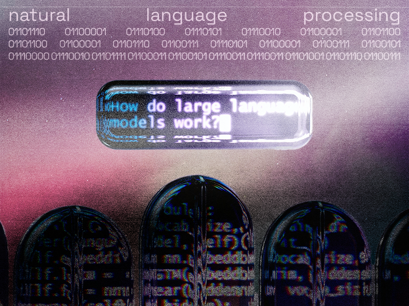[^deepmind]

Natural Language Processing (NLP) is a branch of artificial intelligence that focuses on the interaction between computers and human language.[^NLPIBM] It involves developing algorithms and models that enable computers to interpret, analyze, and generate human language in a way that is both meaningful and contextually relevant. By leveraging techniques from computational linguistics and machine learning, NLP facilitates tasks such as text classification, language translation, sentiment analysis, and conversational agent development.

The field of NLP has undergone significant evolution over the past decades. Early approaches were largely rule-based, relying on hand-crafted linguistic rules to process language.[^speechandlanguageprocessing] Over time, statistical methods were introduced, which paved the way for more scalable approaches. In recent years, the emergence of deep learning—especially transformer-based architectures like BERT has revolutionized NLP by enabling models to capture nuanced contextual information in language data.[^bert]

Applications of NLP span a wide range of areas. For instance, machine translation systems like Google Translate use deep [neural networks](../main/glossary.md#neural-networks) to improve language translation, making it more accurate. Virtual assistants like Siri and Alexa rely on NLP to understand and respond naturally to spoken language. In business, sentiment analysis tools process text from social media, reviews, and surveys to extract insights on public opinion and consumer sentiment.[^speechandlanguageprocessing] Most recently, generative AI chatbots are one of the most significant advancements in NLP, as they act as a culimnation of decades of research and development into computational linguistics.

[^deepmind]: Cockx, Wes and Google DeepMind. 2023. *An Artist’s Illustration of Artificial Intelligence.* Pexels. https://www.pexels.com/photo/an-artist-s-illustration-of-artificial-intelligence-ai-this-illustration-depicts-language-models-which-generate-text-it-was-created-by-wes-cockx-as-part-of-the-visualising-ai-project-l-18069694/.
[^bert]: Devlin, Jacob, Ming-Wei Chang, Kenton Lee, and Kristina Toutanova. 2019. “BERT: Pre-Training of Deep Bidirectional Transformers for Language Understanding.” arXiv. https://doi.org/10.48550/arXiv.1810.04805.
[^speechandlanguageprocessing]: Jurafsky, Dan, and James H. Martin. 2009. Speech and Language Processing: An Introduction to Natural Language Processing, Computational Linguistics, and Speech Recognition. 2nd ed. Prentice Hall Series in Artificial Intelligence. Upper Saddle River, N.J: Pearson Prentice Hall.
[^NLPIBM]: Stryker, Cole, and Jim Holdsworth. n.d. “What Is NLP (Natural Language Processing)? | IBM.” IBM. Accessed February 19, 2025. https://www.ibm.com/think/topics/natural-language-processing.

## Neural Networks

A neural network is a sophisticated form of machine learning and subset of deep learning, designed to emulate the structure and functionality of the human brain[^thisisacitation1]. These systems, often referred to as “Artificial Neural Networks” (ANN) [^thisisacitation2], are inspired by the biological processes of neurons in the brain. They are composed of dense interconnected layers of nodes consisting of an input layer, multiple hidden layers for processing information, and an output layer[^thisisacitation3].

Each node within these layers is assigned a specific weight and threshold. When the input to a node surpasses its threshold, the node becomes activated, transmitting a signal to the next layer of nodes mirroring the way synapses fire in the human brain thus allowing a neural net to tackle complex problems and learn from data. Additionally, due to their interconnected nature, they are able to process vast amounts of information, recognize patterns, and make decisions with remarkable accuracy[^thisisacitation3].

If there are any students in this class who are further interested in how this functions mathematically, as I will not be covering this, they may consult the paper “Activation Functions in Artifcial Neural Networks: A Systematic Overview” by  Johannes Lederer[^thisisacitation4], outlining the neuron activation function and overall architecture as mathematical principles. 

The most common type of neural network, as in the architecture described above, is the Feedforward Neural Networks (FNN) [^thisisacitation1][^thisisacitation5]. FNNs are the simplest form of neural networks, characterized by their unidirectional flow of information, moving exclusively from the input layer, through the hidden layers, and finally to the output layer. This makes them particularly well suited for tasks such as classification and other linear problems. Another prominent example is the Convolutional Neural Network (CNN)[^thisisacitation1][^thisisacitation5], which is specifically designed for pattern identification and recognition using matrix manipulation and other algebraic principles. CNNs excel in tasks involving image and video analysis, detecting similarities, differences, and intricate patterns within data.

Their strengths become apparent in the context of new media art through this distinct aptitude for patterns. They can analyze datasets of existing artworks to identify styles, and features, enabling them to generate new pieces that either mimic or innovate upon existing. More importantly, neural networks can optimize art to align with aesthetic ideals, effectively mirroring the human perceptual process of identifying and evaluating sensorily pleasing qualities. Even without explicit training on visual art, CNNs can produce art-like outputs that exhibit fundamental principles like symmetry, composition, and more. By studying these outputs, researchers gain insights into how art itself is conceptualized in the mind, bridging the gap between models and human creativity. Thus, they not only have the ability to generate, but also provide a deeper understanding of the human cognitive process[^thisisacitation7].

The final aspect to discuss is the training process for neural networks. While difficult to explain, briefly, they are trained using large datasets, where the model iteratively refines its internal parameters, such as weights and biases, through a dominant design paradigm known as backpropagation if multilateral flow exists[^thisisacitation1]. This works by calculating the error between the neural network’s predictions and the actual target outputs and using the discrepancy to adjust its parameters, gradually minimizing errors and improving its accuracy over time, an iterative cycle of learning and refinement[^thisisacitation2]. 

To conclude, since the first trainable neural network was demonstrated by Frank Rosenblatt in 1957[^thisisacitation6], neural networks have evolved into a technology with widespread applications. Today, they are integral to advancements in fields such as facial and speech recognition, financial and weather forecasting, or simply providing accurate predictions that inform decision-making[^thisisacitation1]. Their versatility and power continue to drive innovation, making them a cornerstone of modern artificial intelligence.

(Image created in Blender, edited in Adobe Illustrator)

[^thisisacitation1]: IBM. n.d. "What Are Neural Networks?" IBM. https://www.ibm.com/think/topics/neural-networks.
[^thisisacitation2]: Goodfellow, Ian, Yoshua Bengio, and Aaron Courville. 2016. *Deep Learning*. MIT Press. https://www.deeplearningbook.org/.
[^thisisacitation3]: Haykin, Simon. 1999. *Neural Networks: A Comprehensive Foundation*. 2nd ed. Prentice Hall. https://github.com/anishLearnsToCode/books/blob/master/machine-learning/Neural-Networks-A-Comprehensive-Foundation-Simon-Haykin.pdf.
[^thisisacitation4]: Lederer, Johannes. 2021. “Activation Functions in Artificial Neural Networks: A Systematic Overview.” arXiv preprint arXiv:2101.09957. https://arxiv.org/abs/2101.09957
[^thisisacitation5]: Sharkawy, Abdel-Nasser. 2020. "Principle of Neural Network and Its Main Types: Review." *Journal of Advances in Applied & Computational Mathematics*. https://www.researchgate.net/publication/343837591_Principle_of_Neural_Network_and_Its_Main_Types_Review.
[^thisisacitation6]: MIT News. 2017. "Explained: Neural Networks." *MIT News*. https://news.mit.edu/2017/explained-neural-networks-deep-learning-0414.
[^thisisacitation7]: Evans, Owain. 2019. "Sensory Optimization: Neural Networks as a Model for Understanding and Creating Art." arXiv preprint. https://arxiv.org/abs/1911.07068.

## Online Community
Creating online communities means using the internet to bring people together, helping them interact, and making them feel like they belong to a group. 
These communities exist on websites, social media platforms, and other digital spaces where people can talk to each other, share ideas, and work together. 
Whether it’s through discussions, sharing content, or supporting each other, these online spaces allow people with similar interests to connect and build relationships, no matter where they are in the world[^bell05creating].

When learning how online communities function, researchers discovered three primary interaction patterns: direct reciprocity (people helping others with the expectation of future returns),
indirect reciprocity (contributing without immediate expectations, trusting in community support down the line),
and preferential attachment (newcomers gravitating toward established members).
Interestingly, the results reveal that most online communities thrive through both direct and indirect reciprocity,
challenging previous assumptions that digital interactions primarily follow popularity-driven power-law patterns[^faraj11network].

Research shows extreme-right groups gaining momentum through online communities where they connect with ideologically aligned people.
These groups respond to real-world events like political shifts and social movements by intensifying discussions, organizing collective action,
and reinforcing shared beliefs[^biluc20growing].
The study demonstrates how internet platforms can accelerate these groups' growth and influence by facilitating the spread of their viewpoints while nurturing a powerful sense of community and shared purpose.

[^bell05creating]: Bell, Steven J. 2005. “Creating Community Online.” American Libraries 36, no. 4: 68–71. http://www.jstor.org/stable/25649539.
[^biluc20growing]: Bliuc, Ana-Maria, John Betts, Matteo Vergani, Muhammad Iqbal, and Kevin Dunn. 2020. “The Growing Power of Online Communities of the Extreme-Right: Deriving Strength, Meaning, and Direction from Significant Socio-Political Events ‘in Real Life.’” International Centre for Counter-Terrorism. http://www.jstor.org/stable/resrep25261.
[^faraj11network]: Faraj, Samer, and Steven L. Johnson. 2011. “Network Exchange Patterns in Online Communities.” Organization Science 22, no. 6: 1464–80. http://www.jstor.org/stable/41303137.

## Open Source

The term “open source” refers to the source code of a project that is under an open source licence and is freely available for anyone to inspect, modify and redistribute [^opensource]. For source code to be considered open source, it must adhere to the Open Source Definition (OSD) created by the Open Source Initiative (OSI). This definition was written by Bruce Perens and acts as a bill of rights for users by certifying content as open source [^bruceperens].

The current criteria outlined by the Open Source Definition are as such:

The license must allow for free redistribution of the source code/content.
The content must include source code and allow for redistribution in form of source code.
The license must allow for modifications and for derived works to be redistributed under the same terms as the original license.
The license may require derived works to be distributed under a different name or version number to maintain the integrity of the original project.
The license must not discriminate against any group of people.
The license must not restrict usage in any field or endeavor.
The license must apply to all cases of use without the need of additional licenses.
The license must not be limited to particular software distribution.
The license must not impose restrictions on any other software used in the redistribution of the content.
The license must not be specific to any software, style or interface. [^bruceperens]

The concept of collaboratively developing a project with source code freely available to modify and redistribute was first introduced through the GNU project at MIT in the early 1980’s. In early 1998 the term “open source” was coined by Bruce Perens and Eric Raymond in response to the source code of the Netscape web browser being released [^cristinagacek]. This soon led to the establishment of the Open Source Initiative and the official Open Source Definition to create clear guidelines as to what qualifies as open source. 

A well-known example of open source software is Linux, an open source operating system based on the Linux kernel released in 1991 by Linus Torvalds [^linux]. Linux quickly gained popularity and replaced software with much more restrictive licenses, especially as the World Wide Web emerged and the internet became more mainstream [^ericramond]. Linux demonstrated the benefits of open source software due to its rapid development, and the open source license encouraged developers to feel comfortable while contributing to it.

Although the term originated from a software context and is most commonly used in said context, the open source concept extends onto many other fields such as art, education and research. Open Source recognizes developers as a part of  the user community [^cristinagacek], and emphasises the importance of collaboration and community in innovation.

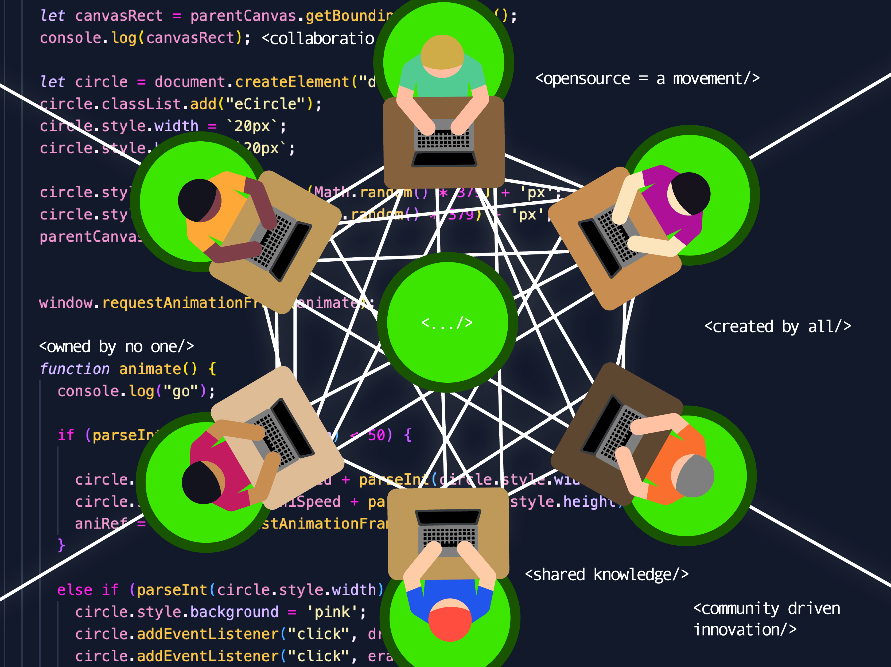

[^cristinagacek]: Gacek, Cristina, and Budi Arief. "The Many Meanings of Open Source." IEEE Software 21, no. 1 (January 2004): 34–40.

[^bruceperens]: Perens, Bruce. "The Open Source Definition." In Open Sources: Voices from the Open Source Revolution, edited by Chris DiBona, Sam Ockman, and Mark Stone, 171–188. Sebastopol, CA: O'Reilly Media, 1999.

[^ericramond]: Raymond, Eric S. The Cathedral and the Bazaar: Musings on Linux and Open Source by an Accidental Revolutionary. O'Reilly Media, 1999.

[^linux]: "Linux." Wikipedia. February 2, 2025. https://en.wikipedia.org/wiki/Linux.

[^opensource]: "Open Source Software." Wikipedia. February 2, 2025. https://en.wikipedia.org/wiki/Open_source_software.

## PHP

**PHP (Hypertext Preprocessor)** is a widely used, open-source scripting language designed primarily for web development. It is embedded into HTML to create dynamic web pages and can interact with databases, manage sessions, and process forms. 

PHP was created in 1993 by **Rasmus Lerdorf** as a set of **Common Gateway Interface (CGI)** scripts to track visitors to his online resume. Initially called "Personal Home Page Tools," it evolved into **PHP/FI (Personal Home Page / Forms Interpreter)** in 1995. By 1997, it became the fully-fledged PHP language. PHP 3, released in 1998, marked its first major version, and it has continuously evolved with regular updates to improve performance, security, and functionality.

### **PHP and Its Relevance to New Media**

In the digital age, new media encompasses various forms of online communication, including websites, social media platforms, streaming services, and interactive content. PHP (Hypertext Preprocessor) is crucial in enabling these digital experiences by serving as a powerful scripting language for web development. Its ability to process dynamic content, manage databases, and facilitate user interactions makes it indispensable in the evolving landscape of new media.

One of PHP’s primary applications in new media is within **Content Management Systems (CMS)**. Platforms such as WordPress, Drupal, and Joomla utilize PHP, allowing users to create, manage, and publish digital content effortlessly. These systems enable individuals and businesses to maintain an online presence without requiring extensive programming knowledge. The flexibility and scalability of PHP-based CMS platforms contribute significantly to the proliferation of digital media.

Additionally, PHP has been pivotal in developing **social media platforms**. Facebook, one of the largest social networks, was initially built using PHP, highlighting its ability to handle vast amounts of user-generated content and real-time interactions. Although Facebook has since modified its backend, PHP remains a cornerstone in many social networking sites, prioritizing user engagement and content sharing.

The language is also essential in **streaming services**, where it helps deliver video, audio, and other interactive media. Websites like YouTube, Twitch, and other multimedia platforms rely on backend scripting to manage content distribution, handle user logins, and provide seamless streaming experiences. PHP’s integration with databases like MySQL ensures that media content is efficiently stored, retrieved, and delivered to users.

Furthermore, **e-commerce and forum-based websites** benefit from PHP’s capabilities. Platforms like Etsy, WooCommerce, and various online marketplaces use PHP to manage transactions, user authentication, and dynamic product displays. Community forums, including those designed for problem-solving and knowledge sharing, also leverage PHP to facilitate discussions and user interactions.

In conclusion, PHP remains a foundational technology in new media, driving the interactivity and functionality of modern websites and digital platforms. Its versatility, efficiency, and database compatibility make it a preferred choice for developers looking to create engaging online experiences. As new media evolves, PHP’s role in shaping the digital landscape will likely persist, ensuring dynamic and interactive web applications for users worldwide.

[^amanatidis16php]: Amanatidis, Theodoros, and Alexander Chatzigeorgiou. 2016. “Studying the Evolution of PHP Web Applications.” _Information and Software Technology_ 72 (April 1): 48–67. https://doi.org/10.1016/j.infsof.2015.11.009.  

[^lockhart15php]: Lockhart, Josh. 2015. _Modern PHP: New Features and Good Practices._ O’Reilly Media, Inc.  

[^wikipedia25php]: Wikipedia. 2025. “PHP.” _Wikipedia_, February 9, 2025. https://en.wikipedia.org/w/index.php?title=PHP&oldid=1274907653.  

## Quantum computing
Quantum computing is a branch of computing that challenges classical computation by leveraging principles of quantum mechanics to process information. Qubits are the core and can be both 0 and 1 simultaneously. Due to this, it can perform complex calculations exponentially faster than traditional computation. [^1citation]

Another key concept is entanglement, which is a phenomenon where qubits become the state of one instantly affects the state of another. Distance here has no impact of their relation, so it makes this very powerful. [^2citation]
At its origins, quantum computing was originated by  Richard Feynman in 1982 [^3citation]. 

However, it wasn’t until later in the late 20th century, that Shor’s algorithm demonstrating how quantum computers could efficiently factor large numbers[^4citation].Today, companies like IBM, Google, and startups such as Rigetti Computing are pioneering real-world quantum hardware and software applications [^5citation].

Despite its promise, quantum computing faces challenges today like decoherence. Building stable quantum computers requires overcoming these hurdles [^6citation] . 
In the 21st century, computing continues to evolve,  and quantum computing is vital to that evolution. When designed and implemented effectively, it has the potential to redefine what is computationally possible.
 
[^1citation]:  Nielsen, Michael A., and Isaac L. Chuang. 2010. _Quantum Computation and Quantum Information_. 10th ed. Cambridge: Cambridge University Press. ↩
[^2citation]: Einstein, Albert, Boris Podolsky, and Nathan Rosen. 1935. "Can Quantum-Mechanical Description of Physical Reality Be Considered Complete?" _Physical Review_ 47 (10): 777–780. https://doi.org/10.1103/PhysRev.47.777. ↩
[^3citation]: Shor, Peter W. 1994. "Algorithms for Quantum Computation: Discrete Logarithms and Factoring." In _Proceedings of the 35th Annual Symposium on Foundations of Computer Science_, 124–34. Santa Fe, NM: IEEE. https://doi.org/10.1109/SFCS.1994.365700. ↩
[^4citation]: Feynman, Richard P. 1982. "Simulating Physics with Computers." _International Journal of Theoretical Physics_ 21 (6): 467–488. https://doi.org/10.1007/BF02650179. ↩
[^5citation]: Arute, Frank, et al. 2019. "Quantum Supremacy Using a Programmable Superconducting Processor." _Nature_ 574 (7779): 505–510. https://doi.org/10.1038/s41586-019-1666-5. ↩
[^6citation]: Preskill, John. 2018. "Quantum Computing in the NISQ Era and Beyond." _Quantum_ 2 (79): 1–20. https://doi.org/10.22331/q-2018-08-06-79. ↩

## Quantum Cryptography

Quantum cryptography has a goal to secure communications and uses principles of quantum mechanics to do so. This opposes the traditional way of using computational mathematical abilities. Quantum cryptography provides information-theoretic security based on the fundamental laws of physics [^1citation].

Quantum Key Distribution (QKD) is the basis of this type of cryptography. It’s a technique that enables two parties to share encryption keys in a way that is provably secure against any computational attack. In other words, it’s a system that allows quantum-encoded information to be sent, and it can also alert the communicating parties if there are any issues [^2citation].

The idea of quantum cryptography originated in the early 1970s, but it was formally introduced in 1984 by Charles H. Bennett and Gilles Brassard [^3citation]. Since then, this field has expanded into real-world applications, including the Micius satellite, which enabled the first intercontinental quantum-secured video call [^4citation].

Despite its promise, quantum cryptography faces challenges, including photon loss in optical fibers. However, ongoing research into quantum repeaters and satellite-based is expected to address these limitations[^5citation]. 

[^1citation]: Bennett, Charles H., and Gilles Brassard. 1984. "Quantum Cryptography: Public Key Distribution and Coin Tossing." In _Proceedings of IEEE International Conference on Computers, Systems, and Signal Processing_, 175–179. Bangalore, India: IEEE.
[^2citation]: Ekert, Artur K. 1991. "Quantum Cryptography Based on Bell’s Theorem." _Physical Review Letters_ 67 (6): 661–663. https://doi.org/10.1103/PhysRevLett.67.661.
[^3citation]: Gisin, Nicolas, Grégoire Ribordy, Wolfgang Tittel, and Hugo Zbinden. 2002. "Quantum Cryptography." _Reviews of Modern Physics_ 74 (1): 145–195. https://doi.org/10.1103/RevModPhys.74.145.
[^4citation]: Liao, Sheng-Kai, Wen-Qi Cai, and Juan Yin et al. 2017. "Satellite-to-Ground Quantum Key Distribution." _Nature_ 549 (7670): 43–47. https://doi.org/10.1038/nature23655.
[^5citation]: Pirandola, Stefano, Ulrik L. Andersen, and Leonardo Banchi et al. 2020. "Advances in Quantum Cryptography." _Advances in Optics and Photonics_ 12 (4): 1012–1036. https://doi.org/10.1364/AOP.361502.

## Ransomware 

**Definition**:[^UKsecurity]  Ransomware is a type of malware which prevents you from accessing your device and the data stored on it, usually by encrypting your files. A criminal group will then demand a ransom in exchange for decryption.
**The birth of ransomware**[^Allan]  : Historically, ransomware dates back to an original piece of malicious code, known as AIDS, written in 1989 by Joseph Popp.
**How dose ransomware work**: 
 - Data access
 - Data encryption 
 - Demanding ransom

**Ransomware is highly relevant to new media because digital platforms, online services, and media companies are frequent targets of cyberattacks. The relationship between ransomware and new media can be explored through several key points:**

**1. How Ransomware Connects to New Media**
Digital Dependency: New media relies on cloud storage, digital publishing, and online platforms, all of which are vulnerable to ransomware attacks.
Media Companies as Targets: News organizations, streaming services, and content platforms store valuable data, making them prime targets.
Disinformation & Cybersecurity Risks: Hackers may use ransomware to control or alter digital narratives, censor journalism, or manipulate public opinion.
**2. Where Ransomware is Used in New Media**
News Organizations: Attackers have targeted news agencies (e.g., The Guardian was hit by ransomware in 2022), disrupting operations.
Streaming & Entertainment Platforms: Netflix and other content providers face ransomware threats, with hackers leaking unreleased movies and shows.
Social Media & Influencers: High-profile social media accounts can be hijacked for ransom, causing reputational damage.
Gaming & Digital Art: Game developers and NFT creators have suffered ransomware attacks, losing valuable digital assets.
**3. Why It’s Relevant**
Threat to Press Freedom: Journalists can be silenced through ransomware attacks, undermining free speech.
Economic Impact: New media companies can lose millions due to downtime and ransom payments.
Evolving Cybersecurity Landscape: The rise of AI and digital platforms increases the risks of cyberattacks.

**Ransomware Examples**
   - SamSam : SamSam first appeared in 2015. It mainly targets healthcare businesses.
   - CryptoLocker :The Trojan Horse virus known as CryptoLocker spreads via unidentified attachments in staff emails. With CryptoLocker, only users of Microsoft® Windows® are in danger; Mac™ users are unaffected. Once your files get encrypted, a countdown timer starts.
   - Ryuk: Ryuk is one of the most harmful ransomware variants due to the extreme ransom amount demanded. Millions of dollars may be required to restore data after a Ryuk attack. Like other viruses, Ryuk spreads via phishing. After infecting a system, it begins shutting down operations on the victim’s computer.
   - Cerber : When Cerber initially debuted in 2016, it was incredibly profitable for attackers, earning them $200,000 in just July of that year. To infiltrate networks, it made use of a Microsoft® vulnerability.

**How to defend against cyber threats**:[^cyberCanada] 
1.	Cyber defence planning: There are several approaches you can take to enhance the protection of your networks and devices. The following list of items provides details on several security controls you can implement to effectively enhance your cyber security posture.
   1.1 Develop your backup plan: Develop and implement a backup plan for your organization. A backup is a copy of your data and systems that can be restored in the event of an incident.
   1.2 Develop your incident response plan: Developing an incident response plan for your organization is the keystone to your cyber defence strategy. You should also consider developing a disaster recovery plan for your business. Through these two plans, your organization considers major events that could cause an unplanned outage and require you to activate your recovery response. Your incident response plan helps you detect and respond to cyber security incidents. Your disaster recovery plan focuses on how the organization recovers and resumes critical business functions after an incident.
   1.3 Develop your recovery plan
   1.4 Manage user and administrator accounts

2. Cyber security controls
   2.1 Establish perimeter defences
   2.2 Implement logging and alerting
   2.3 Conduct penetration testing
   2.4 Segment your networks
   2.5 Constrain scripting environments and disable macros
   2.6 Patch and update
   2.7 Create an application allow list
   2.8 Use protective domain name system (DNS)
   2.9 Apply password management
   2.10 Use email domain protection

--- 
   [^UKsecurity]: *National Cyber Center UK*. https://www.ncsc.gov.uk/ransomware/home#section_4
   [^Allan]: Allan Liska & Timothy Gallo 2016. *Ransomware: Defendfing Against Digital Extortion*. https://learning-oreilly-com.lib-ezproxy.concordia.ca/library/view/ransomware/9781491967874/preface01.html#_using_code_examples
   [^cyberCanada]: Canadian Centre for Cyber Security. 2021. “Ransomware Playbook (ITSM.00.099).” Canadian Centre for Cyber Security, November 30, 2021. https://www.cyber.gc.ca/en/guidance/ransomware-playbook-itsm00099

## RGB
RGB colorspace stands for “Red, Green Blue” colorspace, which is considered an “additive” color model. It is considered additive due to the range of colors being created by adding wavelengths of the main colors together in different proportions. [^zelazko225rgbcolor]
This colorspace is usually used in screens and digital devices. Although different color depths exist for different screens, the most common way of referring to RGB colors is the HEX notation, characterized by 6 hexadecimal (0 to F) values. [^christensson19rgb] This notation is used due to the 24-bit color (256 values per color) being the nearest to the color spectrum visible to humans, making two hexadecimals per color perfectly represent those colors. [^christensson19rgb]

The idea of RGB colorspace was created because of a previous finding by Thomas Young in 1802, who proposed that the human eye had three cone cells. The colors corresponding to those cone cells were later discovered in 1851 by Hermann von Helmholtz. From there, in 1861, James Clerk Maxwell proposed the RGB color model, demonstrating it with photography plates of an image (of a tartan ribbon) that were taken with different filters. [^rhyne17applying] From then on, the RGB colorspace has been what we consider as the "light" colorspace. Other species who have different color cones in their eyes will see color differently than us, therefore would necessitate a different colorspace model. 

Although RGB is universal, the colors are display dependent, meaning that the colors for a same hexadecimal may appear differently on different screens. [^ibraheem12understanding] This is mostly due to variations in the manufacturing of the different layers of the screen, as well as the display technology used (LED vs OLED). [^benq22why]

The theory of RGB is very useful in new media, as the use of screens and lights are very common. Utilising different colors and color mixes in new media will necessitate a basic knowledge in RGB colorspace, as well as some knowledge of CMYK (Cyan, Magenta, Yellow, Black), and other models such as HSI (Hue, Saturation, Intensity), used for digital illustration, or RYB (Red, Yellow, Blue), used for painting. RBG and HSI have also been used together in Deep learning to optimize image denoising (using two colorspaces to add more data and therefore more definition to the denoising)[^Deng24rgb]

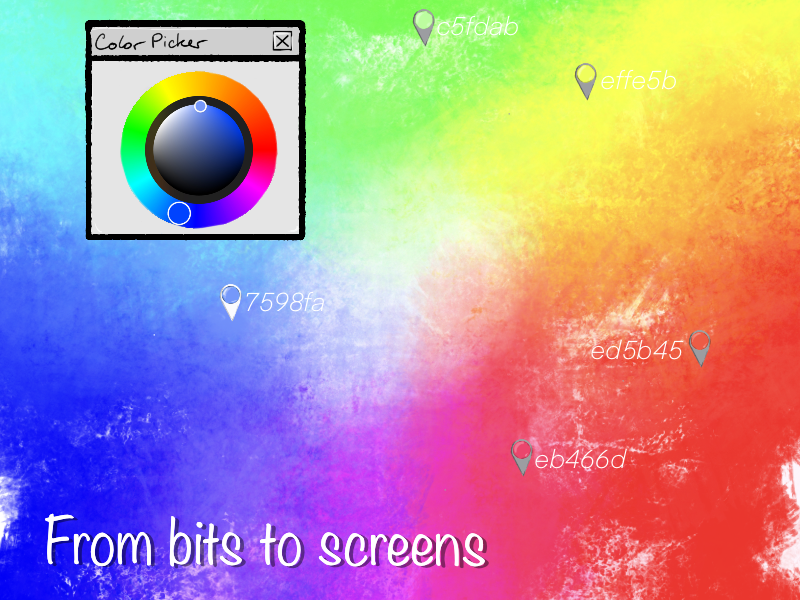
Colorwheel image taken from a screenshot of the procreate colorwheel tool.

[^zelazko225rgbcolor]: Zelazko, Alicja. 2025. “RGB Colour Model | Description, Development, Uses, Science, & Facts.” Encyclopedia Britannica, https://www.britannica.com/science/RGB-color-model.

[^christensson19rgb]: Christensson, Per. 2019. “RGB,” https://techterms.com/definition/rgb#google_vignette.

[^ibraheem12understanding]: Ibraheem, Noor, Mokhtar Mohammed Hasan, Rafiqul Zaman Khan, and Pramod Kumar Mishra. 2012. “Understanding Color Models: A Review.” *ARPN Journal of Science and Technology 2* (3): 265–275.

[^benq22why]: BenQ. 2022. “Why Don’t Colors Look the Same Across Different Devices?” https://www.benq.com/en-ca/knowledge-center/knowledge/why-dont-colors-look-the-same-across-different-devices.html.

[^rhyne17applying]: Rhyne, Theresa-Marie. 2017. "Applying Color Theory to Digital Media and Visualization." *Boca Raton, FL : CRC Press, Taylor & Francis Group* : p.4

[^Deng24rgb]: K. Deng, P. Wang and Y. Qian, "RGB Images Enhancing Hyperspectral Image Denoising with Diffusion Model," ICASSP 2024 - 2024 IEEE International Conference on Acoustics, Speech and Signal Processing (ICASSP), Seoul, Korea, Republic of, 2024, pp. 2960-2964

## Search Engine Optimization

Search Engine Optimization, also known as SEO, optimizes websites to help users find content faster and more efficiently. By developing SEO, websites are pushed to the top of the Search Engine Results Page (SERP), which allows users to engage with website content promptly. SEO also helps improve website traffic since users typically visit the top pages from their search query [^mailchimpSEO]. SEO is fundamental for web development since users rarely click on links found on the following result pages. 

Search Engine Optimization helps search engines understand the content on a website so it can process the information to help people discover content. SEO is widely used in new media for digital marketing purposes [^zilincanSEO]. To allow businesses to thrive and gain a lot of engagement with their clients they must be easily found through search engines. It helps to increase the customer base and website credibility as well. There are two types of SEO: on page and off-page optimization [^santhoshSEO]. On page delves into modifying the content and structure of a webpage like the schema and source code and adding content-specific keywords[^zilincanSEO]. Off-page SEO delves into gathering a user base from outside platforms to link to the targeted web page.

Search Engine Optimization is important in new media, since it shapes how users interact with digital content and determines what the user base sees. It structures content through SERPs and defines how it is interpreted within the digital space of the search engine[^mailchimpSEO].  SEO dictates how content is ranked, who can access it, and how algorithms influence its visibility and interpretation.

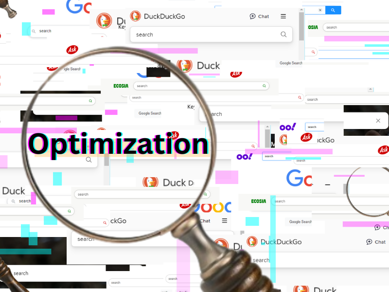 [^imageSEO]

[^mailchimpSEO]: Mail Chimp. “What Is SEO in Digital Marketing?” Mailchimp. Accessed January 29, 2025. https://mailchimp.com/marketing-glossary/seo/#:~:text=SEO%20means%20Search%20Engine%20Optimization,search%20engines%20rank%20them%20better.

[^zilincanSEO]: Zilincan, Jakub. 2015. “Search Engine Optimization.” In Proceedings of the CBU International Conference, 3:506–10. Accessed January 29, 2025. https://doi.org/10.12955/cbup.v3.645

[^santhoshSEO]:Santhosh, R.2018. “A Survey on Search Engine Optimization and Google's Search Engine Algorithms”. International Journal of Distributed and Cloud Computing 6, no. 1: 11. Accessed January 29, 2025. https://concordiauniversity.on.worldcat.org/atoztitles/link?genre=article&issn=23216840&title=International%20Journal%20of%20Distributed%20%26%20Cloud%20Computing&volume=6&issue=1&date=20180101&atitle=A%20Survey%20on%20Search%20Engine%20Optimization%20and%20Google%27s%20Search%20Engine%20Algorithms.&spage=11&pages=11-18&ID=doi:&id=pmid:&sid=EBSCO:Computers%20%26%20Applied%20Sciences%20Complete&au=Santhosh%2C%20R

[^imageSEO]:WIOR Magnifying Glass. 2025. "WIOR Magnifying Glass, 30X Handheld Magnifier." Amazon. Accessed February 8, 2025. https://www.amazon.com/WIOR-Magnifying-Magnifier-Magnification-Inspection/dp/B07RQ576YT

## UNIX

UNIX is a multiuser, multitasking operating system developed in the late 1960s and early 1970s at AT&T's Bell Labs by Ken Thompson, Dennis Ritchie, and others. Known for its simplicity, portability, and powerful capabilities, UNIX has been influential in the development of many modern operating systems.[^raymond03art]

UNIX was created at AT&T's Bell Labs in the late 1960s by Ken Thompson, Dennis Ritchie, and others. The name “UNIX” is a pun on “Multics,” an earlier operating system project, reflecting its creators' intent to develop a simpler, more streamlined system.[^salus94quarter]

In new media studies, UNIX is significant because it provides a stable and flexible platform for various digital media applications. Its design principles have influenced the development of tools and systems that support multimedia processing, web hosting, and content creation. The UNIX philosophy of building simple, modular tools that can be combined in complex ways aligns with the collaborative and participatory nature of new media.[^mcilroy78unix]

Many contemporary operating systems, such as Linux and macOS, are derived from or influenced by UNIX. These systems are widely used in media production, web development, and other digital content creation fields. The command-line interface and scripting capabilities of UNIX allow for efficient processing and manipulation of media files, making it a preferred choice for professionals in the industry.

[^raymond03art]: Raymond, Eric S. 2003. _The Art of Unix Programming_. Addison-Wesley.

[^salus94quarter]: Salus, Peter H. 1994. _A Quarter Century of Unix_. Addison-Wesley.

[^mcilroy78unix]: McIlroy, M. D. 1978. "Unix Time-Sharing System: Foreword." _The Bell System Technical Journal_ 57 (6): 1899–1904.

## User Interface (UI)
A user interface (UI) is the medium through which humans interact with devices. It includes physical tools like keyboards and touchscreens as well as visual elements such as icons, buttons and animations. Some more concrete example include a computer mouse, remote control and virtual reality headsets.[^hashemi24ui]

### History of UI
Early humans used hieroglyphs to communicate. They are universally understood symbols and modern UI design uses this practice with its emphasis on icons and emojis to indicate an action. The typewriter was a pivotal innovation during the age of the machine as it introduced a tactile user interface. This later influenced the design of computer keyboards and digital text interfaces.[^reidworld] However, more concrete work on the user interface began with the development of a graphical user interface (GUI) based on Douglas Engelbart’s work on interactive computing in 1968. He was inspired by calls for technological advancements to do social good after World War II. Xerox PARC further refined GUI concepts, leading to commercial adaptations like Apple's Macintosh and Microsoft Windows. These innovations made computing from a command-line system that was only accessible to experts into a more intuitive and visual experience for everyday users. However, commercial interests began to influence user interface design. The priority is ease of use and market dominance over the original vision of deeper human-computer interactions.[^barnes10history]

### UI Today
User interface (UI) is essential in today's increasingly digital world because it determines how users interact with technology. UI is directly tied to modern digital experiences. With the shift from Web 1.0 to Web 3.0, interfaces have adapted to allow more participation and personalization. Now, UI has advanced to natural user interfaces (NUI), which include voice commands, motion gestures and even biological signal recognition. This allows for more human-like interactions with technology. UI is evolving in industries like gaming, mobile devices and smart applications as human needs change.[^sharma21ui] It does so based on user experience which is another facet of human-computer interaction.[^hashemi24ui]

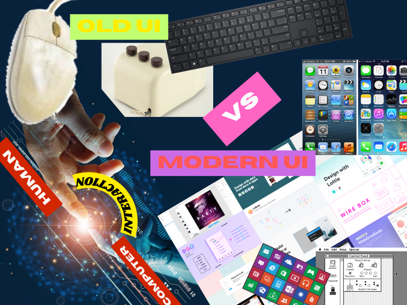 [^dell25keyboard][^tisanti16mouse][^rethin23humam][^wongios][^kamushken20figma][^elius20macintosh][^dev13microsoft]

[^dell25keyboard]: Dell. 2025. “Dell Wireless Keyboard KB500 Product Image.” Dell Canada. Accessed February 9, 2025. https://www.dell.com/en-ca/shop/dell-wireless-keyboard-kb500/apd/580-aklj/pc-accessories.

[^tisanti16mouse]: TiSanti. 2016. "Old Computer Mouse." iStock. Accessed February 9, 2025. https://www.istockphoto.com/photos/old-computer-mouse.

[^rethin23humam]: Rethinagiri, G. M. 2023. "Human-Computer Interaction with Computer Vision: Challenges and Innovations." Medium. Accessed February 9, 2025. https://medium.com/@gmrethinagiri1507681/human-computer-interaction-with-computer-vision-challenges-and-innovations-b99c24c8e6ff.

[^rr20mouse]: RR Auction. 2020. "Ground-breaking Engelbart 3-button computer mouse goes to auction." New Atlas. Accessed February 9, 2025. https://newatlas.com/computers/first-computer-mouse-engelbart-sale/.

[^wongios]: Wong, Lauren. n.d. "iOS: The User Interface Design Journey." Sush Labs. Accessed February 9, 2025. https://www.sushlabs.com/blog/ios-the-ui-design-journey.

[^kamushken20figma]: Kamushken, Roman. 2020. "Best Figma Plugins for 2020 Which Deserve Your Attention." Medium. Accessed February 9, 2025. https://kamushken.medium.com/best-figma-plugins-for-2020-which-deserve-your-attention-d542cc56aee0.

[^elius20macintosh]: Eliuseev, Dmitrii. 2020. "The 1984 Apple Macintosh: How Does It Look Today?" UX Design. Accessed February 9, 2025. https://uxdesign.cc/the-1984-apple-macintosh-how-does-it-look-today-d08dde79da05.

[^dev13microsoft]: DevToolsGuy. 2013. "An Introduction to the Microsoft 'Modern UI' Design Philosophy." Infragistics Blog. Accessed February 10, 2025.

[^hashemi24ui]: Hashemi-Pour, Cameron, and Fred Churchville. 2024. “User Interface (UI).” TechTarget. https://www.techtarget.com/searchapparchitecture/definition/user-interface-UI.

[^reidworld]: Reid, Danielle. n.d. “The World Is Our Interface: The Evolution of UI Design.” Toptal. https://www.toptal.com/designers/ui/touch-the-world-is-our-interface.

[^barnes10history]: Barnes, Susan B. 2010. "User Friendly: A Short History of the Graphical User Interface." _Sacred Heart University Review_ 16 (1): 4.

[^sharma21ui]: Sharma, Vatsal, and A. Kumar Tiwari. 2021. "A study on user interface and user experience designs and its tools." _World Journal of Research and Review (WJRR)_ 12, (6): 41-45.

## Virtual Environment

Virtual environments are the technology which facilitates interactions between users and computer-generated artificial environments.[^ve3] These interactive computer displays are designed to create the illusion that the user has been transported to a different location.[^ve1] In a virtual world, the user can use their senses and their body in a similar way to the real world. They can turn their head to see their surroundings, trace sounds to the direction they are coming from, and use their hands to pick up virtual objects [^ve2]. Virtual environments are thus the most natural form of interaction between humans and computers.[^ve2] 

[^reschke07wallpaper]

[^ve1]: Ellis, Stephen R. 1994. “What Are Virtual Environments?” _IEEE Computer Graphics and Applications_ 14 (1): 17–22. https://doi.org/10.1109/38.250914.
[^ve2]: Mine, Mark R. 1995. “Virtual Environment Interaction Techniques.” _UNC Chapel Hill Computer Science Technical Report TR95-018_.
[^ve3]: Youngblut, Christine, Rob E. Johnston, Sarah H. Nash, Ruth A. Wienclaw, and Craig A. Will. 1996. _Review of Virtual Environment Interface Technology_. Alexandria, VA: Institute for Defense Analyses. Accessed January 20, 2025. https://apps.dtic.mil/sti/tr/pdf/ADA314134.pdf.
[^reschke07wallpaper]: Reschke, Michael. 2007. “800x600 Wallpaper Blue Sky.png.” Wikimedia Commons. December 27. https://commons.wikimedia.org/wiki/File:800x600_Wallpaper_Blue_Sky.png.
## Virtuality

Virtuality refers to how we live, work, and interact through digital technology, like the internet, video games, social media, and other online platforms. Today, many parts of our lives such as work, relationships, entertainment, and even self-care happen online. This virtual world is shaped by different technologies, such as gaming software, social networks, and online communication tools. These technologies create new ways for people to interact and experience life. For example, in video games like World of Warcraft, players connect through various digital tools like blogs, forums, and chat rooms, making the game more than just the software itself [^nardi15virtuality]. Virtuality also explores how these technologies impact society, including how they change activism, work, and entertainment; emphasizing the role of digital technology in shaping how we work, connect, and have fun.

Virtual worlds like online games and platforms are spaces where artists experiment with creating and showcasing art in digital environments. These spaces let artists explore new ways of interacting with their audience and blending physical and virtual worlds. Over time, virtual art has been presented in galleries and exhibitions, encouraging collaboration and new forms of expression [^doyle15art]. Artists use these virtual spaces to reimagine art, create immersive experiences, and explore social engagement in unique ways that wouldn't be possible in the physical world.

Virtuality is the idea that something can have an effect or be experienced even if it isn't physically real. For instance, in a meeting where most committee members aren't physically there, the meeting can still happen because everyone is "virtually" present, maybe through video calls or other digital tools. Even though the people aren't in the same room, their presence is still felt, and the meeting can go on as planned [^norton72what]. Virtuality is powerful because it can fill in for what’s missing in the real world and still allow things to function as if they were real. It helps us continue with important activities, even if the real-world conditions aren't perfect.

[^doyle15art]: Doyle, Denise. 2015. “Art, Virtual Worlds and the Emergent Imagination.” *Leonardo* 48 (3): 244–50. http://www.jstor.org/stable/43832994.

[^nardi15virtuality]: Nardi, Bonnie. 2015. “Virtuality.” *Annual Review of Anthropology* 44: 15–31. http://www.jstor.org/stable/24811646.

[^norton72what]: Norton, Richard. 1972. “What Is Virtuality?” *The Journal of Aesthetics and Art Criticism* 30 (4): 499–505. https://doi.org/10.2307/429465.

## Wiki

Wikis are web-based, collaborative software that enables people to modify content by directly editing pages online.[^ebersbach05wiki] In educational contexts, they facilitate student engagement in a collaborative learning environment.[^parker07wiki]

The term "Wiki Wiki Web" was inspired by the "Wiki Wiki Shuttle" at Honolulu International Airport, as named by Ward Cunningham.[^anderson10wiki] In Hawaiian, "Wiki" means "quick" or "fast."

Wikis differ from traditional websites in that they are collaborative platforms that allow multiple users to create, edit, and organize content. Unlike traditional websites, wikis enable easy navigation between pages through interlinking and often have features such as revision history and discussion pages to track changes and facilitate communication among users. Wikis are commonly used for knowledge management, project collaboration, and intranet applications, and they can be utilized to display information, store corporate records, or serve as knowledge bases for various subjects. While traditional websites are typically front-end oriented, wikis act as a hybrid between an information system and an information displayer, allowing for quick and easy content creation and updates by users with minimal technical skills.[^hester09analysis]

There are numerous platforms for running wikis. Among the most popular are  [MediaWiki](https://www.mediawiki.org/), [DokuWiki](https://www.dokuwiki.org/dokuwiki), and [GitHub](../main/glossary.md#GitHub).

[^anderson10wiki]: Anderson, Melanie O., and Jon R. Serra. 2010. “Is that a Wiki in Your Classroom?.” In *Proceedings of the 2010 Association of Small Computers Users in Education (ASCUE) Conference*.

[^ebersbach05wiki]: Ebersbach, Anja, Markus Glaser, and Richard Heigl. 2005. “The Wiki Concept.” In *Wiki - Web Collaboration*, 1-24. Berlin: Springer.

[^parker07wiki]: Parker, Kevin, and Joseph Chao. 2007. “Wiki as a Teaching Tool.” *Interdisciplinary Journal of E-Learning and Learning Objects* 3 (1): 57–72.

[^hester09analysis]: Hester, Andrea J. 2009. Analysis of factors influencing adoption and usage of knowledge management systems and investigation of wiki technology as an innovative alternative to traditional systems. PhD diss., University of Colorado at Denver.

## XML

**XML (Extensible Markup Language)** is a flexible, text-based format for storing and transporting data. It uses a set of rules for encoding documents in a human-readable and machine-readable format.

The **World Wide Web Consortium (W3C)** developed XML in the late 1990s to address the need for a universal data format on the Internet. It was officially released in 1998 as a simplified version of **SGML (Standard Generalized Markup Language)**, aiming to make data more portable across platforms and applications. Over time, XML became integral for web services, configuration files, and data storage.

### The Role of XML in New Media

In the evolving landscape of new media, **XML (Extensible Markup Language)** plays a crucial role in efficiently structuring, organizing, and transmitting data. As digital communication and multimedia platforms expand, XML provides a standardized format that enables seamless integration across different systems, making it an essential tool for modern content management and distribution.

One of XML’s primary new media applications is **web content management**. Many content management systems (CMS) use XML to structure and store data, allowing easy updates and interoperability between different platforms. By providing a standardized format, XML ensures that digital content remains accessible and adaptable across various devices and screen sizes, making it easier to manage websites dynamically.

Another critical application is **RSS feeds**, which utilize XML to distribute news and updates in a structured format. Many websites, blogs, and news outlets rely on XML-based RSS feeds to deliver real-time content to users and aggregators, ensuring that information reaches audiences efficiently. This capability has transformed how people consume news and digital content by automating the process of content syndication.

XML is widely used in multimedia applications in addition to text-based media. SMIL (Synchronized Multimedia Integration Language) and SVG (Scalable Vector Graphics) leverage XML to create interactive and scalable media experiences. These formats allow developers to build animations, interactive graphics, and other rich media content while maintaining cross-platform compatibility.

Furthermore, XML is integral to data exchange in web services. Many APIs, including those that power social media, streaming platforms, and e-commerce sites, use XML to structure and transmit data between servers and clients. SOAP (Simple Object Access Protocol) and RESTful web services frequently employ XML to ensure seamless data communication across different systems.

XML is a foundational technology in new media, enabling structured content management, automated content distribution, rich multimedia experiences, and efficient data exchange. As digital media continues to evolve, XML remains a vital tool for ensuring interoperability, scalability, and accessibility in the ever-changing digital landscape.

[^vanderaalst25xml]: van der Aalst, Wil M.P. 2025. “Patterns and XPDL: A Critical Evaluation of the XML Process Definition Language.” _Department of Technology Management, Eindhoven University of Technology, The Netherlands_, February 2. PDF Document.  

[^feng24xml]: Feng, Dujuan. 2024. “New Media Advertising Information Search Method Based on XML Technology.” _International Journal of High Speed Electronics and Systems_, October 18, 2540033. https://doi.org/10.1142/S0129156425400336.  

[^wikipedia25xml]: Wikipedia. 2025. “XML.” _Wikipedia_, February 9, 2025. https://en.wikipedia.org/w/index.php?title=XML&oldid=1274745213.  

