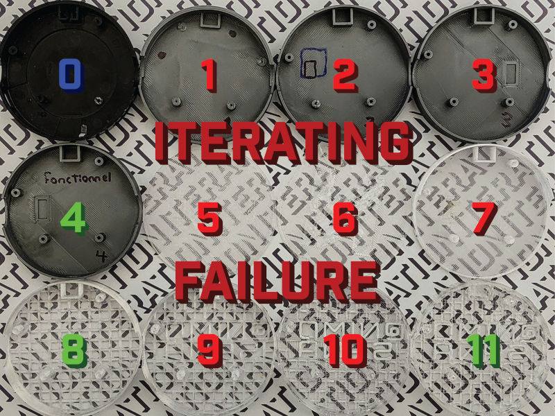

# Glossary of keywords related to new media.

The following list of keywords related to new media is constantly updated by the CART210 community throughout the term.

Each student is responsible for choosing and maintaining a set of three keywords. You will research about, define, and exemplify these terms. Your task involves improving the concepts throughout the term. 

For each keyword, cite at least three references. Ensure that at least two of these are from academic sources, such as journal articles, books, or conference papers. Citations must follow the Chicago author-year format.

>[!IMPORTANT]
To make your contributions and suggest changes, follow the instructions in the repository's [README](https://github.com/concordia-dcart/CART210-glossary/blob/main/README.md) file.

---
## Affordance

Gibson coined the term “affordance” to describe what the environment “offers the individual, what it provides or furnishes, either for good or ill” 

Affordances can be viewed as animal-relative properties of the environment. They correspond to the action possibilities offered to an animal by the environment with reference to the individual’s action capabilities. For example, a leaf provides support for a wasp but not for a dog. Here, the support-ability of the leaf is an affordance for the wasp. 

Affordances can vary not only between species but also between the individuals of the same species. A 30-cm stair is climb-able for an adult but not for a child. In sum, affordances are neither objective nor subjective, but both. They are objective because they exist independently of the act of perception. But, they are also subjective because the frame of reference is the individual’s action capabilities. 

Gibson also assumed that affordance perception does not need information processing or internal representations. Rather, affordance perception is direct, corresponding to a learning process based on the extraction of invariants. An animal perceives walk-ability if it sees a flat, extended, rigid, horizontal surface, because this combination of invariants affords support.

**Physical versus learned affordance**

Norman was inspired by the dichotomy between the ventral system and the dorsal system and drew a close parallel between the functions of the dorsal system and affordances. Specifically, he stressed that some statements made by Gibson were somewhat equivocal. For example, Gibson wrote that the ‘values’ and ‘meanings’ of things in the environment can be directly perceived” or “postboxes afford letter mailing”. Norman proposed that only “physical affordances” are perceived by the dorsal system. So, in the aforementioned example of the postboxes, it would be better to say that slot in the mailbox affords inserting an object of appropriate size and shape.

By contrast, the ventral system is in charge to assign meanings to things, and particularly to provide information about the conventional uses of familiar tools (i.e., familiar tool use). In this case, Norman suggested the notion of “learned affordance”. The physical versus learned affordance dichotomy mirrors the novel versus familiar tool use opposition, respectively. In this view, both types of affordances can contribute to tool use, even though the ability to perform familiar tool use might be one of the properties of the ventral system. 
Importantly, this dichotomy also implies that the perception of physical affordances (dorsal system) guides not only body actions within a hand-centered frame of reference (e.g., reaching, grasping) but also novel tool use, namely, actions involving a toolcentered frame of reference. We see a contradiction in Norman’s argument as he also suggested that the transformation of visual information into a tool-centered framework (called allocentric by Norman) is the specific function of the ventral system (i.e., learned affordance).

By contrast, the dorsal system is responsible for the transformation of “visual information into an egocentric framework allowing the actor to grasp or otherwise bodily manipulate the object” 
Norman and Young (2006) have suggested that the perception of affordances – and more specifically of physical affordances for Norman – might be supported by the dorsal system. The same theoretical rapprochement may be envisaged between the dorsal system and the affordance route to action. Nevertheless, Yoon and Humphreys (2007) argued that such a rapprochement remains to be demonstrated, notably because of studies indicating that action decision tasks can activate the left inferior temporal lobe (i.e., the ventral system).[^neuro&behavior01affordance]

## Affordance with technology 

The concept of affordance has different interpretations in the field of Human-Computer Interaction (HCI). However, its treatment has been merely as a one-to-one relationship between a user and a technology. We believe that a broader view of affordances is needed which encompasses social and cultural aspects of our everyday life.
An interaction-centered view of affordance suggests that affordance is an interpretative relationship between users and the technology that emerges during the users’ interaction with the technology in the lived environments.
There are two types of affordances.

**1-	Affordance in Information**
Refers to users’ understanding of a technology based on their semantic (Semantic interpretation is concerned with the meaning of words, phrases, sentences, or even entire texts. It focuses on understanding the meaning conveyed by language) and syntactic (Syntactic interpretation deals with the structure of sentences or phrases. It focuses on how words are arranged in a sentence and the rules governing their arrangement) interpretation. 

**2-	Affordance in Articulation**
Refers to users’ interpretations about the use of the technology.

The cultural notions on affordance are necessary since the technology, such as mobile and pervasive systems, is becoming part of our every-day lives. The way in which these technologies affect people has changed over time. The forms of these systems and their use are becoming more and more complex and it is likely that they may be perceived and acted upon in different ways by different groups of people. More importantly, the goals of interactive system design are shifting from the mere functionality, usability, productivity and effectiveness to enjoyment, pleasure, fun, and curiosity to other experiential aspects.
What these systems offer and how users signify and use the systems is also changing. As the technology becomes a part of our work, home and leisure environments, the limited and redusive notions of affordances need to be reconsidered. The social notions on affordance are now necessary since users and other relevant agents collectively play an important role in defining meanings of technological systems. During the technology use, users continuously interpret and reconstruct the meanings related to the technology, which makes it difficult to understand the phenomenon behind affordances.[^technology02affordance]

## Perceived affordance

The designer cares more about what actions the user perceives to be possible than what is true. Moreover, affordances, both real and perceived, play very different roles in physical products than they do in the world of screen-based products. In the latter case, affordances play a relatively minor role: cultural conventions are much more important. More on that in a moment. In product design, where one deals with real, physical objects, there can be both real and perceived affordances, and the two sets need not be the same. In graphical, screen-based interfaces, the designer primarily can control only perceived affordances. The computer system already comes with built-in physical affordances. The computer, with its keyboard, display screen, pointing device, and selection buttons (e.g., mouse buttons) affords pointing, touching, looking, and clicking on every pixel of the screen. Most of this affordance is of little interest for the purpose of the application under design. Although all screens within reaching distance afford touching, only some can detect the touch and respond to it. Thus, if the display does not have a touch-sensitive screen, the screen still affords touching, but it has no effect on the computer system. 

The traditional computer screen where the user can move the cursor to any location on the screen and click the mouse button at anytime. In this circumstance, designers sometimes will say that when they put an icon, cursor, or other target on the screen, they have added an “affordance” to the system. This is a misuse of the concept. The affordance is independent of what we see on the screen, what is displayed is not an affordance it is more of visual feedback that ADVERTISES the affordance, which makes it a perceived affordance. The difference is important because they are independent design concepts: the affordances, the feedback, and the perceived affordances can all be manipulated independently of one another.

Perceived affordances are sometimes useful even if the system does not support the real affordance.

Real affordances do not always have to have a visible presence (and in some cases, it is best to hide the real affordance).

The presence of feedback can dramatically affect the usability and understandability of a system, but quite independently of the affordances or their visibility.

The most important design tool is that of coherence and understandability, which comes through an explicit, perceivable conceptual model. Affordances specify the range of possible activities, but affordances are of little use if they are not visible to the users. Hence, the art of the designer is to ensure that the desired, relevant actions are readily perceivable.

Don’t confuse affordances with perceived affordances.
Don’t confuse affordances with conventions. Affordances reflect the possible relationships among actors and objects: they are properties of the world. Conventions, conversely, are arbitrary, artificial, and learned. Once learned, they help us master the intricacies of daily life, whether they be conventions for courtesy, for writing style, or for operating a word processor. Designers can invent new real and perceived affordances, but they cannot so readily change established social conventions.[^perceivedaffordance03affordance]

[^neuro&behavior01affordance]:Osiuraka, François, Yves Rossettic, and Arnaud Badet. June 1st 2017 _"What is an affordance? 40 years later."_ Neuroscience and Biobehavioral Reviews, volume 77 :pages 403-417. Accessed january 16th 2024.
https://www.sciencedirect.com/science/article/pii/S0149763416305061 

[^technology02affordance]:Vyas, Dhaval, Cristina M. Chisalita, and Gerrit C. van der Veer. 2006. _‘Affordance in Interaction’_. In Proceedings of the 13th Eurpoean Conference on Cognitive Ergonomics: Trust and Control in Complex Socio-Technical Systems, 92–99. ECCE ’06. New York, NY, USA: Association for Computing Machinery. https://doi.org/10.1145/1274892.1274907.

[^perceivedaffordance03affordance]:Norman, Donald A. 1999. *‘Affordance, Conventions, and Design’*. Interactions 6 (3): 38–43. https://doi.org/10.1145/301153.301168.

## Agency 

Agency is the “capacity, condition, or state of acting or of exerting power”. [^MerriamWeb24agency] One’s sense of self-agency - that is the sense that there is an “I” who is generating an action - largely depends on “the degree of discrepancy resulting from comparison between the predicted and actual sensory feedback”. [^Sato05agency] The concept is highly applicable to studies of [human-Computer Interaction](../main/glossary.md#computer-human_interaction).

Agency is felt by degrees: one can feel more or less in control. This variation is particularly clear when a [user](../main/glossary.md#user) interacts with a machine: the feeling of control varies between different operator inputs and expected machine response. 

Often, one may knowingly act with agency and receive the expected result of an act. However, these judgements of agency frequently do not follow actual control in situations where agency might be ambiguous.  [^Sato05agency]

Feminist theory has done a lot of the heavy lifting to develop "agency" as a concept, discussing who in society has agency - the ability to exert power - and who does not, and is therefore not fully human[^Davies91agency] (women, children, the insane, the machine).

Image made of a composition of [^Drexler16agency] [^Al24agency] [^tumblr24agency]

[^Davies91agency]: Davies, Bronwyn. 1991. “THE CONCEPT OF AGENCY: A Feminist Poststructuralist Analysis.” *Social Analysis: The International Journal of Social and Cultural Practice*, no. 30: 42–53.

[^MerriamWeb24agency]: “Definition of AGENCY.” 2024. January 28, 2024. https://www.merriam-webster.com/dictionary/agency.

[^Sato05agency]: Sato, Atsushi, and Asako Yasuda. 2005. “Illusion of Sense of Self-Agency: Discrepancy between the Predicted and Actual Sensory Consequences of Actions Modulates the Sense of Self-Agency, but Not the Sense of Self-Ownership.” *Cognition* 94 (3): 241–55. https://doi.org/10.1016/j.cognition.2004.04.003.

[^Drexler16agency]: Drexler, Doug. “LCARS Interface - Star Trek Deep Space Nine - TV".  2016. ArtStation. April 8, 2016. https://www.artstation.com/artwork/EbP8n.

[^Al24agency]: Alrubaie, Dun. “Hand Reaching out to an Orange Sky · Free Stock Photo.” Accessed February 11, 2024. https://www.pexels.com/photo/hand-reaching-out-to-an-orange-sky-9740932/.

[^tumblr24agency]: thevaultofretroscifi. “Thevaultofretroscifi.” Tumblr. Tumblr (blog). Accessed February 11, 2024. https://thevaultofretroscifi.tumblr.com/post/138664053372.

## API
The Application Programming Interface (API) is responsible for transmitting data from one device to another by taking in a request and responding with the data requested.

### Advantage and Purpose of APIs

The advantage of using an API to communicate between the client and the server rather than sending a direct query to the databases is that it protects the database from potential security risks. It also allows developers to keep a similar syntax when requesting data from any type of database. [^dreanfactory2023understanding]
The purpose of an API is to provide the client, whether a mobile application, website or other software, the information to build their product.

Several APIs are available on the Internet with different sets of data pertinent for various purposes. For example, if making an application that gives information on the weather, an API for the weather would be used to gather the necessary information. The developer or client would send a request to the API server that would return a response including some data. Using APIs also helps construct flexible applications by allowing developers to add functionalities easily to an existing project.[^aws24what] Anyone can easily integrate APIs into their projects by searching for them online. However, they are mostly implemented by programmers since it is not meant to be used by the end-user.[^wiki24api]

### Types of APIs
There are several types of APIs available for developers depending on the needs of a project. Each type of API has its own architecture and data formats.
#### Representational State Transfer (REST or RESTful):
The architecture of the REST API relies on six constraints, a uniform interface, a client-server decoupling, statelessness, storing cache, a layered system architecture and code on demand.
This gives developers consistent data that are uniform and predictable, making it easier for them to understand and put the information requested to use. The data can be delivered in several kinds of formats such as JSON, HTML, SLT, Python, PHP and plain text.
This type of API is ideal for web and mobile applications as it allows flexibility in programming languages. It is also able to handle large numbers of users simultaneously.[^ibm24what]

#### Simple Object Access Protocol (SOAP):
SOAP API, in comparison to REST API, is more rigid in its structure and only returns data in an XML format. It is most used when building on outdated systems which already use the protocol. There are also advantages in using SOAP for its tighter security beneficial to internal applications. It is also a better option if the integrity of the data is important as it implements the Atomicity, Consistency, Isolation, and Durability (ACID) properties. It is more reliable at the cost of less flexibility.[^aws24soap]

#### GraphQL (Query Language):
GraphQL is a query language signifying that the developer can use queries to request specific data. The string is sent to the server for interpretation and responds to the request with a JSON. It was developed by Facebook[^meta15graphql] and is the most modern standard for APIs after REST. It allows developers to avoid over-fetching data and only collecting what they request.[^graphql24basics] The developer can specify the structure of the response it needs for certain tasks. Additionally, GraphQL can retrieve the required data with a single request which reduces redundant communication between the client and the server.

### APIs and Art
Some museums have incorporated new technologies in the recent decade by [digitalizing](../main/glossary.md#Digitization) their collections to provide wider accessibility. By openly sharing a database of their art collections online, anyone with Internet access can view the collections through the museum's API. For example, the Metropolitan Museum of Art introduced the Metropolitan Museum of Art Met Collection API with an Open Access policy, allowing the distribution of their collection for the public domain. The data also includes relevant information on the history, artist and other details along with the works.[siegel18APIs] This reflects the integration of APIs in the art world and its impact on how we consume art. 

[^wiki24api]: Wikipedia. 2024. "API". Accessed January 29, 2024. https://en.wikipedia.org/wiki/API
[^aws24what]: 2024. "What is an API (Application Programming Interface)?" AWS. Accessed January 29, 2024. https://aws.amazon.com/what-is/api/.
[^dreanfactory2023understanding]: Nguyen, Spencer. 2023. "Understanding the Connection Between Databases and APIs." Accessed January 25, 2024. https://blog.dreamfactory.com/understanding-the-connection-between-databases-and-apis/#:~:text=APIs%20facilitate%20communication%20between%20applications,layer%20of%20protection%20to%20databases.
[^ibm24what]: 2024. "What Is a Rest Api?" IBM. Accessed February 26, 2024. https://www.ibm.com/topics/rest-apis. 
[^aws24soap]: 2024 "What is the Difference Between SOAP and REST?" AWS. Accessed February 26, 2024. https://aws.amazon.com/compare/the-difference-between-soap-rest/. 
[^graphql24basics]: 2024. "GraphQL is better than REST." How to GraphQL. Accessed February 26, 2024. https://www.howtographql.com/basics/1-graphql-is-the-better-rest/. 
[^meta15graphql]: Byron, Lee. 2015. "GraphQL: A data query language." Engineering at Meta. Accessed February 26, 2024. https://engineering.fb.com/2015/09/14/core-infra/graphql-a-data-query-language/
[siegel18APIs]: Siegel, Camille. 2018. "APIs and the art world: Working together for digital collaboration." Axway. https://blog.axway.com/product-insights/amplify-platform/application-integration/apis-art-world.
## Artificial life

Artificial life is a field of research ranging from computer science to biology. Its goal is to simulate various forms of life, in mathematical, computer and/or robotic form. [^Langton89systems] Artificial life thus allows the more in-depth study of the principles of life, its creation and new applications. [^Bedau&Packard94evolution]

[^Langton89systems]: Langton, C. G. (1989). Artificial life. In Artificial life (pp. 1-47). Springer, Boston, MA2
https://faculty.washington.edu/lynnhank/Langton.pdf 

[^Bedau&Packard94evolution]: Bedau, M. A., & Packard, N. H. (1994). Measurement of evolutionary activity, teleology, and life. Artificial life, 1(1-2), 11-221
https://people.reed.edu/~mab/publications/papers/alife2.pdf

Farnell R. (2000). Attempting Immortality : AI, A-Life, and the Post-humain in Greg Egan’s Permutation City

## Asset

The definition of asset in a general context is rooted in the business and economics. In a paper on the definition of a brand asset, the term is defined as a symbol that helps identify goods or services that differentiates it from its competitors.[^tollington98asset]

An asset defined more in lined with traditional media assets, whether that be an audio asset or some form of visual imagery, relates more to the term new media. 

Beyond this general definition, an asset can be defined as the relationship between the computer and the asset.[^mateas05asset] Instead of merely being a playback of sorts, it is defined by the “ratio of computation to the size of the media.” Chris Crawford coins the term “crunch per bit” as the process intensity of the computation. 

Outside of a definition of bits, an asset can also be described as an “intangible asset” as it relates to new media arts.[^tsortanidou19asset] It can play a role in defining an aesthetic or the artistic process. 

[^tollington98asset]: Tollington, Tony. 1998. “Brands: The Asset Definition and Recognition Test.” Journal of Product &#38; Brand Management 7 (3): 180–92. https://doi.org/10.1108/10610429810222822.
[^mateas05asset]: Mateas, Michael. 2005. “Procedural Literacy: Educating the New Media Practitioner.” On the Horizon 13 (2): 101–11. https://doi.org/10.1108/10748120510608133.
[^tsortanidou19asset]: Tsortanidou, Xanthippi, Thanasis Daradoumis, and Elena Barberá. 2019. “Connecting Moments of Creativity, Computational Thinking, Collaboration and New Media Literacy Skills.” Information and Learning Sciences 120 (11–12): 704–22. https://doi.org/10.1108/ILS-05-2019-0042.

## Avatar

[^avatarSourceList]

An avatar is a digital entity or body through which a human being can experience the events within a digital world, giving the user a “subject-position within a simulated environment, a vicarious body through which the player can act as an agent in a fictional world.”[^Castronova03avatar] 

The term takes its meaning from Hinduism, deriving from a Sanskrit word for “descent” and used to refer to the incarnations the Hindu god Vishnu on earth.[^Klevjer06avatar] This term has evolved to symbolize the body that we inhabit when visiting a virtual world, and that only exists there.[^Trepte/Reinecke10avatar]

The creation and use of avatars began mostly in entertainment media such as video games or virtual reality where they can be used by players to accomplish several gameplay related actions such as combat or communication.  But with the increasing popularity and accessibility of 3D art and 3D creation software, avatars have also found use in the creation of 3D artwork, from artistic screenshots to sceneries. The design of an avatar can be as grounded or fantastical as the user desires, ranging from human-like characters to fantastic beasts. Alongside this, the ever-increasing computing power and graphical capabilities of modern computers expand the options available in avatar creation, enabling users to create avatars with more and more sophisticated designs and details.
[^avatarSourceList]:All 3d models belong to their respective owners: ARC SYSTEM WORKS, NIS America, Team Reptile, Nintendo, Pupuya Games, Tango Gameworks, Valve, Antro (@antro3dcg), Rockstar, Edelweiss.

[^Castronova03avatar]:Castronova, Edward. 2003. “Theory of the Avatar.” CESifo Working Paper Series, no. 863. Munich: CESifo.

[^Klevjer06avatar]:Klevjer, Rune. “What is the avatar? Fiction and embodiment in avatar-based singleplayer computer games.” (2006).

[^Trepte/Reinecke10avatar]:Trepte S, and Reinecke L. “Avatar Creation and Video Game Enjoyment.” Journal of Media Psychology 22, no. 4 (2010): 171–84. https://doi.org/10.1027/1864-1105/a000022.

## Big Data
Big Data is the use of a large quantity of stored and analyzed information to form accurate understandings and predictions about the world. The wielding of this type of information processing has been accelerated by improvements in technology and the growing amounts of digital connections between people and organizations. [^AsktCite]

Big Data is used in everything from health care to political campaigns. Notably big data was a cornerstone of [Barack Obama’s presidential campaigns](http://www.jstor.org/stable/26466778) where personalized messaging and interaction were optimized by the assessment of potential voter preferences. [^LadonMurraycite] Large-scale data analysis was also used in the NBA to track player shooting accuracy. A sensor placed on the hoop would track and record the player’s shots from different points on the court. It would then be able to suggest where to shoot from to maximize winning potential. [^Ricecite] 
In both of these examples, real-world phenomena were tracked and enumerated. They were then sent through systems and by people who would find patterns that could predict outcomes. 

[^nosebleed22]

[^LadonMurraycite]: Landon-Murray, Michael. 2016. “Big Data and Intelligence: Applications, Human Capital, and Education.” Journal of Strategic Security 9, no. 2: 92–121. doi:10.5038/1944-0472.9.2.1514

[^AsktCite]: Akst, George. 2019. “Sponsor’s Corner: What Is a Data Scientist, Anyway?” Phalanx 52, no. 1 (2019): 58–60. https://www.jstor.org/stable/26627999.

[^Ricecite]: Rice, Mae. 2023.“25 Data Science Applications and Examples.” Built In, February 9, 2023. https://builtin.com/data-science/data-science-applications-examples. 

[^nosebleed22]: Freepik. 2022. “Nosebleed Vectors, Photos and PSD Files: Free Download.” Accessed February 11, 2024. https://www.freepik.com/search?format=search&last_filter=query&last_value=nosebleed&query=nosebleed&type=photo

## Biometrics

Biometrics refers to the measurement and statistical analysis of people's unique physical and behavioral characteristics[^Gillis2021biometric].Biometric authentication is used to verify and identify the identity of an individual[^Das2015biometric]. This way of identification is often used in settings like the airport security, health care and law enforcement[^Gillis2021biometric]. In the context of new media, biometrics can be user in fields such as [UX](../main/glossary.md#ux) to provide a more seamless user experience. For instance, biometric authentication is used to make it easier for user to open their phone or easier to save and store passwords and can even be found in smartwatches[^Schwartz2017].There are two types of biometric technologies, which include physical and behavioral. The physical biometric technologies examining the unique features of our biological self, while the behavioral is related to our mannerisms[^Das2016biometric]. Examples of biometric technologies include fingerprint recognition, vein pattern recognition, hand geometry recognition, iris recognition, retinal recognition, facial recognition, keystroke recognition and signature recognition[^Das2015biometric].
Advantages of biometrics include being more difficult to fake or steal, easy and convenient to use, stays constant trough out one’s life and nontransferable[^Gillis2021biometric]. Despite that, biometrics system can be quite costly to keep running. If the system fails to properly register someone’s biometry data, this can lead to the system being unable to identifier the user (web). Other instances where the system wouldn’t be able to identify the user is if the user get injured[^Gillis2021biometric]. For example, if the user burns their hand there is a higher change the system will not be able to recognize their fingerprint. 

[^Schwartz2017]:Schwartz, Ezra. 2017. “Exploring Experience Design : Fusing Business, Tech, and Design to Shape Customer Engagement”. Birmingham, UK: Packt Publishing. https://search.ebscohost.com/login.aspx?direct=true&scope=site&db=nlebk&db=nlabk&AN=1585789.
[^Das2015biometric]:Das, Ravindra. 2015. "Biometric Technology : Authentication, Biocryptography, and Cloud-Based Architecture". Boca Raton: CRC Press. https://doi.org/10.1201/b17640.
[^Das2016biometric]:Das, Ravindra. 2016. "Adopting Biometric Technology : Challenges and Solutions". Boca Raton: CRC Press. https://doi.org/10.1201/b19512. 
[^Gillis2021biometric]:Gillis, Alexander S., Peter Loshin, and Michael Cobb. 2021. “What Is Biometrics?” Security. https://www.techtarget.com/searchsecurity/definition/biometrics. 

 

## Blockchain

A blockchain is a shared and public ledger that stores data and is used to record transactions accross multiple computers. This database has a continuously growing list of information/records called blocks which are linked through cryptography. Every block stores a hash, history of the previous block, transactional data, date and time.[^berg18blockchain]

Blockchains are secure and maintain a decentralized record of transactions which is the reason they are used for (although not limited to) cryptocurrencies. There is no way to change a block therefore making it very safe and removes the need of third parties for transfers.[^kulhari18blockchain]

For example, blockchains are used in the monetary world for crypto currencies such as Bitcoin and Ethereum since it ensures transparency between transactions and protects the financial identity of individuals when they use crypto to buy or sell anything.[^segura23blockchain]

[^berg18blockchain]: Berg, Willem van den. 2018 “Blockchain for Fragile States: The Good, the Bad and the Ugly.” Clingendael Institute.

[^kulhari18blockchain]: Kulhari, Shraddha. 2018. “Data Protection, Privacy and Identity: A Complex Triad.” In *Building-Blocks of a Data Protection Revolution: The Uneasy Case for Blockchain Technology to Secure Privacy and Identity*, 1st ed., 23–37. Nomos Verlagsgesellschaft mbH. 

[^segura23blockchain]: Abad Segura, Emilio. 2023. “Blockchain and Cryptocurrencies in Accounting.” In *Holistic Approach to New Technologies for Secure Accounting Management*, 57–68. Dykinson, S.L.

## Blog

Blogs are similar to personal journals that are shared on the internet through a website of choice. They are updated often and are aimed for public consumption. 
Blogs tend to follow a specific format where posts are arranged in reverse chronological order. They also allow for easy interaction with others online, people 
can share their ideas and comments instantly for others to engage back.[^andrews07blog]

Blogs represent many things for many different users. It can a way to present introspective thinking, a record of daily events, a tool for political mobilization, 
a journalistic project, an open-ended literary experiment, a constant exhibition of images and/or videos, or often enough, is a different combination of things listed 
above. An early study of blogs summarize them as providing a large variety of expression within the restrictions of the simplicity of the format.[^siles11blog]

Blogs usually tend to have a header, sidebar and footer as well as the main content area. A header can include navigation or menu items, and the sidebar could include 
favourites, masterlists and more. A footer can also be included depending on what kind of blog, and it tends to show contact information.[^greatcontent22blog] However, this does not mean blogs 
are limited to follow this format, it is just commonly follows it. Blogs allow for a lot of customization, this included the format, as well as the aesthetics. 

Blogs are convenient because they allow anyone to curate a space for pretty much anything. It makes it easy for people to share their own content and thoughts, you can easily 
start posting your own writing or art no matter how niche it is.

[^andrews07blog]: Andrews, Michael. “What Is a Blog?” Essay. In Business Law Today 16, 3rd ed., 16:51–51. American Bar Association, 2007. https://www.jstor.org/stable/23296739.

[^siles11blog]: Siles, Ignacio. “From Online Filter to Web Format: Articulating Materiality and Meaning in the Early History of Blogs.” Essay. In Social Studies of Science 41, 5th ed., 41:737–58. Sage Publications, 2011. https://www.jstor.org/stable/41301958. 

[^greatcontent22blog]: GreatContent. “What Is Blogging & How to Start It?” GreatContent, November 8, 2022. https://greatcontent.com/pillar/what-is-blogging/. 

## Brain Interfaces

[^Angelsimon]

Brain Interfaces, also commonly called Brain-computer interfaces (BCIs) enables users to send messages or commands directly via brain activity, without movement. It is a communication system in which messages or commands of an individual sending it to the external world do not pass through the brain’s normal output pathways of peripheral nerves and muscles.[^GugerChris]

Brain-compiter interfaces raise and confront on level of philosophical and cultural questions to be asked. Initially, known in the realm of science fiction and popular movies, such as The Matrix(1999), the audiences has been confronted ot this idea of being connected via the brain/spine "plugged" to a virtual reality world or memory upload.[^CaldwellEverett]

In the view of Hayles, she engages with the facts that the body can be integrated with technology or without technology, but stands with the complexity of the material world: "If my nightmare is a culture inhabited by posthumans who regard their bodies as fashion accessories rather than the ground of being, my dream is a version of the posthuman that embraces the possibilities of information technologies without being seduced by fantasies of unlimited power and disembodied immortality, that recognizes and celebrates finitude as a condition of human being, and that understands human life is embedded in a material world of great complexity, one on which we depend for our continued survival."[^Hayles]

[^Angelsimon]: Simon, Angel. "Textura de un cerebro fresco de cordero". Education License - Adobe Stock. Assessed February 12, 2024. https://stock.adobe.com/ca/Library/urn:aaid:sc:VA6C2:82f1f676-07ac-428f-92d4-006bfcf3333e?asset_id=123121549.

[^GugerChris]: Guger, Christoph, Allison, Brendan Z., and Aysegul Gunduz. 2021. "Brain-Computer Interface Research: A State-of-the-Art". Brain-Computer Interface Research, SpringerBriefs in Electrical and Computer Engineering.

[^CaldwellEverett]: Everett, Anna, Caldwell, John T. 2003. "New Media: Theories and Practices of Digitextuality". Routelegde.

[^Hayles]: Hayles, Katherine. 1999. "How We Became Posthuman: Virtual Bodies in Cybernetics, Literature, and Informatics." University of Chicago Press.

## CMOS

CMOS (Complementary metal–oxide–semiconductor), is a type of transistor that is typically used for IC (integrated circuit) chips like microcontrollers, and memory chips. [^WikiCMOS]

CMOS typically refers to a CMOS chip in a computer motherboard, which holds the BIOS settings of the computer in a RAM chip. This chip mainly consists of interpolation filters, RAM chips, and RAM address buffers. [^layoutCMOS]

This chip needs to be powered by a coin battery, best known as a CMOS battery. Without this battery, the CMOS chip loses power, and loses the BIOS settings as well as the accurate time of the computer. [^WikiCMOSChip]

[^WikiCMOS]: Wikipedia contributors. (2024c, March 22). CMOS. Wikipedia. https://en.wikipedia.org/wiki/CMOS

[^layoutCMOS]: Baker, R. Jacob. CMOS: circuit design, layout, and simulation. John Wiley & Sons, 2019.

[^WikiCMOSChip]: Wikipedia contributors. (2024, January 16). Nonvolatile BIOS memory. Wikipedia. https://en.wikipedia.org/wiki/Nonvolatile_BIOS_memory

## CMYK

CMYK is a color model used in printing. It is an abbreviation of **C**yan, **M**agenta, **Y**ellow, and **K**ey[^pham07cmyk] (black, which refers to printing plates being keyed or aligned to the black printing plates) which provides a more reliable reproduction of images that RGB cannot provide. It is also used quite a bit thanks to its incredible accuracy that it can hold.[^liu19cmyk] While it is not the most accurate with darker tones (leading it to become lighter in rare cases) it still holds up to be the most accurate.

While it has many uses, the most used ways are in medicine and printing processes. 

For medical use, it is used as an analysis tool as you can adapt the CMYK models for use to find certain stains in the cells. For example, in a study conducted to attempt to be able to find IHC (immunohistochemistry) stains, researchers edited the CMYK model to be able to read better the IHC as well as being able to tell STAT3 levels easier thanks to the better Yellow channel.

For printing, as it’s most common usage. It is used side by side with Pantone as they are the two printing styles that offer the most accurate version of the original image/as the creator intends.[^plumgrove07cmyk] As screens normally use RGB, most software defaults with RGB which makes it so that printers normally turn the image into CMYK for easier printing.

[^pham07cmyk]: Pham, Nhu-An, Andrew Morrison, Joerg Schwock, Sarit Aviel-Ronen, Vladimir Iakovlev, Ming-Sound Tsao, James Ho, and David W Hedley. “Quantitative Image Analysis of Immunohistochemical Stains Using a CMYK Color Model.” Diagnostic Pathology, February 27, 2007. https://diagnosticpathology.biomedcentral.com/articles/10.1186/1746-1596-2-8. 

[^liu19cmyk]: Liu, Qiang, Zheng Huang, Michael R. Pointer, and M. Ronnier Luo. “Optimizing the Spectral Characterisation of a CMYK Printer with Embedded CMY Printer Modelling.” MDPI, December 5, 2019. https://www.mdpi.com/2076-3417/9/24/5308. 

[^plumgrove07cmyk]: “What Is CMYK Color?” Plum Grove, January 21, 2022. https://plumgroveinc.com/what-is-cmyk-color/. 

## Codec

A "codec," which stands for "coder-decoder" or "compressor-decompressor," is a type of technology primarily used in digital media for encoding and decoding audio and video streams. The primary purpose of a codec is to compress large multimedia files to reduce their size for more efficient storage and faster transmission over networks, which is particularly vital in applications like webcasting, video conferencing, and online streaming.

Codecs work by compressing (coding) a media file when it is saved or transmitted and then decompressing (decoding) it for playback or editing. This process involves removing redundant or unnecessary data, and in some cases, data that is less perceivable to human senses, such as inaudible sounds in audio (as seen in MP3 codecs). The level of compression can vary, with some codecs prioritizing higher compression rates to save on bandwidth and storage, while others focus on retaining higher quality with less compression.

Different codecs are optimized for specific types of data. For instance, some are tailored for human speech, making them ideal for voice calls or audio books, while others are designed for high-fidelity music or complex video sequences[^kerdranvat20codec]. The effectiveness of a codec is a balance between the processing power required for compression and decompression, and the level of compression achieved. More efficient codecs that achieve higher compression rates typically require more processing power, which can be a consideration for devices with limited computational resources.

The development and evolution of codecs have played a pivotal role in shaping the handling of multimedia on the Internet[^chen18codec]. For example, the introduction of the MP3 format revolutionized the music industry by allowing for the easy digital distribution of music, albeit raising significant copyright issues. Similarly, advancements in video codecs, such as AV1, HEVC, and AVC, have significantly impacted online video streaming, providing high-quality video at lower bandwidths.

In the realm of visual arts, the artistic exploration of codecs is exemplified by German artist Thomas Ruff's JPEGs series. Starting in 2002, Ruff used digital photographs taken by himself and from the web, compressed using the maximum rate, and then decompressed into large-scale prints. This method of hypercompression and enlargement highlights the mathematical infrastructure of the JPEG image, exposing the pixel blocks into which the image is split during the compression process. Ruff's work turns a digital artifact (pixelation) into a default aesthetic, reflecting how JPEG has become the modern default mode of viewing images online and on-screen. This illustrates a shift from geometric projection to algorithmic processing in image creation, emphasizing that 'photographic' now denotes a specific mode of image processing, with the mathematical matrix used during compression as the new 'architectural order' of the image[^hoelzl13codec].

The ongoing innovation in codec technology, including the development of both proprietary and open-source variants, continues to be integral to enhancing multimedia experiences on the Internet. This is especially evident in the increasing demand for codecs that can provide high video compression efficiency in the face of rising video data traffic, balancing the need for quality, bandwidth availability, and processing capability.

[^kerdranvat20codec]: Kerdranvat, Michel, Ya Chen and Rémi Jullian. 2020. "The Video Codec Lanscape in 2020." 

[^chen18codec]: Chen, Yue, Debargha Murherjee and Jingning Han. 2018. "An Overview of Core Coding Tools in the AV1 Video Codec."

[^hoelzl13codec]: Hoelzl, Ingrid and Remi Marie. 2013. "CODEC: on Thomas Ruff's JPEGs."

## Compression
Compression (or in this case Data Compression) is a process that computers[link] have for a multitude of reasons but mainly to reduce the size of digital files.[^adobecompression] There are many types of compression; image compression, audio compression, and file compression just to name a few. For all of the previously stated, they can either have [lossy](../main/glossary.md#lossy) or [lossless](../main/glossary.md#lossless) compression. 

The main idea of compression is for the selected file to have more effective density and be able to communicate the information internally more easily (for example, open a file more easily or transfer the file around the computer).[^lelewer97compression] Data compression is extremely important for the effectiveness of a computer because of reasons such as less space taken in the storage which means the file will use less RAM (memory) when opening.[^tuteja04compression]

[^adobecompression]: Adobe. “Lossy vs Lossless Compression: Differences & Advantages | Adobe.” www.adobe.com, n.d. https://www.adobe.com/uk/creativecloud/photography/discover/lossy-vs-lossless.html.
[^lelewer97compression]: Lelewer, Debra A., and Daniel S. Hirschberg. “Data Compression.” ACM Computing Surveys 19, no. 3 (September 1987): 261–96. https://doi.org/10.1145/45072.45074.
[^tuteja04compression]: Tuteja, Deepa, Ethan Miller, and Scott Brandt. “MRAMFS: A Compressing File System for Non-Volatile RAM †,” 2004. https://users.soe.ucsc.edu/~elm/Papers/mascots04mramfs.pdf.

//need to delete, info now under human-computer_interaction.md

## Copyright

Copyright is a right that allows people to copy or recreate a work, ranging from artistic creations to a computer program. A person who owns the copyright of a certain work owns all the rights to it. It is used to protect it's creators from having their work copied, sold or posted online without their permission. Creators can extend the copyright to another person if they choose to do so.[^govcan23copyright] The laws of copyright vary from country to country, with some laws being stricter than others.

The first copyright law passed in America was in 1790 in the United States, which initially protectected books, maps and charts. In the 1800s, other mediums were added such as published music, dramatic works and works of art. Motion pictures were added as early as 1912 and computer programs joined the list in the late 80s. With the arrival of VHS tapes, the laws were updated to prevent private recordings from being sold.[^davidson00copyright]

Copyright can expire after a certain amount of years. The time it takes for it to expire may vary on the country. It would then fall into the public domain, where it becomes available to be used, distributed or reworked freely.[^dulongmartin12copyright]

### See also

[Copyleft](../keywords/copyleft.md)

[Creative Commons](../keywords/creativecommons.md)

 [^pexelscopyright][^khromkrathokcopyright][^purePNGcopyright][^wikipedia2012copyright]

[^govcan23copyright]: Government of Canada. "A guide to copyright." Government of Canada. Last modified January 10, 2023. https://ised-isde.canada.ca/site/canadian-intellectual-property-office/en/guide-copyright.
[^davidson00copyright]: Davidson, Mary Wallace. 2000. "Copyright." *Notes 56*, no. 3 (March): 598-604. doi: https://www.jstor.org/stable/899643
[^dulongmartin12copyright]: Dulong de Rosenay, Melanie, and Juan Carlos De Martin. 2012. *The Public Domain Manifesto*. 1st ed. Open Book Publishers. https://www.jstor.org/stable/j.ctt5vjsx3.6
[^pexelscopyright]: Pexels. "Free Stock Photo of Old Wall." Freerange. https://freerangestock.com/photos/128596/old-wall--background-.html
[^khromkrathokcopyright]: Khromkrathok, Natthaphong. "collection of wooden shelves on an isolated white background." Vecteezy. https://www.vecteezy.com/png/10135574-collection-of-wooden-shelves-on-an-isolated-white-background-objects-with-clipping-paths-for-design-work
[^purePNGcopyright]: PurePNG. "Glass Jar." Pinterest. https://www.pinterest.com/pin/1120903794727045021/
[^wikipedia2012copyright]: Wikipedia Commons. "Copyright.svg." Wikipedia. September 21, 2012. https://commons.m.wikimedia.org/wiki/File:Copyright.svg

## Creative Commons

In an easy way to understand, Creative Commons is basically a fancy law regarding copyright. Essentially, why Creative Commons are so particular is because they are a more globally known copyright law which easier to use and more common. In simple terms, when an author uses Creative Commons on his work he's allowing users/readers to reuse their work on another.[^Harington20creativecommons] Moreover, the praticality of Creative Commons is also really important to know. In fact, when Creative Commons are used appropriately users don't have any financial, legal or politcal constraints. Basically, a worry-free enviornment for using people's content. [^Margoni16creativecommons]

With the concept now explained it's important to also know the format/protocols authors need to follow to apply Creative Commons licenses. To use these licenses there are four conditions that have to be met. These conditions can be mixed into six different licenses. To grasp this idea I recommend watching the following Youtube video. [^CreativeCommons17creativecommons] The last thing to remember from this is that at the end of the day the Creative Commons licenses come in three formats which are machine-readable, lawyer-readable and human-readable. 

[^Harington20creativecommons]: Harington, Robert. 2020. "Copyright, Creative Commons, and Consufion." The Scholarly Kitchen, https://scholarlykitchen.sspnet.org/2020/04/20/copyright-creative-commons-and-confusion/.
[^Margoni16creativecommons]: Margoni, Thomas., and Peters, D.M., 2016. “Creative Commons Licenses: Empowering Open 
Access,” Social Science Research Network, https://doi.org/10.2139/ssrn.2746044.
[^CreativeCommons17creativecommons]:Creative Commons. 2017. “Breaking down the CC Licenses - Creative Commons,” https://creativecommons.org/get-cc-savvy/breaking-cc-licenses/.

## Cryptocurrency
Cryptocurrency is a type of digital or virtual currency that uses cryptography for security. Unlike traditional currencies used by governments and centralized banks, the main idea is that cryptocurrencies attempt to operate on decentralized networks founded on blockchain technology. Cryptocurrencies rely on secure distributed ledger data structures; where mining is an integral part of Proof-of-Work systems. Mining requires the use of computer power to solve complex mathematical problems (encrypted transaction keys), validate transactions, and add them to the blockchain. A successful miner is rewarded with newly created cryptocurrency as an incentive.[^watorek21cryptocurrency] Other systems also exist such as Proof-of-Stake or PoS for short.[^mukhopadhyay16cryptocurrency] PoS relies on participants holding a certain amount of cryptocurrency to validate transactions and create new blocks, eliminating the need for intensive computational work. Cryptocurrency can typically be bought on trading exchanges such as Binance or Coinbase, but can also be bought and sold via peer-to-peer methods.[^wu21cryptocurrency] Digital currencies can also be stored on software-wallets and hardware-wallets. In most cases, the singular term cryptocurrency can mean a token. Some notable cryptocurrencies are Bitcoin, Ethereum, and Cardano. Any cryptocurrency that is not Bitcoin, is considered as an Altcoin. As the cryptocurrency landscape evolves, new projects, cryptocurrencies, altcoins, systems, and use cases are being implemented.

[^mukhopadhyay16cryptocurrency]: Mukhopadhyay, Ujan, Anthony Skjellum, Oluwakemi Hambolu, Jon Oakley, Lu Yu, and Richard Brooks. "A brief survey of cryptocurrency systems." In 2016 14th annual conference on privacy, security and trust (PST), pp. 745-752. IEEE, 2016.

[^watorek21cryptocurrency]: Watorek, M., Drożdż, S., Kwapień, J., Minati, L., Oświęcimka, P., & Stanuszek, M. (2021). Multiscale characteristics of the emerging global cryptocurrency market. Physics Reports, 901, 1-82.

[^wu21cryptocurrency]: Wu, Jiajing, Jieli Liu, Yijing Zhao, and Zibin Zheng. "Analysis of cryptocurrency transactions from a network perspective: An overview." Journal of Network and Computer Applications 190 (2021): 103139.

## CSS (Cascading Style Sheet)
### Definition

(under construction + placeholder for my sources)
- [^meyer01css]
- [^robbins02css]

### Examples

#### Collage demonstrating the importance of CSS in webpages

[^meyer01css]:Meyer, Eric A. 2006. "CSS: The Definitive Guide: The Definitive Guide." O'Reilly Media, Inc.
[^robbins02css]:Robbins, Jennifer Niederst. 2012. "Learning web design: A beginner's guide to HTML, CSS, JavaScript, and web graphics." O'Reilly Media, Inc.

## Cultural Determinism

Cultural determinism is a conceptual theory stating that the culture in which we are raised determines the basis for our emotions, behaviors, values, and politics. It suggests that cultural and social influence dominate even biological behavior (i.e., firmly on the "nuture" side of the [nature vs nuture debate](https://www.psychologytoday.com/us/basics/nature-vs-nurture)). Breaking the theory down into two concepts, culture is the sum of socially shared attitudes, customs, and beliefs that distinguishes one group of people from another; while determinism is a philosophical position whereby an event has conditions that could not be caused by any other means.  [^feenberg10CD] Cultural determinism is oppositionally related to [technological determinism](../main/glossary.md#technological_determinism), which states that technology determines our culture/society. The concept of cultural determinism first began to gain traction with cultural antropologists in the 1930s, in pushback to concepts of biological determinism and eugenics. [^dutton2018] 

Cultural determinism may not be all determinant, however. Often, people feel pressured to follow cultural norms without understanding or recognizing the reasons or pressure for following those norms. As long as the culture’s coercion remains unconscious, there are few opportunities to act outside of those norms. But it’s not entirely unusual for a person to become aware of their cultural coercion, and act in a different way. [^ketner71CD] There is some debate that this resistance to cultural expectations is also a culture-bound decision. According to Dutton, "it has been argued that cultural determinism is philosophically problematic because, if cultural differences are caused by different histories and history is a group's culture in a set period, we have a circular argument that reifies history". [^dutton2018]

[^dutton2018]: Dutton, Edward C. 2018. “Determinism, Cultural.” *The International Encyclopedia of Anthropology*, 1–4. John Wiley & Sons, Ltd. https://doi.org/10.1002/9781118924396.wbiea1293.

[^feenberg10CD]: Feenberg, Andrew and Anne-Marie Feenberg. 2010. “An Internet of Everything? Technological and Cultural Determinism". <i>Wikibooks, Open Books for an Open World</i>. Accessed January 29, 2024. https://en.wikibooks.org/wiki/An_Internet_of_Everything%3F/Technological_and_Cultural_Determinism.

[^ketner71CD]: Ketner, Kenneth L. 1971. “Concerning Cultural Determinism.” <i>The Journal of American Folklore</i> 84 (334): 444–46. https://doi.org/10.2307/539639.

## Cyberspace

Cyberspace’s current definition according to the CSRC (Computer Security Resource Center) is “The complex environment resulting from the interaction of people, software and services on the Internet by means of technology devices and networks connected to it, which does not exist in any physical form.” [^bussel23wiki]

The term, cyberspace, has always meant a virtual “place” accessed through the internet by machines. When it first appeared in Omni Magazine in 1982, in a short story written by the Canadian-American author William Gibson, it was referred to as a computer network filled with artificial beings. In the same year, the movie Tron was released, depicting a completely digital world. This popularized the idea that computers shared a digital location in which one could interact with digital beings.[^csrc24wiki]

In the 1990s, due to the pop culture popularization of the term, the definition morphed into “The ‘location’ in which people interacted with each other while using the Internet.” It became the “space” where one played online games or interacted on forums and blogs. [^dclark10wiki]

[^bussel23wiki]: Bussell, J., 2023. "cyberspace.", Encyclopedia Britannica. https://www.britannica.com/topic/cyberspace.

[^csrc24wiki]: Editor, CSRC Content. “Cyberspace - Glossary | CSRC.” Accessed January 29, 2024. https://csrc.nist.gov/glossary/term/cyberspace.

[^dclark10wiki]: David Clark, 2010, Characterizing cyberspace: past, present, and future, Accessed January 29, 2024

## Data Mining
Data Mining is when data scientists use big data to find patterns that are novel and/or useful for businesses or individuals who want to learn more in-depth information about data collected. For instance, a data scientist could look at a real estate database containing leases and permits and find out patterns that could predict purchasing patterns for  companies [^Sipes].

Data mining can be particularly useful because you don’t necessarily need to know the question you are asking in order to find answers. Using a top-down approach, data scientists are able to find patterns and create analysis of said patterns without a particular question in mind. This way companies can find ways to identify novel, useful, or understandable correlations and patterns in data sets
without having a particular question in mind. Companies can find answers like correlative purchases (like how men buying diapers often buy beer as well [^Chung]) or new patterns (who will repay a loan). 

[^Slobogin]

[^Chung]: Chung, H. Michael, and Paul Gray. “Special Section: Data Mining.” Journal of Management Information Systems 16, no. 1 (1999): 11–16. 

[^Sipes]: Sipes, James L. 2016.“MINING FOR DATA.” Landscape Architecture 96, no. 10 (2006): 126–32. 

[^Slobogin]: Slobogin, Christopher. 2008. “Government Data Mining and the Fourth Amendment.” The University of Chicago Law Review 75, no. 1 (2008): 317–41. 

## Data Science
Data Science is the use of datasets ([big data](bigdata.md)) by data scientists to analyze information and answer questions through a combination of statistics and computer science[^Blei2017Cite]. These analyses are most often used to make predictions about consumer patterns. Data science is also used by governments worldwide for ‘security’ purposes and scientific research. [^Floridi2016Cite] 

However, data science could be applied to almost anything that involves the study and use of collected data. [The US Coast Guard](http://www.jstor.org/stable/resrep26526), for instance, plans to use data science for automating fishery observations, streamlining and perfecting search and rescue missions, and improving recruitment of talented employees[^Davenport2020Cite]. Data science is an incredibly powerful tool that can be used in countless fields. 

[^Blei2017Cite]: Blei, David M., and Padhraic Smyth. “Science and Data Science.” Proceedings of the National Academy of Sciences of the United States of America 114, no. 33 (2017): 8689–92.
[^Davenport2020Cite]: DAVENPORT, AARON C., MICHELLE D. ZIEGLER, ABBIE TINGSTAD, KATHERINE ANANIA, DANIEL ISH, NIDHI KALRA, SCOTT SAVITZ, RACHEL LIANG, and MELISSA BAUMAN. 2020. Decoding Data Science: The U.S. Coast Guard’s Evolving Needs and Their Implications. RAND Corporation. 
[^Floridi2016Cite]: Floridi, Luciano, and Mariarosaria Taddeo. 2016. Introduction: What Is Data Ethics? Philosophical Transactions: Mathematical, Physical and Engineering Sciences 374, no. 2083: 1–5.

## Dataset

A dataset is essentially a structured collection of data which can be tabular or non-tabular. Four features of datasets include grouping, content, relatedness, and purpose. In this sense, the data is represented as a collective unit or a set of numbers, where addition/subtraction doesn't change the sets identity, for observing and related by time, place, instrument, or object of observation. [^Renear]. Tabular data is oragnized by rows and columns, whereas non-tablular data is unorganized with brackets. Datasets can be categorized by information, such as numerical, bivariate, mulitvariate, categorical, and correlational data  [^IBM]. Data is important for making decisions, making it valuble for making decisions regarding consumerism and science [^Renear]. 

In conclusion, datasets are overall very valuble for data analaysis, in making decisions, and optimizing resources. [^Chapman]. Large datasets are essential for machine learning and algorithms [^IBM Support" 2021], valuble to companies, and overall analyzing data. 

[^IBM]: "IBM Support.": IBM Documentation. Last modified March 1, 2021. Accessed [March 8, 2024]. https://www.ibm.com/docs/en/zos-basic-skills?topic=more-what-is-data-set.

[^Renear]: Renear, Sacchi, and Wickett. 2011. "Definitions of dataset in the scientific and technical literature". In *Asis * T*, no. 47: 1-4. doi.org/10.1002/meet.14504701240

[^Chapman]: Chapman, Simperl, Koesten, Konstanitinidis, Ibáñez, Kacprzak, and Groth. 2020. "Dataset search: a survey" in *The VLDB Journal*, no 29: 251-272. 

## Deep fakes

- synthetic media
- vary in their form and creation ( text, image, audio, video)
-	automatically synthesized by a machine-learning system.
-	Can manipulate reality

“ for as long as we have been recording the sights and sounds around us, we have been manipulating them”(farid hany)
We are bombarded with manipulated imagery from the humorous to the absurdly unrealistic body images in fashion magazines and Instagram, weaponized in the form of non-consensual pornography, political attack ads, scientific fraud, misrepresentations in the media, and disinformation campaigns design to sow civil unrest and disrupt democratic elections
he most recent development in digital tampering , in the form of automated AI-powered media synthesis and manipulation aka deep fakes
leveraging modern tools in machine learning, computer graphics and computer vision has lowered the skill and time barriers for manipulating content.
While the ability to alter and change and delete content media is not new, the true power of deep fakes is the widespread access to sophisticated technology that previously was only in the hands of Hollywood-style studios and state-sponsored actors, along with the instantaneous and global distribution channels afforded by social media. [^hany01deepfakes]

## Upside of deep fakes 

Deep fakes don't create new problems so much as make existing problems worse.
Journalism, education, individual rights, democratic systems, and voting protocols have long been vulnerable. Deep fakes might just be the straw that breaks them. And there lies opportunity for repair. 

Often what's been missing is the political will to make the changes and corrections happen. Perhaps these small incursions into our technologies and civic institutions haven't been significant enough to foment a meaningful appetite for reform. Or perhaps lawmakers and the public simply can't get angry about ephemeral and sometimes difficult to describe harms to concepts like due process, data integrity, and collective intelligence that are not felt viscerally. Sometimes we just need a push. And deep fakes make for a memorable bully.

The potential upside of deep fakes is that they might help muster the political will to address the larger, structural problems made worse by the inability to trust what we see and hear. In other words, maybe an effective way to respond to the scourge of deep fakes isn't to target the creation and use of deep fakes themselves, but rather to focus on strengthening the social and political institutions they disrupt. Now would be a good time to focus on institutional inoculation, fortitude, redundancy, and resiliency. Deep fakes are a symptom of deep problems. 

### Education

We should not be training students to take standardized tests and memorize factors and formulae outside of the contexts in which they are meaningful. We should be teaching students (and continue to train ourselves) to evaluate facts, test systems, and challenge accounts by examining alternative perspectives. This isn't about the subjectivity of all stories or the relativity of truth. We are not relativists when it comes to facts and cultural narratives. But we are realists. And what we learn in the study of humanities and law is how stories work to sustain or undermine power. We might as well acknowledge this as one-way deep fakes function and work from within that structure to talk back to them. Stories (fake or not) will never go away. We have to learn how to have the narrative upper hand to produce critical thinkers and win the battle for truth. To students schooled this way, deep fakes may be annoying-they might even be amusing-but they will not be quite as disruptive to our children's hopeful future if education trains them to be curious, collaborative, skeptical, and productive.

### Media 

We don't pay for journalism as much (or at all) anymore. And we can curate our own news by selecting from hundreds of television channels, shows, and radio stations, to attend to the one that confirms our own views and comports with our own politics. As much as we may praise the information floodgate that is the internet, platforms like Facebook and "Twitter... encourage a mind-set antithetical to journalistic inquiry: They prize image over substance and 'cheap dunks' over reasoned debate. In other words, our personalized, networked, firehose news feeds are rich soil for cultivating deep fakes. 
We should collectively encourage and invest in trusted journalism and reestablish institutional norms of authentication and verification-for example, fact checking that requires standards of proof. Newspapers should not be driven to depend on bottom-line driven platforms like Facebook or networks like Google for advertising dollars. Eyeballs demand catchy headlines and lots of photographs. But click bait luring readers to a non-story with lots of pop-up advertisements is a videogame, not news.
We need to commit to investigative journalism and photo journalists whose professionalization as truth seekers and truth tellers are so central to our democracy we protected the press from government interference

### Democratic institutions

Lawmakers could start by better pursuing electoral integrity, which includes ensuring more people vote and their votes count. Increasing the number of voters might help dilute the negative effect a deep fake would produce and have the additional benefit of better ensuring a representative democracy. Political, social, and economic inequality, bred through the alienation of individuals from their communities of support, feeds peoples' receptiveness to disinformation. As Claire Wardle writes, "When humans are angry and fearful, their critical thinking skills diminish." With more participation and enthusiasm for self-government, the benefits of which should begin with those who have the least, the governmental institutions that sustain us will work for us all. And the deep fakes that aim to dismantle them will be outvoted by those who believe and know better.[^upside02deepfakes]

## Regulations of deep fakes

### 1-	Deep fake pornography

**What is it?**

Revenge porn and celebrity deep fakes. Revenge porn refers to sexually explicit material which is created and widely disseminated to humiliate, threaten, or make other harm to a person, who has broken off the relationship. Lately, revenge porn expanded to similar deep fake sex videos where nonconsensual pornographic deep fakes are distributed by hackers or anyone seeking financial gain or notoriety rather than revenge for the lost relations. Another category of deep fake sex content refers to face-swapped celebrity porn where celebrity images are superimposed on the bodies of individuals engaged in sexual acts.
From the ethical and normative perspective, deep fake sex videos first and foremost are seen as a new form of sexual privacy invasion. Sexual privacy serves an invaluable function in the society: it facilitates identity development, intimacy and equality. Furthermore, sexual privacy forms one of the cornerstone pillars of human agency and autonomy. Deep fake sex videos have additional negative ramifications. In particular, revenge porn could oftentimes be one aspect of sexual humiliation and exploitation, physical, mental or financial abuse of individuals. Revenge porn and deep fake sex videos could be witnessed also in corporations as a tool for sexual exploitation or workplace discrimination.

**Regulations?**

3 major issues in legal practice 

*1.	Difficult to identify the victim.*
Differently from porn videos, deep fake pornography involves three (not two) individuals: the person(s) whose body is truthfully being represented and the person whose face has been added by AI. In either case, none of the individuals concerned had given consent; and therefore both could raise claims in relation to the violation of self-image rights. In jurisdictions where pornography is protected by copyright, authors of the movie may raise claims related to the modification of the video.

*3.	Identification of the wrongdoer*
Is it the person who created the original video, created deep fake, or uploaded it to the site and distributed online? The situations may vary depending on whether the person creating the original and the deep fake video and the person uploading and distributing the deep fake is not the same. Besides, the potential defendant is likely to argue that one cannot sue someone for exposing the intimate details of someone’s life when it is not that person’s personal life that is in fact being exposed.

*4.	Liability problems*
It may be challenging to impose the liability creating, distributing, and storing deep fake sex content. Online platforms hosting such content may be not able or willing to react to the requests to remove the content. Should the court order be necessary? The plaintiff may also face jurisdictional and choice of law hurdles.

### 2-	Deep fakes in political campaigns 

**What is it?**

Deep fakes can have profound negative consequences to democracies: deep-faked news reports could be aimed at targeting the reputation of certain individuals, portray fake events (e.g., faked terrorist attack) or impact such democratic processes as electoral campaigns or other socially significant events. Deep fakes may be used as catalyst to erode trust in political institutions, deepen division among social groups. If used by hostile governments, deep fakes could even pose threats to national security or impair international relations.
The danger of deep fakes is that technology enables one to present to others an alternative reality presenting people saying and doing things they never did, thus deceiving an unaware public. This makes an old age saying seeing is believing no longer valid. The problem with deep fakes is that their impact is hard to measure. In fact statistics showing how many viewers viewed or shared a deep fake may not reveal the real impact to those viewed. Some authors suggest that fake news (including deep fakes) shared on social media tend to have a stronger effect than ordinary political campaigns. Another recent finding suggests that people overestimate their ability to separate the truth from false, that people overestimate political news that are in line with their beliefs and discount news which are contrary to their beliefs. In the post-truth political environment, this translates into the trend of political communication where the crucial concern becomes not what is moral, ethical or factual, but what works.

**Regulations?**

Certain sanctions for disseminating false information could be imposed in criminal laws. However, granting excessive “censorship” rights to administrative agencies could be challenged as an unconstitutional restriction of the freedom of speech. It may be argued that the “market” will be able to react to the realities of fake news in the political sphere. Arguably, politicians whose images are used in creating defamatory or false deep fakes could seek remedies entrenched in tort laws or copyright law. The problem with this argument is that it does not provide efficient remedies to clean-up the detrimental consequences caused by videos that have become viral.

### 3-	Commercial uses of deep fakes 

**What is it?**

Deep fake technology has enormous beneficial potential in commercial applications. Creation of video content will become way cheaper and will undoubtedly facilitate a wave of new business models and also facilitate new forms of communication. One possible unintended consequence could be the emergence of “deep fake data silos” on the internet which control how deep fakes are created or disseminated. Commercial uses of deep fakes are socially beneficial as long as deep fake technologies are used for lawful purposes. There may nonetheless be situations where the content is created without getting the necessary right-holder’s consent. In such cases, the suffering party should be able to rely on the wide array of traditional legal concepts and theories in contract or tort law.

**Regulations?**

Commercial uses of deep fakes are socially beneficial as long as deep fake technologies are used for lawful purposes. There may nonetheless be situations where the content is created without getting the necessary right-holder’s consent. In such cases, the suffering party should be able to rely on the wide array of traditional legal concepts and theories in contract or tort law. Furthermore, in situations where there is disagreement as to the legal ownership of the new content created using GAN technologies, parties should be able to rely on the existing rules on initial ownership or work-made-for-hire doctrine.

### 4-	Creative deep fakes 

**What is it?**

Deep fake technology opens endless opportunities to use that technology for creative and scientific purposes by students or artists. It could be seen as a medium which facilitates creative interactions, political debates and forms a constitutive part of free speech. One of the unintended consequences of using deep fakes technology in creative or educational setting is that it could lead to bullying among children at schools.

**Regulations?**

From the legal perspective, besides invasion to privacy, a number of other fundamental legal doctrines from contract, tort, or property law could be relevant in disputes concerning the legality of creative deep fakes. In addition, creative deep fakes may lead to certain IP-related controversies. More specifically, from the copyright law perspective, it may be questioned whether the creator of a deep fake could claim copyright authorship of the newly created deep fake or whether the use of the original content (one or multiple copyrighted works) amounts to an infringement of copyright and/or image rights. Furthermore, it may be questioned whether the creator of a deep fake could rely one certain doctrines that would exempt from liability. For instance, in the case of copyright infringement, the creator of a deep fake could invoke statutory exemptions such as parody or satire.[^regulations03deepfakes]

[^hany01deepfakes]:Farid, Hany. September 20th 2020, “*creating, using, misusing, and detecting deep fakes*”, Journal of Online trust & safety, volume 1, no.4. Accessed February 12th 2024.
https://www.tsjournal.org/index.php/jots/article/view/56 

[^upside02deepfakes]:Silbey, Jessica, and Woodrow Hartzog. 2018. ‘*The Upside of Deep Fakes Symposium - Truth Decay: Deep Fakes and the Implications for Privacy, National Security, and Democracy*’. Maryland Law Review 78 (4): 960–66.

[^regulations03deepfakes]:Meskys, Edvinas, Julija Kalpokiene, Paul Jurcys, and Aidas Liaudanskas. 2019. *‘Regulating Deep Fakes: Legal and Ethical Considerations’*. SSRN Scholarly Paper. Rochester, NY. https://papers.ssrn.com/abstract=3497144.

## Digital Footprint

A digital footprint is a trail of data that a user leaves behind as they browse the internet[^coates12digitalfootprint]. This data comes from downloading online files, visiting websites and webpages, sending emails, and submitting information. According to the Canadian Center for Cyber Security, a digital footprint is built both actively and passively. An active digital footprint is done through intentional actions such as accepting cookies, posting things online and filling out forms. A passive digital footprint is left unintentionally, with some websites tracking the user’s IP address without their knowledge[^govcan24digitalfootprint]. This often leads to third parties accessing it[^coates12digitalfootprint]. Many things could make up a person’s digital footprint: their location, their address, their internet usage, their methods of communication, their employment history and much more[^weavergahegan07digitalfootprint]. A digital footprint leaves bits and pieces of someone’s personal information, which could potentially be a threat to their privacy and safety if accessed by someone with harmful intentions such as identity theft. 

A good way to reduce one’s digital footprint is to limit or even refuse website cookies and be weary of dangerous websites or possible phishing scams. It is also recommended to install anti-virus software to prevent data sharing and to use a VPN[^govcan24digitalfootprint].

### See also

[Dataset](../keywords/dataset.md)

[Data Mining](../keywords/datamining.md)

[Pattern Recognition](..keywords/patternrecognition.md)

[^govcan24digitalfootprint]: Canadian Center for Cyber Security. 2024. “Digital footprint (ITSAP.00.133).” Government of Canada. Last modified February 16, 2024. https://www.cyber.gc.ca/en/guidance/digital-footprint-itsap00133

[^coates12digitalfootprint]: Coates, David. 2012. “Privacy Rights”, *The Oxford Companion to American Politics v.s*. Oxford University Press (2012). https://www-oxfordreference-com.lib-ezproxy.concordia.ca/display/10.1093/acref/9780199764310.001.0001/acref-9780199764310-e-0206?rskey=KkQbu2&result=7 

[^weavergahegan07digitalfootprint]: Weaver, Stephen D., & Gahegan, Mark. 2007. “Constructing, Visualizing, and Analyzing a Digital Footprint.” *Geographical Review* 97, no. 3 (July): 324-350. https://www.jstor.org/stable/30034175

# Digitization:

Digitization is a process or a creation of a physical object that becomes photographed, processed into the computer using descriptive coding and then fully becomes a digital media that can be viewed across any search engine.[^mallison23digitization] Digitization entails any physical object or in-person sound that was scanned or recorded and uploaded to a computer to then be showcased within the digital realm. By digitizing data and services, it allows things like energy transformation, mobility and logistic sectors, and enhanced health care to be possible.[^kagermann15digitization] 

An example of digitization is taking a photo with a camera of something and then uploading it onto the computer to edit it, just by uploading it or scanning it, within the computer the image is being hardcoded to now be a digital image able to be manipulated unlike the actual object itself. Another example can be written text as well as typewritten text when written on the computer turns the process digital. The process of converting music from a VHS tape and making it into an LP or video is also a form of digitization. Digitization ultimately becomes the idea that all the analog elements as well as physical elements that are then hardcoded into a computer using ones and zeros are now a digitized version of them.[^bloomberg18digitization]

[^bloomberg18digitization]: Bloomberg, Jason. *Digitization, Digitalization, And Digital Transformation: Confuse Them At Your Peril*. Monique Babin. https://moniquebabin.com/wp-content/uploads/articulate_uploads/Going-Digital4/story_content/external_files/Digitization%20Digitalization%20and%20Digital%20Transformation%20Confusion.pdf.

[^kagermann15digitization]: Kagermann, Henning. 2015. “Change Through Digitization—Value Creation in the Age of Industry 4.0.” *Springer Link*, (December): 23-45, https://link.springer.com/chapter/10.1007/978-3-658-05014-6_2#citeas

[^mallison23digitization]: Mallison, Theodore, “Digitization,” Georgetown University. Last modified November 29, 2023. https://guides.library.georgetown.edu/c.php?g=1347959&p=9946942

## DNS
The Domain Name System is a system that matches the name in the URL to the IP address of the sites we are looking for on the Internet. This makes it easier for us to navigate to our favorite websites rather than remembering their IP addresses.[^couldflare24what] The DNS provides the corresponding IP address to the domain name for browsers to find the page we are searching for.
In short, the DNS allows a more user-friendly interface for users to navigate the Internet through human-readable host names.[^acm01dns]

### Domain Namespace
#### Search Structure
The DNS is a database that contains information on namespaces and provides the browser with the appropriate information from internet hosts to allow the navigator to reach the right places. It uses the domain namespace, a collection of all the domain names existing on the internet, to perform the search. This system is built on an inverted tree diagram where the initial point splits into several segments that also divide into more subsegments. As the search reaches lower into the tree, the more specific the namespace becomes. The nodes at the root of the tree are referred to as top-level domain names (TLD).[^google06dnsbind]

#### Seven Top-Level Domain Names (TLD) That Divide The Internet
To host a website on the Internet, we are required to buy a root domain which includes the domain name and the TLD. The combination creates a website address such as _google.com_. Originally, seven top-level domain names reflected the nature of the organization behind the website.
- **.com** : Commercial use.
- **.edu** : Educational organizations.
- **.gov** : Government websites.
- **.mil** : Military websites.
- **.net** : For NSFNET and UUNET, and commercial use after 1996.
- **.org** : Noncommercial organizations (before 1996).
- **.int** : International organizations.

Today, other domains were added with the expansion of the Internet, allowing for a larger pool of available namespaces.[^google06dnsbind] Big companies like Apple, Google, Audible, Amazon, Best Buy, and more own TLDs that are reserved strictly for their use and inaccessible to the public. [E-commerce](../main/glossary.md#E-commerce) businesses rely on the DNS to ensure their clients can easily navigate to their websites.

### DNS and New Media
The obvious relation between the DNS and new media is through everything that needs to connect to the Internet.
Therefore, all new media platforms in the form of websites, applications and other online formats require IP addresses and a corresponding domain name. Without the DNS, it would be much harder to navigate the Web and access new media content.

#### Top-Level Domains and New Media Art
The DNS allows artists to choose namespaces that correspond to their work and specializations. This creates room for artists to express themselves by using the DNS and namespaces as a way to establish a unique name reflecting their brand.

Several examples of top-level domains available for artists, designers and creators to buy include:
[^wiki24list]
- **.actor**
- **.art**
- **.design**
- **.digital**
- **.graphics**
- **.media**
- **.studio**
- **.tech**
- etc.

[^couldflare24what]: CloudFlare. 2024. "What is DNS? | How DNS works." Accessed January 25, 2024. https://www.cloudflare.com/learning/dns/what-is-dns/.
[^acm01dns]: Jung, Jaeyeon, Sit, Emil, Balakrishnan, Hari and Morris, Robert. 2001. "DNS Performance and the Effectiveness of Caching: Proceedings of the 1st ACM SIGCOMM Workshop on Internet Measurement." ACM Conferences. Accessed February 26, 2024. https://dl.acm.org/doi/epdf/10.1145/505202.505223.
[^google06dnsbind]: Liu, Cricket, and Albitz, Paul. 2006. "How Does DNS Work?" DNS and Bind, 11-34. Google Books. Accessed February 26, 2024. https://books.google.ca/books?hl=en&lr=&id=u0GbAgAAQBAJ&oi=fnd&pg=PT4&dq=DNS&ots=6-v2uEt-Oy&sig=wV_8GvQVJJORsEiKSgDny91vV3A#v=onepage&q&f=false. 
[^wiki24list]: 2024. "List of Internet Top-Level Domains." Wikipedia. Accessed February 26, 2024. https://en.wikipedia.org/wiki/List_of_Internet_top-level_domains. 
## E-commerce
E-commerce, short for electronic commerce, refers to buying and selling goods and services on the internet. It is part of a bigger industry called e-business which includes all the processes that are needed to run an online company.[^Bloomental23ecommerce] Consumers can buy almost everything at any time of the day through ecommerce.[^Forbes23ecommerce]

The history of e-commerce dates back to even before the creation of the Internet. It started with the electronic system called EDI in the 1960s, which allowed document transfers. The first online transaction happened in 1994 when a CD was sold through an online market called NetMarket. Since then, the industry has grown and given rise to today’s popular platforms such as Amazon, eBay, Shopify, etc.[^Bloomental23ecommerce]

E-commerce is related to new media as it has been significantly influenced by the rise of new media, particularly social media. Platforms like Facebook, Instagram, and Twitter have emerged as new marketplaces for businesses, facilitating them to broaden their reach and establish a more personal connection with their customers.[^Dwivedi23ecommerce] This fusion of media and commerce, often termed “social commerce,” has redefined the traditional business model and unlocked new possibilities for businesses.[^HuangYu16ecommerce]

Moreover, E-commerce has also transformed marketing strategies. The rise of seamless shopping experiences has pushed marketers to use methods and content types that make the customer’s path to purchase smoother.[^HuangYu16ecommerce] This includes strategies like using video ads on sites like YouTube, working with influencers, and new trends like shopping in a virtual reality setting and live online shopping events.[^HuangYu16ecommerce]

[^Bloomental23ecommerce]: Bloomenthal, Andrew. 2023. “E-commerce Defined: Types, History, and Examples.” Investopedia. https://www.investopedia.com/terms/e/ecommerce.asp.
[^Forbes23ecommerce]: Jolaoso, Christina. 2023. “What Is E-Commerce?.” Forbes Advisor. https://www.forbes.com/advisor/business/what-is-ecommerce/.
[^Dwivedi23ecommerce]: Dwivedi, Yogesh K., Elvira Ismagilova, Nripendra P. Rana, and Ramakrishnan Raman. 2023. “Social Media Adoption, Usage And Impact In Business-To-Business (B2B) Context: A State-Of-The-Art Literature Review.” Information Systems Frontiers 25 (3): 971–93. https://doi.org/10.1007/s10796-021-10106-y.
[^HuangYu16ecommerce]: Huang, Zhao, and Wang Yang Yu. 2016. “Bringing E-Commerce to Social Networks.” In HCI in Business, Government, and Organizations: eCommerce and Innovation, edited by Fiona Fui-Hoon Nah and Chuan-Hoo Tan, 46–60. Cham: Springer International Publishing. https://doi.org/10.1007/978-3-319-39396-4_5.

## Edge Computing

Edge computing is a type of network structure for managing data communication. This model allows for applications to be deployed remotely on a global scale, depending on the current demand.[^DavisJ-EdgeComp] This allows for data to be processed closer to the devices requesting it which reduces the latency of the communication.[^IBM-EdgeComp]

One of the main reasons for using edge computing as opposed to centralized data centers - including cloud computing - comes from the fact that more and more devices now have access to the Internet, and this increase in the number of connected devices to the network results in bandwidth issues and overall lower communication speeds.[^ThomasJ-EdgeComp] The complexity of the data being transmitted also factors into these issues. With edge computing, the demand for data processing is spread across multiple endpoints on demand, which helps to even things out.

Developpers do need to pay a closer attention to [network security](#networksecurity.md) when developping apps and [software](#software.md) that gets deployed on the edge, as well as a means of monitoring their status when deployed to assure the availability and quality of the service being provided.[^DavisJ-EdgeComp]

[^DavisJ-EdgeComp]: Davis, Andy, Jay Parikh and William E. Weihl. 2004. "EdgeComputing: Extending Enterprise Applications «to the Edge of the Internet." *Alternate track papers & posters of the 13th international conference on World Wide Web - WWW Alt. '04*: 180-7. [https://web.archive.org/web/20100702112106/http://spanish.akamai.com:80/enes/dl/technical_publications/EdgeComputingExtendingEnterpriseApplicationstotheEdgeoftheInternet.pdf](https://web.archive.org/web/20100702112106/http://spanish.akamai.com:80/enes/dl/technical_publications/EdgeComputingExtendingEnterpriseApplicationstotheEdgeoftheInternet.pdf)

[^IBM-EdgeComp]: IBM. "What is edge computing?" IBM. Accessed March 20, 2024. [https://www.ibm.com/topics/edge-computing](https://www.ibm.com/topics/edge-computing)

[^ThomasJ-EdgeComp]: Thomas, Jevin J, Aryadevi CS, James Mathew and Vishnu K Saji. 2022. "Edge Computing." *International Journal of Engineering Technology and Management Sciences*: 567-573. [https://web.archive.org/web/20220823024849/https://ijetms.in/Vol-6-issue-5/Vol-6-Issue-5-91.pdf](https://web.archive.org/web/20220823024849/https://ijetms.in/Vol-6-issue-5/Vol-6-Issue-5-91.pdf)
## Embodiment 

As an overall term, embodiment can carry several meanings. Embodiment is described as "someone or something that represents a quality or an idea exactly" in the cambridge dictionary[^cambridge01wiki].  Its most common use deals with physical representations of subjects both real and abstract. For example, "She is the embodiment of anger!", this concrete defintion is simple enough to understand. However depending on context the definition of the term shifts. 

In computation and media, embodiment is a discourse that can be deeply philosophical and has a rich history. Within the body's interactions itself, there are many forms of abstraction to be dealt with. Many people have heard of the comparison of brains to computer. The early 4EA (Embodied, Embedded, Extended, Enacted, Affective) cognitive science movement questioned the notion of computation related to an organism. These thinkers arrived to the conclusion that... Today, there remains three schools of thought to consider: body conservationism, body functionalism and body enactivism. The latter of which states that cognition arises from the dynamic interaction between an organism, its body, and its environment [^kiverstein05wiki].

The social aspect of media deepens this discourse, our presence online, our usage annd adaption to technology (its use of us), and our online embodiments, such as avatars [avatars](../main/glossary.md#Avatar)are an emphatical form of embodiment and interaction. Embodied interactions refer to the way our bodies interact with the physical world, impacting our thinking processes. This is also known as embodied cognition. Embodied interaction and embodied user interfaces aim to create seamless interactions between users and technology, moving computing tasks from traditional desktop setups to physical spaces.The success of these in motivating students proves embodiment is an integral part of immersion [^chen02wiki]. In video games, avatars are central to narriatve, expeirence and immersion. 

Immserion itself has a longstanding history in new media art, th work of artists like Char Davies, Jon McCormack, and Catherine Richards set the precedent of such. The importance of hearing and the auditory in shaping "new media" through immersion has been a necessity throughout all forms of modern art and entertainment [^haddow04wiki]. 

In a more physical sense, cyborgs represent the latest form of new media human-machine interaction that centers embodiment in scholarship. The subjectivity of human beings comes into question as we are able to undergo biomedical interventions such as organ transplants, xenotransplants, implantable cardiac devices, and 3-D bioprinting. These interventions raise philosophical and sociological questions about the identity of resulting bodies, blurring the boundaries between human and machine. [^haddow04wiki] 

[^cambridge01wiki]:Cambridge. n.d. “EMBODIMENT | English Meaning - Cambridge Dictionary.” Cambridge Dictionary. Accessed April 7, 2024. https://dictionary.cambridge.org/dictionary/english/embodiment.
[^chen02wiki]:Chen, Jessie YC, and Gino Fragomeni. 2018. Virtual, Augmented and Mixed Reality: Interaction, Navigation, Visualization, Embodiment, and Simulation: 10th International Conference, VAMR 2018, Held as Part of HCI International 2018, Las Vegas, NV, USA, July 15-20, 2018, Proceedings, Part I. Vol. 10909. Springer.
[^dyson03wiki]:Dyson, Frances. 2009. Sounding New Media: Immersion and Embodiment in the Arts and Culture. Univ of California press.
[^haddow04wiki]:Haddow, Gill. 2021. “Embodiment and Everyday Cyborgs: Technologies That Alter Subjectivity.”
[^kiverstein05wiki]:Kiverstein, Julian. 2012. “The Meaning of Embodiment.” Topics in Cognitive Science 4 (4): 740–58.
[^kleyjer01wiki]:Klevjer, Rune. 2006. “What Is the Avatar? Fiction and Embodiment in Avatar-Based Singleplayer Computer Games.”
N.d.

## Ethernet 

Ethernet is a wired network technology that connects computers and other devices within a local area network (LAN) using cables and protocols. It was invented in the early 1970s by Xerox and became a standard in the 1980s. Ethernet operates by using a set of standards and protocols that define how data is transmitted over the network. It has different types and speeds depending on the cable and device used. The most common types of Ethernet cables include twisted pair, coaxial, and fiber optic cables. The most common Ethernet speeds are 10 Mbps, 100 Mbps, 1 Gbps, and 10 Gbps, with never standards offering even faster data rates.[^BasuMallick23ethernet]

Ethernet usually offers faster [Internet](../main/glossary.md#internet) connection than Wi-Fi because of its use of cables rather than radio waves which can be less stable and secure.[^BusinessInsider24ethernet]

Ethernet's relevance to new media lies in its ability to provide a stable and high-performance backbone for various digital applications and services. In the context of new media, Ethernet plays a crucial role in enabling the seamless delivery of multimedia content, such as streaming video, online gaming, and video conferencing, which are integral to many modern communication and entertainment platforms.[^Kizza13ethernet]

Furthermore, Ethernet's reliability and security features make it a preferred choice for businesses and organizations that require robust and secure network infrastructure to support their digital operations, including e-commerce, cloud computing, and enterprise-level applications.[^Tanenbaum11ethernet]

[^BasuMallick23ethernet]: BasuMallick, Chiradeep. 2023. “What Is Ethernet? Definition, Types, and Uses.” Spiceworks. https://www.spiceworks.com/tech/networking/articles/what-is-ethernet/.
[^BusinessInsider24ethernet]: Business Insider. 2024. “What Is Ethernet? the Wired Network Connection, Explained.” Business Insider. https://www.businessinsider.com/guides/tech/what-is-ethernet.
[^Kizza13ethernet]: Kizza, Joseph Migga. "Ethernet and the Local Area Network." In Guide to Computer Network Security, 149–72. Computer Communications and Networks. Springer, London, 2013. https://doi.org/10.1007/978-1-4471-4543-1.
[^Tanenbaum11ethernet]: Tanenbaum, Andrew S., and David J. Wetherall. 2011. Computer Networks. 5th ed. Pearson. 

## Facial Recognition

Facial recognition is a recognition system that utilizes biometrics to detect, analyze, and recognize faces.[^kaur20facial] The process can be broken down into three technologies: detection, analysis, and recognition. Detection infers the training of an algorithm to recognize faces; The detected faces are then mapped and converted into a “faceprint”.[^klosowski20facial] Finally, and most notably, faceprints are compared to individuals in a database to find their closest match.[^klosowski20facial] Face recognition, defined by the IEEE, is an umbrella term capturing all "related technologies for building a face recognition system," including "face detection, face position, identity recognition, image preprocessing, etc."[^li20facial] It is ultimately a product of the combination of simple image analysis and [pattern recognition](../main/glossary.md#patternrecognition) systems. 

This software can be traced back to the 1960s. A system developed by Woodrow Wilson Bledsoe in which an "unknown face is compared against data points of previously entered pictures."[^klosowski20facial] As computers became more powerful, they began utilizing [neural networks](../main/glossay.md#neural-networks) in the recognition process, resulting in the development of databases of faces. Such algorithms were predominantly trained on white males, thus leading to a higher rate of misidentification amongst BIPOC and female faces.[^klosowski20facial] Furthermore, facial recognition - notably its increasing use by governments - has given rise to security concerns, including the archiving of biometric information and images to build their databases.[^klosowski20facial] Despite these worries, facial recognition has trickled into our day-to-day lives: face ID has become a vital and normalized feature of our mobile devices. Hence, this recognition technology and its increasing presence in our systems contributes to the growth of surveillance capitalism.

[^kaur20facial]: Kaur, Paramjit, Kewal Krishan, Suresh K Sharma, and Tanuj Kanchan. 2020. “Facial-Recognition Algorithms: A Literature Review.” Medicine, Science and the Law 60 (2): 131–39. https://doi.org/10.1177/0025802419893168.

[^klosowski20facial]: Klosowski, Thorin. “Facial Recognition Is Everywhere. Here’s What We Can Do about It.” The New York Times, July 15, 2020. https://www.nytimes.com/wirecutter/blog/how-facial-recognition-works/. 

[^li20facial]: Li, Lixiang, Xiaohui Mu, Siying Li, and Haipeng Peng. “A Review of Face Recognition Technology.” IEEE Access 8 (2020): 139110–20. https://doi.org/10.1109/access.2020.3011028. 

## Fan/Fandom

A Fan is a person that devotes themselves with genuine enthusiasm to something or someone. Whether it be an activity, a person, a product, a group, a company, etc… They can range from people who simply deeply enjoy something to someone who dedicates themselves to something they enjoy to the point of positively advertising it to people who are unaware of it and/or creating content around it.

Originating from the latin term fanaticus, meaning insane, mad, or possessed by gods [^Barton14Fan/Fandom] and the term “fanatic” used to describe extremely devout religious followers, the term was shortened to “fan”, which allowed it to abandon such a religious connotation and the usual intensity that accompanies the term, and then made its way into common English language.

Fans and Fandoms are very known for expressively displaying their love for the material, person, or organization that they are fans of. Fanfiction, which can be described as stories written by fans of mass-produced media [^De_Kosnik16Fan/Fandom], is one of the prime methods fans use to show their affection for storytelling media for example. Fans will analyze the source material, re-structure, re-imagine a written story that they enjoyed and discuss it with others. Fans and fandoms are usually positive minded. But people can also form a community around things they hate. The term anti-fandom/anti-fans describes this as “distant readers who form an image of a text or a genre without actually paying attention to it, and who then viscerally define their identity against the disliked object.”[^Duffett13Fan/Fandom]
[^Barton14Fan/Fandom]:Barton, Kristin Michael, and Jonathan Malcolm Lampley, eds. 2014. Fan Culture : Essays on Participatory Fandom in the 21st Century. Jefferson, North Carolina: McFarland &#38; Company, Inc.

[^De_Kosnik16Fan/Fandom]:De Kosnik, Abigail. 2016. Rogue Archives : Digital Cultural Memory and Media Fandom. Cambridge, Massachusetts: MIT Press. 

[^Duffett13Fan/Fandom]:Duffett, Mark. 2013. Understanding Fandom : An Introduction to the Study of Media Fan Culture. New York: Bloomsbury.

## Firewall

A firewall is like a security gate that controls what comes in and out. It is a [network security](../main/glossary.md#networksecurity) device that monitors the incoming and outgoing network traffic and decides whether to allow or block them based on a set of defined security rules. There are different types of firewalls, such as proxy, stateful inspection, UTM, next-generation, cloud-native firewalls and more, each with different features and functions. [^Cisco24firewall]

A firewall has many benefits, such as blocking spyware, stopping virus attacks, promoting privacy, and network traffic, and preventing hackers from accessing the network. [^Spiceworks24firewall]

In the context of new media, firewalls play a crucial role in securing the infrastructure that supports various digital platforms and services. As new media increasingly relies on internet-based technologies, firewalls become essential for protecting against cyber threats, ensuring the confidentiality, integrity, and availability of sensitive data, and maintaining the overall security of the digital ecosystem.[^Whitman18firewall]

Firewalls are particularly important for [e-commerce](../main/glossary.md#e-commerce) platforms, where they safeguard the transmission of financial and personal information between customers and businesses. They also protect against distributed denial-of-service (DDoS) attacks, which can disrupt the availability of online services.[^Vacca17firewall]

Furthermore, firewalls are essential for securing cloud-based new media applications, where data and resources are hosted on remote servers. They help to establish a secure perimeter around the cloud infrastructure, preventing unauthorized access and ensuring the privacy and integrity of the data.[^Rittinghouse16firewall]

[^Cisco24firewall]:“What Is a Firewall?” n.d. Cisco. Accessed January 29, 2024. https://www.cisco.com/c/en/us/products/security/firewalls/what-is-a-firewall.html.
[^Spiceworks24firewall]: “What Is a Firewall? Definition, Key Components, and Best Practices.” n.d. Spiceworks (blog). Accessed January 29, 2024. https://www.spiceworks.com/it-security/network-security/articles/what-is-firewall-definition-key-components-best-practices/.
[^Whitman18firewall]: Whitman, Michael E., and Herbert J. Mattord. 2018. Principles of Information Security. 6th ed. Cengage Learning. 
[^Vacca17firewall]: Vacca, John R. 2017. Computer and Information Security Handbook. 3rd ed. Morgan Kaufmann. 
[^Rittinghouse16firewall]: Rittinghouse, John W., and James F. Ransome. 2016. Cloud Computing: Implementation, Management, and Security. CRC Press. 

## Futurism

Futurism was an artistic and social movement that started in Italy at the beginning of the 20th century. The movement was started by Filippo Tommaso Marinetti, publishing a manifesto in the French journal, Le Figaro.[^coenmunsgrove03futurism] During that time, new technologies were being developed at a rapid pace. Futurists rejected the past and believed in a future where technology ruled. Futurist ideas were expressed through painting, sculpture and even fashion, favoring less conventional elements to separate themselves from traditional methods used in these mediums, often putting an emphasis on dynamism and speed in their art.[^coenmunsgrove03futurism] Destruction was believed to bring change to their country in order to make it stronger and more developed.[^casden15futurism]

However, this movement was not without controversy. Because futurists had an industrialized view of the future, they deemed museums and libraries as unnecessary and advocated for their destruction. They also deemed feminism as unnecessary.[^casden15futurism][^luisettisomigli09futurism] Another reason for this is due to Italy not being as industrially developed during this time as the other powerful countries. Italy was often associated with classical art movements such as the Renaissance, making technological advancements seem more necessary than ever.[^casden15futurism] Futurism also had heavy ties to Fascism, with members siding with Mussolini after the First World War.[^luisettisomigli09futurism]

### See also

[Post-Digital](../keywords/postdigital.md)

[Posthuman](../keywords/posthuman.md)

[^casden15futurism]: Casden, Emily. 2015. “Italian Futurism: An Introduction.” Khan Academy. https://www.khanacademy.org/humanities/art-1010/xdc974a79:italian-art-before-world-war-i/art-great-war/a/italian-futurism-an-introduction 

[^coenmunsgrove03futurism]: Coen, Ester, and John Musgrove. 2003. “Futurism.” *Oxford art online*. DOI: https://doi-org.lib-ezproxy.concordia.ca/10.1093/gao/9781884446054.article.T030277 

[^luisettisomigli09futurism]: Luisetti, Federico, and Luca Somigli. “A Century of Futurism: Introduction.” *Annali d’Italianistica* 27, (2009): 13-21. JSTOR, https://www.jstor.org/stable/24016244

## GAN

Generative adversarial networks (GANs) enable the learning of deep representations without the need 
for significant training data annotation[^wang10GAN]. They do this by generating backpropagation signals via a 
rival approach involving two networks meshing together[^Creswell10GAN]. Generative adversarial networks (GANs) 
are a form of artificial intelligence that can create new instances based on patterns discovered in data. They 
excel in creating realistic, high-quality photographs[^goodfellow10GAN]. Essentially, GANs recognize the likelihood of various 
attributes happening in a dataset and utilize that information to generate new, comparable instances[^goodfellow10GAN]. This makes 
them more successful than other approaches that produce pictures using deep learning, a form of sophisticated machine 
learning methodology[^goodfellow10GAN].

[^wang10GAN]: Wang, K., C. Gou, Y. Duan, Y. Lin, X. Zheng, and F. -Y. Wang. 
"Generative adversarial networks: Introduction and outlook." IEEE/CAA Journal of Automatica Sinica 4, 
no. 4 (2017): 588-598. doi: 10.1109/JAS.2017.7510583.

[^Creswell10GAN]: Creswell, A., T. White, V. Dumoulin, K. Arulkumaran, B. Sengupta, and A. A. Bharath. "Generative Adversarial 
Networks: An Overview." IEEE Signal Processing Magazine 35, no. 1 (January 2018): 53-65. doi: 10.1109/MSP.2017.2765202.

[^goodfellow10GAN]: Goodfellow, I. J., Pouget-Abadie, J., Mirza, M., Xu, B., Warde-Farley, D., Ozair, S., Courville, A., & Bengio, Y. (2020).
Generative adversarial networks. Communications of the ACM, 63(11), 139–144. https://doi.org/10.1145/3422622

## Git

Git is a free, [open source](#opensource.md), and dedicated [version control](#version_control.md) and source code management software. It was created in 2005, when a group of volunteers working on the Linux Kernel had to quickly find a new version control system after a conflict happened with their previous source control management providers, BitKeeper. No longer being able to use this system without paying to use it, and with other free-to-use solutions not being able to fit their development needs, they instead created their own system.[^Geeksforgeeks-Git]

One of its main features is its ability to create branches[^Git-Git]; Different versions of the same code that are independant from each other, but still lets you copy the changes made in another branch into your own if needed. Another important feature is the staging state before a commit is fully completed, which allows you to select which changes will be included in a specific commit.

Examples of repository hosting platforms that use Git include:[^Opensource-Git]
- [GitHub](#github.md)
- GitLab
- Bitbucket
- SourceForge

[^Geeksforgeeks-Git]: GeeksForGeeks. 2021. "History of Git." GeeksForGeeks. [https://www.geeksforgeeks.org/history-of-git/](https://www.geeksforgeeks.org/history-of-git/)

[^Git-Git]: Git. "About." Git. Accessed March 1, 2024. [https://git-scm.com/about](https://git-scm.com/about)

[^Opensource-Git]: Opensource. 2018. "6 places to host your git repository." Opensource. [https://opensource.com/article/18/8/github-alternatives](https://opensource.com/article/18/8/github-alternatives)

## GitHub
GitHub is a web-based platform for version control and collaboration using Git,[^github24wikis] allowing users to manage and share code in various repositories and offering wikis for documentation and collaborative editing. GitHub employs Git software, offering distributed version control, access control, bug tracking, feature requests, task management, continuous integration, and project [wikis](../main/glossary.md#wiki).[^kinsta24what]

As of 2020, GitHub is the most important platform for collaborative Free/Libre Open Source Software (FLOSS) development, with 31 million user accounts and over 100 million code repositories.[^zoller20topology] FLOSS development is associated with the idea of commons-based peer production, presenting it as a different approach to creating goods and services compared to traditional market or hierarchical methods. It is seen as a method for producing without the usual power imbalances.

GitHub's development process is distributed, allowing developers to collaborate, discuss, and comment on code from various locations. This platform generates a wealth of textual, numerical, and collaborative data, making it a prime source for software engineering research.[^seker20open]

[^seker20open]: Seker, Abdulkadir, Banu Diri, Halil Arslan, and Mehmet Fatih Amasyalı. 2020. “Open Source Software Development Challenges: A Systematic Literature Review on GitHub.” International Journal of Open Source Software and Processes (IJOSSP) 11, no. 4: 1-26. 

[^zoller20topology]: Zöller, Nikolas, Jonathan H. Morgan, and Tobias Schröder. 2020. “A Topology of Groups: What GitHub Can Tell Us about Online Collaboration.” Technological Forecasting and Social Change 161: 120291​.

[^github24wikis]: GitHub Docs. 2024. “About wikis.” Accessed January 2. https://docs.github.com/en/communities/documenting-your-project-with-wikis/about-wikis.

[^kinsta24what]: Kinsta. 2024. ”What Is GitHub? A Beginner's Introduction to GitHub.” Accessed January 2. https://kinsta.com/knowledgebase/what-is-github/.

## GPU
A Graphic Processing Unit (GPU) is a device originally designed to perform rendering for computers to be able to make 3D visual effects on 2D surfaces.[^parker17gpu] Not to be confused with CPU [link], the GPU is tasked to run parallel to it to complete the CPU's tasks with minimum latency. Nowadays, GPU is used in countless industrial applications instead of CPU doing all the work.[^brodtkorb13gpu]

Being officially created by NVIDIA™ Corporation, they made the first ever GPU called the GeForce 256 on August 31, 1999.[^nvidia99gpu] It was a decision that would take months or years to be able to master and do its job as programming the machine would take a lot of effort. 

The GPU is used for graphical rendering, machine learning[link], and video editing programs requiring any mathematical calculations done rapidly (as it is the GPU’s specialty)[^amazongpu]. The GPU is also well to be able to raise the effectiveness of many compute-intensive tasks. GPUs are mostly used for gaming, professional visualization (such as video editing programs, drawing programs, and other types of visualization applications), machine learning, blockchain (such as [NFTs](../main/glossary.md#nft)), and simulations.

[^parker17gpu]: Parker, Michael. 2017. Digital Signal Processing 101 : Everything You Need to Know to Get Started. Oxford, United Kingdom: Newnes.
[^brodtkorb13gpu]: Brodtkorb, André R., Trond R. Hagen, and Martin L. Sætra. 2013. “Graphics Processing Unit (GPU) Programming Strategies and Trends in GPU Computing.” Journal of Parallel and Distributed Computing 73 (1): 4–13. https://doi.org/10.1016/j.jpdc.2012.04.003.
[^nvidia99gpu]: NVIDIA. 1999. “NVIDIA Launches the World’s First Graphics Processing Unit: GeForce 256.” Www.nvidia.com. NVIDIA. August 31, 1999. https://www.nvidia.com/object/IO_20020111_5424.html.
[^amazongpu]: Amazon. n.d. “What Is a GPU? - Graphics Processing Unit Explained - AWS.” Amazon Web Services, Inc. https://aws.amazon.com/what-is/gpu/.

## GUI (Graphical User Interface)

## Haptics

The word “haptics” means ‘concerned with the sense of touch’ [^haptics1]. It is believed to have come from the Greek word “hapthesthai” [^haptics1]. In psychology and medicine, haptics refers to the study of how humans process sensory touch input through the body’s touch receptors [^haptics1]. In the late twentieth century, the definition had to be broadened because emergent technologies such as robots, video game consoles and virtual reality are all capable of creating touch sensations [^haptics2]. Thus, in the context of new media, haptics is defined as physical sensations—such as pushes or vibrations—that a user experiences while using an electronic device [^haptics3].

[^haptics1]: Hannaford, Blake, and Allison M. Okamura. 2016. “Haptics.” In Springer Handbook of Robotics, edited by Bruno Siciliano and Oussama Khatib, 1063–84. Springer Handbooks. Cham: Springer International Publishing. https://doi.org/10.1007/978-3-319-32552-1_42.
[^haptics2]: Srinivasan, Mandayam A. n.d. "What is Haptics?" Accessed January 29, 2024. https://www.merriam-webster.com/dictionary/haptics 
[^haptics3]: “Definition of HAPTICS.” n.d. Accessed January 29, 2024. https://www.merriam-webster.com/dictionary/haptics.

## Hash Functions

A hash function, used within code, is meant to turn numerical or string instances, or "keys", into usable buckets of data, known as "hashes". When you hash a message, it takes your file or message of any size, runs it through a mathematical algorithm, and spits out an output of a fixed length. 
Usually implemented to fulfill a form of a hash table, it operates three various functions within itself:
- It converts the keys into fixed lengths using ADD or XOR
- It rearranges the bits to uniformly disturbute them over the keyspace
- Generate a hash that is equal to or less than the network's target hash [^Frankenfield23whatishash]

In laymans terms, it stores each value into a book of sorts, storing it then in a bookshelf for easy keeping, by assigning the often times complex wording scheme into a simple letter, less than or equal to the amount of space the bookshelf has.

Used in other languages such  as C#, PHP, Java, and Python, it is often times implemented by default for a variety of those listed above, and can be overridden to suit the users needs for that specific program or project.

As well, it is used in certain types of modern cryptography, mostly within banks for making sure no fraudulance can happen within. Based on the Security by Obscurity Approach, the whole cryptosystem is communicating securely while maintaining a high level of privacy. [^Ahmed22hashfunctionapplications] Even though hash functions have many applications in modern cryptography, they
are perhaps best known for the important role they play in the practical use of digital signatures. [^Paar70hashfunction]

[^Frankenfield23whatishash]:Frankenfield, Jake. “What Is a Hash? Hash Functions and Cryptocurrency Mining.” Investopedia, Investopedia, 28 May 2023, www.investopedia.com/terms/h/hash.asp. 
[^Paar70hashfunction]:Paar, Christof, and Jan Pelzl. “Hash Functions.” SpringerLink, Springer Berlin Heidelberg, 1 Jan. 1970, link.springer.com/chapter/10.1007/978-3-642-04101-3_11. 
[^Ahmed22hashfunctionapplications]:Ahmed, Haifaa. “A review of hash function types and their applications.” Wasit Journal of Computer and Mathematics Science, vol. 1, no. 3, 30 Sept. 2022, pp. 75–88, https://doi.org/10.31185/wjcm.52. 

## Hashtag
A hashtag, denoted by the symbol “#”, is a metadata tag commonly use in the [Internet](../main/glossary.md#internet) culture, particularly on social media.[^Merriam-Webester24Hashtag] It originated as a feature on a post on Twitter in August 2007 from a product designer named Chris Messina. The primary purpose was to provide users with an easy way to categorize, discover and participate in specific topics on social media.[^Hastags.org12Whatis#] In addition, tweets containing hashtags can link to a specific timeline of other tweets with the same hashtag.[^WikströmHashtagOnTwitter] 

Hashtags are related to new media as it has significantly impacted the overall performance of social media content which can help small businesses, influencers, brands, and many more to reach a larger audience. A hashtag can contain multiple words without space, such as `#dogLover` and may also contain numbers. They can be added to social media posts, bios, comments, [blog](../main/glossary.md#blog) posts and other content. They are utilized across various platform, including Instagram, TikTok, YouTube, Facebook, Twitter and many more.[^SproutSocial23HashtagsWhatAreThey] [Users](../main/glossary.md#user) are also able to use emoji as hashtags on Instagram. They are mostly used to describe the content of the pictures, thereby increasing interaction.[^GiannoulakisTsapatsoulisPowerOfInstagram]  

By paying attention and researching trends, you can create a powerful tool to engage your audience and increase your social impact at no cost using hashtag. They can create a community where answers and questions can be freely exchange.[^OBrienDigitalMarketingInstitute] 

In addition, hashtags can be useful in assisting people in need and raising awareness about important issues. During the COVID-19 pandemic, Instagram hashtags helped young people at risk of poverty and social exclusion by fostering scientific education and promoting remote learning.[^PublicHealth22Instagram]

[^Merriam-Webester24Hashtag]: “Hashtag.” Merriam-Webster. Accessed January 27. https://www.merriam-webster.com/dictionary/hashtag. 

[^Hastags.org12Whatis#]: Hastags. 2012. “What is a (#) Hashtag?.” hashtags.org. Accessed January 27. https://www.hashtags.org/how-to/history/what-is-a-hashtag/.
	
[^SproutSocial23HashtagsWhatAreThey]: “Hashtags: What they are and how to use them effectively.” Sprout Social. Accessed January 27. https://sproutsocial.com/insights/what-is-hashtagging/.

[^GiannoulakisTsapatsoulisPowerOfInstagram]: Giannoulakis, Stamatios, and Tsapatsoulis, Nicolas. 2016. “Evaluating the descriptive power of Instagram hashtags.” Journal of Innovation in Digital Ecosystems, Vol. 3, p.114-129. https://www.sciencedirect.com/science/article/pii/S2352664516300141?ref=pdf_download&fr=RR-2&rr=86fc3e901a046e02.

[^WikströmHashtagOnTwitter]: Wikström, Peter. 2014. "#srynotfunny: Communicative Functions of Hashtags on Twitter". SKY Journal of Linguistics, Vol. 27, p.127-152. https://www.linguistics.fi/julkaisut/SKY2014/Wikstrom.pdf.

[^PublicHealth22Instagram]: Aitor, Cañaveras, Gairal-Casadó, Regina, Gómez, Paula, Puigvert, Lídia, Sordé Martí, Teresa, and Villarejo-Carballido, Beatriz. 2022. "An Instagram Hashtag Fostering Science Education of Vulnerable Groups during the Pandemic." National Library of Medicine. https://www.ncbi.nlm.nih.gov/pmc/articles/PMC8872541/.

[^OBrienDigitalMarketingInstitute]: O’Brien, Clodagh. 2023. “How to Use Hashtags Effectively on Social Media.” Digital Marketing Institute. https://digitalmarketinginstitute.com/blog/how-to-use-hashtags-in-social-media#:~:text=A%20hashtag%20is%20a%20word,your%20posts%20and%20encourage%20interaction.

# Hologram:

A hologram is created using a laser to project a three-dimensional photograph. How a laser can turn a photograph three-dimensional is done by having the object that will be made three-dimensional needs one laser beam to shine through the whole object first. Then another laser beam is projected onto the reflection of the first laser beam, and the point of intersection is then filmed. The film must then be developed and only afterwards, a third laser beam must pass through the film which finally projects a three-dimensional hologram onto a surface. The great thing about holograms from regular films and photographs is that they can be manipulated however possible and yet the original image or film will always be there. This is because all the information from the film or image is stored within the hologram from the object it is reflected from.[^talbot06hologram] Holograms are significantly different from what we know as digitized forms of reality. Holograms are just created through light diffractions which means that it has all the same information stored within it as the original object. Unlike anything that is turned into a digitized format, a lot of information is lost in translation and thus while the product may look as crisp as the original, it will always be a little less real. Holograms are just presented in another format using the light that shines off of an object, thus it can be seen with the naked eye and is merely the original object seen in an alternate way with the help of laser beams.[^elmahaln.d.hologram]

An example of a hologram can be seen in our daily lives in education when holograms are used to teach students if a teacher cannot be present, they can project themselves in front of the class in order for the lesson to continue. Particularly in medicine, another example of hologram usage is when students and even doctors themselves use them to learn more about human anatomy or specific organs on a three-dimensional hologram of the body. They can also learn about medical data and health conditions of different individuals by seeing many different holograms of different bodies reacting differently. Having these three-dimensional settings allows for more physical interaction with these objects, making engagement and immersiveness two of the key factors that allow students to learn better which holograms can help with.[^walker13hologram]

[^elmahaln.d.hologram]: Elmahal, Doaa, Asma Ahmad, Alaa Alomaier, Reem Abdlfatah, and Dina Hussein. n.d. “Comparative Study between Hologram Technology and Augmented Reality.” *Journal of Information Technology Management* 12 (2): 90–106. Accessed March 1, 2024. https://doi.org/10.22059/jitm.2020.75794.

[^walker13hologram]: Walker, Robin A. 2013. “Holograms as Teaching Agents.” *Journal of Physics: Conference Series* 415: 25–29. Accessed March 1, 2024. https://doi.org/10.1088/1742-6596/415/1/012076.

[^talbot06hologram]: Talbot, Michael. 2006. “The Holographic Universe Does Objective Reality Exist?” Accessed March 1, 2024. https://www.stealthskater.com/Documents/Holography_03.pdf.

## Collage on the Keyword Hologram

Image on the top left[^bobby19hologram]

Image on the top right[^hackl20hologram]

Image in the middle[^wikiepedia16hologram]

Image on the bottom corner[^rosenthal21hologram]

[^bobby19hologram]: Bobby. *Star Wars Hologram Tech is here Now !! Epic Cool Things !! Voxon Photonics*. Image. Epic Heroes. November 2, 2019. https://www.epicheroes.com/star-wars-hologram-tech-buy-now-epic-cool-voxon-photonics/.

[^hackl20hologram]: Hackl, Cathy. *From Gaming To Holograms, How Tech Is Helping Candidates Campaign In The Metaverse*. Image. Forbes. November 2, 2020. https://www.forbes.com/sites/cathyhackl/2020/11/02/from-gaming-to-holograms-how-tech-is-helping-candidates-campaign-in-the-metaverse/?sh=5461f7c64055.

[^wikiepedia16hologram]: Wikiepedia. *Holograms & Holographic Projectors*. Image. Wikie Pedia. April 4, 2016. https://wikiepedia.wordpress.com/2016/04/04/holograms-holographic-projectors/.

[^rosenthal21hologram]: Rosenthal, Lynn. *Could Holograms Be the Future of Entertainment and Advertising?*. Image. RollingStone. December 14, 2021. https://www.rollingstone.com/culture-council/articles/holograms-future-entertainment-advertising-1268769/.

## HTTPS
Throughout most of the [Internet](../main/glossary.md#internet)
history, web traffic was unencrypted, meaning that traffic went over HTTP without the protection of SSL or TLS. This lack of encryption allowed anyone on the network positioned between the client(user) and the server to intercept or modify the transmitted content. As the Internet evolved, HTTPS adoption increased and websites using HTTP could even change the UI to alert users to potential privacy risks.[^MozillaGoogleHTTPSAdoptionOnWeb] Nowadays, users depend heavily on HTTPS for secure communication with websites, fostering trust in the protection of their private information.[^ClarkOorschotSSLandHTTPS]

HTTPS is an extension of the HTTP but is more secure as it incorporates encryption, authentication, and integrity checks. It provides a secure method for transmitting data between a web server and a web browser by using encryption technology like SSL or TLS. It operates on a request-response model, it sends a request and awaits the server’s response.[^WhatIsHTTPS24]

HTTPS safeguards users against any malicious activities such as eavesdroppers and man-in-the-middle attacks. It is relatively easy to impersonate, modify or monitor an HTTP connection since any information is sent as a plain text. Therefore, using HTTPS is more secure and ensure that no attacks can temper with the exchanged information.[^HypertextTransferProtocolSecure22]

### HTTPS Cryptographic protocols
#### Secure Sockets Layer (SSL)
SSL is the predecessor to the modern encryption, TLS. It was developed by Netscape in 1995[^CloudflareWhatIsSSL24] for ensuring the identity and authentication of a website, enabling a secure HTTP session between the client and the server. However, since SSL 3.0,  developed in 1996, several vulnerabilities have been identified, rendering it unsafe for use. Consequently, most browsers no longer support this protocol.

#### Transport Layer Security (TLS)
TLS is the successor of SSL and ensures privacy, authenticity and data security while exchanging data over the internet. The key difference between SSL and TLS lies in the handshake process, where a browser authenticates a server’s SSL or TLS certificate. SSL handshake involves an explicit connection and has more steps, while TLS is an implicit one, making it faster.[^AWSDifferenceBetweenSSL]

The terms SSL and SSL/TLS both refer to the TLS protocol and certificates, as all version of SSL are now deprecated and considered outdated version of TLS.[ ^ClarkOorschotSSLandHTTPS]

HTTPS contributes to a better overall [user](../main/glossary.md#user)
experience by providing faster loading times, especially on modern web browsers and prioritize secure connections. Additionally, search engines prioritize websites that use HTTPS in their search results.[^LinkedInHTTPSSEO24] It plays an important role in facilitating secure communication and interaction across various platform, including social media, streaming service and many more website. It does integrate a safety wall for the users navigating the web, therefore it plays a crucial role in the context of new media.

[^MozillaGoogleHTTPSAdoptionOnWeb]: Barnes, Richard, Bentzel, Chris, King, April, Palmer, Chris, Porter Felt, Adrienne, and Tabriz, Parisa. 2017. “Measuring HTTPS Adoption on the Web.” USENIX. Accessed April 05. https://www.usenix.org/conference/usenixsecurity17/technical-sessions/presentation/felt.

[^ClarkOorschotSSLandHTTPS]: Clark, Jeremy, and Van Oorschot, P. C. 2013. “SoK: SSL and HTTPS: Revisiting past challenges and evaluating certificate trust model enhancements.” IEEE Symposium on Security and Privacy, Berkeley, CA, USA, 2013, pp. 511-525. https://ieeexplore.ieee.org/abstract/document/6547130/authors.

[^WhatIsHTTPS24]: Pol, Tushar. 2024. “What is HTTPS?.” Semrush Blog. Accessed January 27. https://www.semrush.com/blog/what-is-https/.

[^HypertextTransferProtocolSecure22]: Awati, Rahul. 2022. “Hypertext Transfer Protocol Secure (HTTPS).” TechTarget. Accessed January 27. https://www.techtarget.com/searchsoftwarequality/definition/HTTPS.

[^CloudflareWhatIsSSL24]: “What is SSL | SSL definition.” Cloudflare. Accessed January 27. https://www.cloudflare.com/learning/ssl/what-is-ssl/.

[^AWSDifferenceBetweenSSL&TLS24]: “What’s the Difference Between SSL and TLS?.” AWS. Accessed January 27. https://aws.amazon.com/compare/the-difference-between-ssl-and-tls/#:~:text=SSL%20is%20technology%20your%20applications,that%20fixes%20existing%20SSL%20vulnerabilities.

[^LinkedInHTTPSSEO24]: AI and the LinkedIn community. 2024. "Why does HTTPS matter for SEO?." LinkedIn. Accessed January 27. https://www.linkedin.com/advice/0/why-https-important-seo-skills-search-engines-ixwyc#:~:text=HTTPS%20is%20crucial%20for%20SEO,in%20search%20engine%20results%20pages.

## Human-Computer Interaction 

Human-Computer Interaction (HCI) delves into the intricacies of how individuals engage with computers, with a primary focus on user interfaces and ensuring the friendliness of digital technologies. This interdisciplinary field brings together elements from computer science, psychology, design, and sociology to create technology that is effective and accessible.

Key facets of HCI encompass:

1. User-Centered Design (UCD): The design process revolves around understanding users' needs, preferences, and behaviors. User-centered design entails iterations of prototyping and testing, ensuring the final product aligns with users' expectations and needs. A user-centered and friendly interface enables individuals to accomplish tasks with ease and minimal errors, enhancing the overall user experience.

3. Interaction Models: HCI explores a number of expansive interaction models, including graphical user interfaces (GUIs), touchscreens, voice recognition, gesture-based interfaces, and augmented reality. The goal is to identify the optimal way/s for users to interact with the technology.

4. Cognitive Aspects: Understanding human cognition, perception, and memory is absolutely essential in HCI. Designers strive to create interfaces that harmonize with users' mental models, reducing cognitive load and ensuring intuitive and human interactions.

5. Accessibility: HCI actively addresses the accessibility of digital systems for users with diverse abilities and disabilities. This encompasses considerations for visual, auditory, motor, and cognitive impairments, fostering inclusivity— necessary system changes with increasing importance in today's world.

6. Social and Cultural Factors: HCI recognizes the influence of social and cultural factors on user interactions. Designers take into account cultural norms, societal expectations, and user diversity, tailoring interfaces to resonate with a broad audience.

The overarching objective of HCI is to craft systems that are not merely functional but also user-friendly, intuitive, and gratifying for those engaging with them. It adopts a comprehensive approach to refining the interaction dynamics between humans and computers.

[^caroll97human-computer_interaction]: Carroll, John M. 1997. “HUMAN-COMPUTER INTERACTION: Psychology as a Science of Design.” Annual Review of Psychology 48 (1): 61–83. https://doi.org/10.1146/annurev.psych.48.1.61.

[^helander14human-computer_interaction]: Helander, M. G. 2014. Handbook of Human-Computer Interaction. Elsevier.

[^mackenzie24human-computer_interaction]: MacKenzie, I. Scott. 2024. Human-Computer Interaction: An Empirical Research Perspective. Elsevier.

[^myers98human-computer_interaction]: Myers, Brad A. 1998. “A Brief History of Human-Computer Interaction Technology.” Interactions 5 (2): 44–54. https://doi.org/10.1145/274430.274436.

Bibliography for images in collage: 

[^edlow23human-computer_interaction]: Edlow, Brian L., et al. “7 Tesla MRI of the Ex Vivo Human Brain at 100 Micron Resolution.” Scientific Data, vol. 6, no. 1, 30 Oct. 2019, p. 244, www.nature.com/articles/s41597-019-0254-8, https://doi.org/10.1038/s41597-019-0254-8. Accessed 10 Feb. 2024.

[^drawpaintacademy23human-computer_interaction]: “Hand Reference Photos.” 2023. Draw Paint Academy. February 2, 2023. https://drawpaintacademy.com/gallery/hand-reference-photos/.

[^wikipediacontributors19human-computer_interaction]: Wikipedia Contributors. “Human Eye.” Wikipedia, Wikimedia Foundation, 23 Apr. 2019, en.wikipedia.org/wiki/Human_eye. Accessed 10 Feb. 2024.

## Hypertext

Ted Nelson first introduces the term in his 1965 paper “A File Structure for the Complex, the changing and the indeterminate”, describing it as “a body of written or pictorial material interconnected in such a complex way that it could not conveniently be presented or represented on paper”.[^TedNelson1965]

Hypertext is a digital form of writing text, exploiting the use of hyperlinks. Commonly found in webpages, documents or files, hyperlinks are clickable & link to other webpages/texts/media on the internet (commonly known as “links”). [The Oxford Advanced Learner’s Dictionary](https://www.oxfordlearnersdictionaries.com/) defines hypertext as “text stored in a computer system that contains links that allow the user to move from one piece of text or document to another”.[^OxfordHypertext]

Hypertext allows people to easily access information from multiple sources and navigate through and between multiple documents from different sources on the web. As a form of information management, hypertext allows for a non-linear, and less restrictive exploration of digital content & information.[^JSMERP16] 

[^TedNelson1965]: Nelson, Theodor H. 1965. “Complex Information Processing: A File Structure for the Complex, the Changing, and the Indeterminate.” In *ACM’65 Proceedings of the 1965 20th National Conference*, 84-100.
[^OxfordHypertext]: Oxford University Press. Oxford Advanced Learner’s Dictionary. “Hypertext”. Accessed January 28, 2024. https://www.oxfordlearnersdictionaries.com/definition/english/hypertext
[^JSMERP16]: Koskinen, Jussi, Airi Salminen, and Jukka Paakki. 2004. “Hypertext Support for the Information Needs of Software Maintainers.” *Journal of Software Maintenance and Evolution: Research and Practice* 16 (3): 187–215. https://doi.org/10.1002/smr.292.

Image recognition that takes various images as raw data has wide applications such as medical image diagnosis, optical character recognition, signature authentication, fingerprint identification, iris recognition, DNA sequence identification, image retrieval, visual object detection, face and gesture recognition, autonomous vehicles, military applications, and much more.

The general structure of an image recognition system is composed of four building blocks:

**1-	 Image acquisition**
Image acquisition converts a scene into an array of numbers that can be manipulated by a computer.

**2-	 Image preprocessing and segmentation**
This block removes noise, enhances the picture, and segments the regions of interest from the image background as well as normalizes the segmented sub-image such as rotation, translation, scale and contrast normalization. Both input and output of this building block are images.

**3-	 Feature extraction**
This block reduces the data dimension by removing redundancy and unreliable components from the data and hence represents the object of interest by a reduced set of numerical features.

**4-	Classification**
Classification is the last stage of an image recognition system, where a class label is assigned to the unknown image object by comparing the extracted features with class representations that the classifier has learned during its training stage.

Among the four building blocks of a general image recognition system, feature extraction and classification are more closely related to the pattern recognition discipline than the other two and hence are intensively studied in the research fields of pattern recognition and computer vision.

The goal of feature extraction is to yield a pattern representation that makes the classification trivial. Conversely, a good classification design would not need the help of a sophisticated feature extraction. In fact, there is no conceptually clear boundary between feature extraction and classification.[^general01image_recognition]

## Applications of deep learning in  image recognition

Image recognition technology has appeared in the 1940s, but limited by the technical environment and hardware facilities at that time, at that time did not get a long development. Until the 1990s, artificial neural networks were combined with support vector machines to provide support for the development of image recognition techniques, enabling its wide utilization, for example, in license plate recognition, face recognition, object detection, and so on. However, traditional image recognition techniques use structural models that are insufficient to pre-process images and require manual pre-processing first, leading to reduced accuracy of image recognition. The purpose of deep learning is to extract higher-dimensional and more abstract information by constructing a multilayer network on which the computer automatically learns and obtains the relationships implied by the data internally so that the learned features are more expressive.

**Deep learning**

Deep learning is a branch in machine learning, and its concept is derived from artificial neural networks (ANN), which simulate the pattern of passing and processing information between neurons in the human brain from the perspective of information processing. 

Supervised learning and unsupervised learning are the two main categories of deep learning, and classification is based on whether the data contains markers or not. The supervised learning process identifies the mapping relationship between the features of the training data and the markers, and continuously corrects the bias in the learning process through the markers to continuously improve the prediction rate of learning. 

Deep learning is used in many applications because of its strong ability to extract image features, accurate recognition, and fast real-time.. Especially, it has achieved notable results in face recognition, medical image recognition, remote sensing image recognition, etc. Before the emergence of deep learning technology, image recognition mainly relied on traditional technical means to achieve, for example, principal component analysis (PCA), Laplace feature map method, local value-preserving mapping (LPP), sparse representation, neural network dimensionality reduction, et. However, the image recognition performance is not ideal due to the defects of traditional technical means. Advances in deep learning technology have allowed researchers to gradually apply deep learning to image recognition, and good results have been achieved in subsequent scientific work, and the recognition efficiency and recognition effect of images have improved significantly over traditional recognition means.

**CNN**

Convolutional Neural Network (CNN) is not only an important part of deep learning, but also one of the more widely used models in the field of image recognition. The advantage of the CNN model mainly lies in avoiding a large amount of feature extraction work in the pre-processing of images and simplifying the steps of image pre-processing.

The CNN model is based on the assumption of local correlation and feature repetition of the image, i.e., it is assumed that the pixel at a certain point of the image is generally more correlated with its neighboring pixels and less correlated with other pixels, avoiding the large number of parameters necessary for full connectivity, which is the local connectivity property of CNN.[^deep_learning02image_recognition]

## Pattern recognition and image processing

During the past twenty years, there has been a considerable growth of interest in problems of pattern recognition and image processing. This interest has created an increasing need for theoretical methods and experimental software and hardware for use in the design of pattern recognition and image processing systems.

Although pattern recognition and image processing have developed as two separate disciplines, they are very closely related. The area of image processing consists not only of coding, filtering, enhancement, and restoration, but also analysis and recognition of images. On the other hand, the area of pattern recognition includes not only feature extraction and classification, but also preprocessing and description of patterns. It is true that image processing appears to consider only two-dimensional pictorial patterns and pattern recognition deals with one-dimensional, two-dimensional, and three-dimensional patterns in general. However, in many cases, information about one-dimensional and three-dimensional patterns is easily expressed as two-dimensional pictures, so that they are actually treated as pictorial patterns. Furthermore, many of the basic techniques used for pattern recognition and image processing are very similar in nature. Differences between the two disciplines do exist, but we also see an increasing overlap in interest and a sharing of methodologies between them in the future.

Pattern recognition is concerned primarily with the description and classification of measurements taken from physical or mental processes.

In order to determine a good set of characteristic measurements and their relations for the representation of patterns so good recognition performance can be expected, a careful analysis of the patterns under study is necessary. Knowledge about the statistical and structural characteristics of patterns should be fully utilized. From this point of view, the study of pattern recognition includes both the analysis of pattern characteristics and the design of recognition systems.

The many different mathematical techniques used to solve pattern recognition problems may be grouped into two general approaches:

1-	Decision-theoretic (or discriminant) approach 
In the decision-theoretic approach, a set of characteristic measurements, called features, are extracted from the patterns. Each pattern is represented by a feature vector, and the recognition of each pattern is usually made by partitioning the feature space.
2-	 Syntactic (or structural) approach
The syntactic approach, each pattern is expressed as a composition of its components, called sub patterns or pattern primitives. This approach draws an analogy between the structure of patterns and the syntax of a language.

The recognition of each pattern is usually made by parsing the pattern structure according to a given set of syntax rules. In some applications, both of these approaches may be used. For example, in a problem dealing with complex pattems, the decision-theoretic approach is usually effective in the recognition of pattern primitives, and the syntactic approach is then used for the recognition of sub patterns and of the pattern itself.[^pattern03image_recognition]

[^general01image_recognition]:Jiang, Xudong. 2009. _‘Feature Extraction for Image Recognition and Computer Vision’_. In 2009 2nd IEEE International Conference on Computer Science and Information Technology, 1–15. https://doi.org/10.1109/ICCSIT.2009.5235014.

[^deep_learning02image_recognition]:Li, Yinglong. 2022. _‘Research and Application of Deep Learning in Image Recognition’_. In 2022 IEEE 2nd International Conference on Power, Electronics and Computer Applications (ICPECA), 994–99. https://doi.org/10.1109/ICPECA53709.2022.9718847.

[^pattern03image_recognition]:
Fu, King-Sun and Rosenfeld. 1976. _‘Pattern Recognition and Image Processing’_. IEEE Transactions on Computers C–25 (12): 1336–46. https://doi.org/10.1109/TC.1976.1674602.

## Immersion

Immersion refers to the state of being deeply engaged or absorbed in an activity or environment to the extent where one loses awareness of the outside world. It involves a complete focus on the present moment which often leads to a flow state where time seems to pass quickly.[^frances09immersion]

The term "Immersive technology" refers to technologies that merge the physical and digital world together. Two examples of this would be [AR](./ar.md) and [VR](./vr.md) which engage the user through a screen and the physical world at the same time.[^ryan99immersion]

Immersion relates equaly to psychology, media studies, and the arts, since it explores how individuals engage with various stimuli and environments. It also intersects with theories of attention, consciousness, and presence, offering insights into human experiences and perceptions.[^wolf17immersion]

[^frances09immersion]: Frances, Dyson. 2009. “Immersion.” In Sounding New Media: Immersion and Embodiment in the Arts and Culture, 1st ed., 107–35. University of California Press.

[^ryan99immersion]: Marie-Laure, Ryan. 1999. “Immersion vs. Interactivity: Virtual Reality and Literary Theory.” SubStance 28, no. 2. 110–37. 

[^wolf17immersion]: Wolf, Mark J. P. 2017. “Beyond Immersion: Absorption, Saturation, and Overflow in the Building of Imaginary Worlds.” In World Building, edited by Marta Boni, 204–14. Amsterdam University Press.

# Information Overload

The human brain is the most complex organ in one of the most complex organisms on earth. It can process information sent through the rest of the body, and can register and comprehend imagery in as little as 13 milliseconds. [^Trafton14blinkofaneye]

With this in mind, there can sometimes be moments in which there is too much information present at once, where the cognative and motor functions of the human body may be stopped, as our brain is taking an astronomical amount of power and focus to comprehend and register it all. Much like the title may have been shown to be, this is called information overload.

Information overload occurs when the brain is presented with too much information at once, and has varying levels of overloading process that occurs with various types of people. Some may be able to handle perfectly fine, as they are more comfortable in high pressure scenarios. However, there are others with whom thoughts stop occurring in their head, or even freeze up, as their brain is attempting and failing to process all the information presented in front of them.

It doesn't just happen with seeing something in front of you, but registering if it's a threat, wondering where you may have seen something from, recalling events, seeing what others may want, seeing if the food is good, what the weather is like, *if the dog in the oncoming distance is ready to pounce, thinking of a random thought in the morning for whether or not a meteor will fall upon your head, getting handed documents at work that must be filled out all for this afternoons Scrum meeting and the pile goes on for so long that you wonder whether or not it will ever end, **seeing an old friend that you never liked and who you had a falling out with and they now have a girlfriend that you used to hang out with but you told rumors of her to all of her friends who unfriended her on Instagram and she never forgave you for such so now you have to turn the other way and attempt not to make eye contact and hope to the heavens above that they do not recognize you as they walk the same dog that looks like its about to pounce and a man gets cut off on the street next to you and honks the loud and obnoxious horn that startles you and almost makes you scream!!!***

What was just described was a possible example of information overload. Many people who are within their own heads too much tend to suffer from information overload. It happens more often to some than to others. It could be from a stressful day at work, a school project due in only a few days, or watching the news during a national disaster when everyone is trying to make sense of the current monsoon of information being flooded.

In 2000, two psychologists, Sheena Iyengar and Mark Lepper, set up an experiment to test this: they set up a booth at a food market for two days where they had a selection of jams on the table. Customers could approach, taste the jams, buy if they were interested, and then leave. A free sampling of jams. However, the two days didn't sell the same jams: on the first day, there was a selection of **24** jams to choose from. On the second day, however, there was only a section of **6** jams. What the study concluded was the following:
> - 3% of the crowd of customers bought jam on the first day.
> - 33% of the crowd of customers bought jam on the second day.
> - A larger crowd was attracted towards the larger display.
> - Customers, however, were **ten times** more likely to buy jam at the smaller display.

This study demonstrated the ability for choices to overload our senses and leave us almost incapable of decision-making for something as simple as buying jam. This classic example of information overload is one of the most popular examples of the subject. [^Schwarts06morebetter]

However, it's not just real life where this happens. The fast-paced age in which we currently live in offers a variety of ways to get information, and yet we can sometimes feel overwhelmed by the amount presented to us, especially through the ever-growing tumor in the brain that is the internet: **social media**.

It has been proven that the brain cannot comprehend a variety of the ways social media operates, from its constant stimulating feed to its false excuse for a network of friends. [^Lovink11networkcause] The internet prides itself on knowing more about you than even you do, with its new algorithmic-based method of navigation providing even more of an opportunity for it to bombard you with information, ads, and scams, all to siphon money out of your pockets by selling you ads for things that you don't need and can't afford.

"I should really take that trip to the Bahamas" 
"Now that I think about it, that grill of mine really doesn't work very well" 
"Woah, the newest iPhone has such crisp picture quality! 
"Those Balenciagas are soooooo in fashion, I need one!!

It's consumerism at its highest peak, and when the brain is overloaded on information to the point where the body almost achieves a zombified state as it mindlessly scrolls, anyone can do or sell anything to you.

Even to ignore the series of ads put within your face, the content itself also causes the brain to get overloaded with information, with user-generated content reaching an all-time peak in the history of the internet.[^Tang15trustinsocialmedia] YouTube reports that 500 hours of content are uploaded every minute. [^Fischbach20youtube] X reports that 350,000 tweets are sent every minute. [^Sayne22twitter] Facebook reports that 510,000 comments, 293,000 status updates, and 136,000 photos are uploaded every minute. [^Shepherd24facebook] Instagram reports that 95 million pieces of media are uploaded per day. [^Lister24instagram] There is so much user-generated content on these major platforms, and that doesn't even count TikTok, which does not show its amount of hours uploaded per minute, but can be assumed to be at least double that of YouTubes in the current year of 2024.

If we were to take the following information:
- 30,000 minutes of YouTube (500 * 60 minutes)
- 90,000 minutes of TikTok (1,500 * 60 minutes)
- 350,000 tweets
- 510,000 comments, 293,000 status updates, 136,000 photos
- 65,972 Instagram posts (95 million / 24 hours / 60 minutes)

It adds up to 1,474,972 different pieces of information across 5 of the most popular social medias on the internet uploaded ***every single minute***.

If we turn this number into meters, it would be equal to more than half the length of the Great Wall of China.

What the brain has experienced while reading the numbers mentioned above may have been akin to information overload. The senses went blurry and the brain got fogged. Maybe the attention may have been diverted to somewhere else, or the brain may have shut off entirely as to save itself from physical pain by nothing but reading text. Information overload takes many forms, and the takeaway from any of what was mentioned above was this:

**Spend more time dealing with the problems in your head and mentally fortifying before information overload assault you all at once like a hurricane.**

  

[^Shepherd24facebook]:Shepherd, Jack. “33 Essential Facebook Statistics You Need to Know in 2024.” Social_Shepherd, February 26, 2024. https://thesocialshepherd.com/blog/facebook-statistics.

[^Lister24instagram]:Lister, Mary. “33 Mind-Boggling Instagram Stats & Facts for 2024.” WordStream, January 14, 2024. https://www.wordstream.com/blog/ws/2017/04/20/instagram-statistics. 

[^Sayne22twitter]:Sayce, David. “The Number of Tweets per Day in 2022.” David Sayce, August 16, 2022. https://www.dsayce.com/social-media/tweets-day/. 

[^Fischbach20youtube]:Fischbach, Mark Edward. “YouTube Just Gave Me a Strike...” YouTube, September 2, 2020. https://www.youtube.com/watch?v=z0K6r1hoD7I. 

[^Tang15trustinsocialmedia]:Tang, Jiliang, and Huan Liu. 2015. Trust in Social Media. Cham, Switzerland: Springer. https://doi.org/10.2200/S00657ED1V01Y201507SPT013.

[^Trafton14blinkofaneye]:Trafton, Anne. “In the Blink of an Eye.” MIT News | Massachusetts Institute of Technology, January 16, 2014. https://news.mit.edu/2014/in-the-blink-of-an-eye-0116.

[^Schwarts06morebetter]:Schwartz, Barry. “More Isn’t Always Better.” Harvard Business Review, June 25, 2006. https://hbr.org/2006/06/more-isnt-always-better.

[^Lovink11networkcause]:Lovink, Geert. 2011. Networks without a Cause : A Critique of Social Media. Cambridge, UK: Polity.

## Information Architecture 

Information architecture is an area within the field of library and information science. [^dillon05information_architecture] It is the practice of making information easily accessible and understandable.[^usibility19information_architecture]
Thus, it involves processes such as searching, categorizing, and presenting relevant information to help individuals understand how to access the things that they are looking to find. [^rosenfeld98information_architecture]

Nowadays, the term has become mostly associated with web design as it is quite useful to create a comprehensible and easily navigated website.[^dillon05information_architecture]
But it is important to remember that the fundamental aspects of information architecture can be easily applied to the physical world and not only to the World Wide Web.[^dillon05information_architecture]
For instance, it is put into use in most public spaces such as department stores and museums. We know exactly that we will be able to find our favorite ice cream flavor in the frozen food aisle just as we know that we will find the Egyptian sarcophagi in the wing of the museum that is dedicated to Egyptian art and artifacts.

In the context of creating a website, information architecture is about setting up a framework such that the user has a cohesive, coherent, and consistent experience. 
The word “architecture” is a fitting metaphor because to achieve such an endeavor of creating a sustainable experience for the user—to create the larger picture—it is important to understand underlying factors and the ways in which they relate to each other within these complex multidimensional information spaces.[^rosenfeld98information_architecture]

Information architecture is more and more significant because we live in a world where information is never-ending.[^usibility19information_architecture]

[^dillon05information_architecture]: Dillon, Andrew, and Don Turnbull. 2005. “Information Architecture.” Repository.arizona.edu. New York: Marcel Dekker. 2005.
[^rosenfeld98information_architecture]: Rosenfeld, Louis, and Peter Morville. 1998. Information Architecture for the World Wide Web. Beijing: O’reilly. 1998.
[^usibility19information_architecture]: Usability.gov. 2019. “Information Architecture Basics .” Usability.gov. 2019. 

[Information Architecture](../main/glossary.md#information_architecture)

# Interactivity:

Interactivity originates from the word “interaction”  which in itself is a word with a plethora of meanings depending on the situation it is being spoken about. It can be interaction between two people, interaction between one person and something like a computer or AI or it can be an interaction between a person and an object. This also extends to creatures and their interactions with things. Thus, interactivity when spoken about its influence on new media is the active participation of an individual and their actions to control a computer or video program for it to respond in the way they wish it to. With this human input, the computer gives an output that reflects what the input is and tries to find an appropriate response that corresponds to the program being used to get this response.[^jensen98interactivity] Interactivity is thus the interaction between human and computer to get an output that reflects the input. Interactivity is used on a daily basis no matter what program or website is being used, there is always a desired reaction and output that the individual working with the computer is looking for and through all the knowledge the computer already has, this interaction becomes a lot easier. Different websites and programs were built differently and thus require different interactions to work with them, thus if something within the computer is well done, the outputs from the input will be more accurate and easy to follow, while a program or website made less user-friendly is more likely to need more than just interaction and input to get the desired output.[^heeter13interactivity] 

An example of interactivity can be as simple as clicking the mouse button and for the computer to direct the cursor and click where the individual intended the action to be. But interactivity can also be seen when using a website that requires the individual to click on different tabs to get new layers of the website, or when there are user generated content like images, reviews and videos that the individual can click on and the computer may zoom in or send them to a new page to look into it further. Interactivity can also be used to create contacts and share things with others not only through the computer but the computer interacts with the input of the individual to send them the right information to create these new actions within a website or within a program.[^siemieniecka17interactivity] Therefore, any interactive media within a computer, such as a website and whatever content is within it, requires interactivity from the individual to the computer to get the correct outputs that make the media work for the individual.

[^jensen98interactivity]: Jensen, Jens F. 1998. “Tracking a New Concept in Media and Communication Studies,” *Nordicom Review* 19 (1): 185–204. https://www.diva-portal.org/smash/get/diva2:1534605/FULLTEXT01.pdf.

[^heeter13interactivity]: Heeter, Carrie. 2013. “Interactivity in the Context of Designed Experiences.” *Journal of Interactive Advertising* 1 (1): 3–14. https://doi.org/10.1080/15252019.2000.10722040.

[^siemieniecka17interactivity]: Siemieniecka, Dorota, Wioletta Kwiatkowska, Kamila Majewska, and Małgorzata Skibińska. 2017. “The Potential of Interactive Media and Their Relevance in the Education Process.” *International Journal of Psycho-Educational Sciences* 6 (3): 1-10. https://files.eric.ed.gov/fulltext/EJ1254649.pdf.

## Internet

The Internet is a global network of interconnected computer networks that enables individuals around the world to communicate and exchange information. [^Zare24internet1] 

The word internetted was used as early as 1849, meaning interconnected or interwoven. The word Internet was used in 1945 by the United States War Department in a radio operator's manual, and in 1974 as the shorthand form of Internetwork. Today, the term Internet most commonly refers to the global system of interconnected computer networks, though it may also refer to any group of smaller networks.[^Zare24internet2] 
The term internet (or internetwork) is simply a contraction of the phrase inter-network. However, when written with a capital "I," the Internet refers to a global network of interconnected systems. [^Zare24internet3]

The Internet functions as an interactive medium, linking millions of devices and people. It facilitates data transmission, communication across several platforms, and access to a wide range of information. The Internet is naturally interactive, allowing computer users to communicate across networks. [^Zare24internet4] 

The Internet has empowered ordinary citizens by making it easier for them to produce and distribute information to a variety of audiences. This transformation has caused a fundamental shift in the traditional media landscape. [^Zare24internet5]

[^Zare24internet1]: Spiceworks. "What Is the Internet?" Accessed January 28, 2024. https://www.spiceworks.com/tech/networking/articles/what-is-the-internet/.

[^Zare24internet2]: Oxford English Dictionary. "Internetted." Online edition. Oxford University Press. Nineteenth-century use as an adjective.

[^Zare24internet3]: Goswami, S. 2003. "The Internet Protocol." In *Internet Protocols*, published by Springer, Boston, MA. https://doi.org/10.1007/978-1-4615-0385-9_2.

[^Zare24internet4]: Rust, Roland T., and Sajeev Varki. 1996. "Rising from the Ashes of Advertising." *Journal of Business Research* 37, no. 3: 173-181. https://doi.org/10.1016/S0148-2963(96)00067-7.

[^Zare24internet5]: Jenkins, Henry, Ravi Purushotma, Margaret Weigel, Katie Clinton, and Alice J. Robison. 2009. *Confronting the Challenges of Participatory Culture: Media Education for the 21st Century*. The MIT Press. DOI: https://doi.org/10.7551/mitpress/8435.001.0001. ISBN (electronic): 9780262258951.

## Iteration:
The word iteration generally refers to an instance of a process in which repetition is fundamental. The iteration process aims to exploit repetition to take advantage of the information gathered during each iteration. However, in certain fields such as mathematics, computation and design, the word has acquired more specific meanings for each field. In fact, in various areas comprising product development, such as: design, construction, manufacturing and software (among others), the importance of the iteration process is well-recognised.[^perspectivesOnIteration] below are more specific definitions of *iteration*:
### In Mathematics:
The iteration process is used for equations where obtaining the exact answer is difficult or impossible. The process involves repeatedly calculating approximations of the equation(s) in question, attempting to combine the results of multiple approximative calculations to converge to the solution. In this context, an iteration refers to a single calculation of the iterated equation(s).
### In Computation:
In computation, an iteration usually refers to a complete calculation of a repeatedly executed programmed algorithm. Iterations are fundamental in computing, computers repeatedly run algorithms to execute processes or calculations, each iteration being based on the last.[^OxfordIteration] For example, many physics simulations rely on repeatedly executing physics calculation algorithms, introducing small (simulated) time differences through each iteration, continually updating data and allowing for accurate calculation and display of the simulations.
### In product development or design:
In software development, an iteration refers to a specific software version/build. When developing or designing products, creating prototype iterations is often necessary to find unexpected problems or flaws overlooked during the design phase, in order to improve the next iteration, repeating the process until a satisfactory product is obtained. The beginnings of aviation showcase the importance of iteration in design engineering, “It took the Wright brothers five iterations of the design process to get to the first successful power aircraft.  Each iteration, which took about a year, brought them closer to their final success.  The iterations started with a kite and progressed to gliders. These gliders were successively improved until they could build their famous powered aircraft.  Each iteration also allowed the Wrights to gain valuable experience in learning how to fly”[^wrightBrosIteration].

This aims to showcase the importance of iteration in design, and how failure and improvement are fundamental to this process. Marked in red are failed iterations, in green are functional ones.

[^perspectivesOnIteration]: Wynn. C, David & Claudia M. Eckert. April 2017. “Perspectives on iteration in design and development” in *Research in Engineering Design 28 (2)*. 153–184. David C. Wynn.

[^OxfordIteration]: Oxford University Press. Oxford Advanced Learner’s Dictionaries. “Iteration” Accessed March 6 2024. https://www.oxfordlearnersdictionaries.com/us/definition/english/iteration

[^wrightBrosIteration]: Shlien, D. Joseph. June 18, 2000. “The Wright Brothers as Design Engineers” presented at the *ASEE Annual Conference (Session 3225)*. ASEE PEER. Accessed March 6 2024. https://peer.asee.org/8853

## JPEG
JPEG most commonly refers to the .JPG & .JPEG digital file formats, widely used for digital imagery, it is an abbreviation for Joint Photographic Experts Group, mostly known for its lossy compression format. “JPEG compression is performed by a series of operations: transform (DCT), quantization, zigzag scanning, differential pulse code modulation (DPCM), and entropy coding. Decompression is accomplished by performing inverse steps in an inverse order.”[^JPEG-compression] It was released in 1992 and standardized in 1994 by the International Organization for Standardization (under ISO/IEC 10918-1), with the goal of creating a compression standard for digital imagery with minimal quality loss at a moment where the use of digital images was often limited due to storage or data transmission costs.[^JPEG-origins] Unlike lossless compression formats, JPEG selectively discards data while compressing for significant file size reduction, and allows for progressive rendering, which is particularly useful for web-based applications and large files. Additionally, it offers variable compression levels to either prioritize file size or visual fidelity. Overall, JPEG proved to be a highly compatible and versatile option for a variety of applications, making it a format of choice. As of 2024, JPEG remains one of the prominent and most successful image compression formats used for digital imagery, notably dominant in digital photography, and supported and/or used in most modern webpages and software applications.[^JPEG-importance]

[^JPEG-compression]: de Queiroz, R L. 1998. “Processing JPEG-Compressed Images and Documents.” in *IEEE Transactions on Image Processing: A Publication of the IEEE Signal Processing Society 7 (12): 1661–72*. https://doi.org/10.1109/83.730378.

[^JPEG-origins]: Wallace, G.K. 1992. “The JPEG Still Picture Compression Standard.” in *IEEE Transactions on Consumer Electronics 38 (1)*. https://doi.org/10.1109/30.125072.

[^JPEG-importance]: Wikipedia contributors. "JPEG." In *Wikipedia, The Free Encyclopedia*. Last modified March 30, 2024. Accessed April 1, 2024. https://en.wikipedia.org/wiki/JPEG.

## Lossless
Lossless is when there is no loss in data. When compressing a file, we want to store fewer bits all while preserving the original content [^brookes2021lossless], this is so that data is easier to store or transmit more efficiently[^lu2016lossless]. Lossless compression occurs when the decompressed data is the same as before the compression occurred and there is no loss of information during reconstruction[^brookes2021lossless]. For example, PNG is a lossless compression [^brian2022lossless] because the compression does not affect the quality of the image.

Techniques used are called dictionary code and run length encoding. Run length encoding is where redundant data is represented differently to save space. For example, if an image contains 7 yellow pixels instead of storing each yellow pixel 7 time it would be better to say there 7 yellow pixels and would only need to mention that there a yellow pixel one time.[^crashcourse2017lossless]

In our contemporary world, lossless compression is important because we live in a digital era, where more often than not we are constantly sharing information online to our friends, peers and colleagues. Whether it’s images or text files, lossless compression plays a crucial role since it important to be able to send out information quickly and efficiently without losing any of that data.

[^brookes2021lossless]: Brookes, Tim. 2021. “Lossy vs. Lossless Compression: What’s the Difference?” How To Geek, https://www.howtogeek.com/744381/lossy-vs-lossless-compression-whats-the-difference/.  
[^crashcourse2017lossless]: CrashCourse. 2017.“Compression: Crash Course Computer Science #21.” YouTube. https://youtu.be/OtDxDvCpPL4?si=N7dJNUot4i-9CwiZ. 
[^lu2016lossless]: Lu, Zhe-Ming, and Shi-Ze Guo. 2016. Lossless information hiding in images. Elsevier Science. https://www.overdrive.com/media/3040124/lossless-information-hiding-in-images. 
[^brian2022lossless]: Pickle, Brian, and Per Christensson. 2022. “Lossless.” Definition - What is lossless compression?. https://techterms.com/definition/lossless. 

## Lossy
Lossy is when there is a loss in data or information. Lossy compression discards as much data as possible in order to make a file smaller. This is done by targeting data that is less noticeable to the human eye.[^brookes2021lossy] When compressing a file, there will be a distortion in the reconstruction of the file. Lossy compression occurs when the decompressed data is not the same as before the compression occurred.[^shukla2011lossy] 

For example, JPEG is a lossy compression because the compression does affect the quality of the image.[^shukla2011lossy]
Techniques used are called color space and Chroma subsampling. Color space reduction is when we reduce the color pixels to the most common colors found in the image. Chroma subsampling refers to when we are averaging or dropping some of the chrominance information in the image. This is because human eyes and perception are able to detect changes in brightness more sharply than color. [^lu2016lossy]

Because we live in a digital era, lossy compression has its advantages in making it easier for us to send files and prioritizing / synthesizing the essential information. But it is worth noting that the more compressed a file is the more the quality of the image or sound will suffer.

[^brookes2021lossy]:Brookes, Tim. 2021. “Lossy vs. Lossless Compression: What’s the Difference?” How To Geek, https://www.howtogeek.com/744381/lossy-vs-lossless-compression-whats-the-difference/. 
[^lu2016lossy]: Lu, Zhe-Ming, and Shi-Ze Guo. 2016. Lossless information hiding in images. Elsevier Science. https://www.overdrive.com/media/3040124/lossless-information-hiding-in-images. 
[^shukla2011lossy]:Shukla, K. K, and M. V Prasad. 2011. Lossy Image Compression : Domain Decomposition-Based Algorithms. Springerbriefs in Computer Science. London: Springer. 

## Machine Learning 
Machine learning refers to the process wherein systems autonomously learn from data and experiences to improve their performance without explicit programming [^panesar02]. The term was coined by Arthur Samuel in 1959, who trained a computer to play checkers better than the programmer (himself) in a project for IBM[^samuel03wiki].

Computers have improved vastly, with faster components, larger memory space, and sophistcated programs. Alongside this, Machine learning has become an incredible complex field. Data Mining and Machine Learning (DMML) is done through a series of complex mechanisms heavily based in mathematics. Probability and variation predicition provide the basis for dataset collection and processing. Datasets can be large, meaning infinte in dimension or small, a finite dataset. The latter is used in nonparamatic models, which is used to "smoothen" DMML[^clarke04wiki].  

This technology is revolutionizing various fields, including healthcare, where it enables faster and more accurate medical diagnostics. Across fields like healthcare and security machine learning raises a number of ethical concerns, including access to data by collectors and processors. The importance of informed consent, data protection, and transparency is extremely detrimental to the moral usage and training of Machine Learning programs [^Panesar]. Most recently, Machine learning has been used to detect a variety of diseases including Parkison's through its pattern recognition cognitive abilities. During COVID 19, transfer learning was suggested as a viable solution to combat data shortage [^Gunjan].

[^clarke04wiki]:Clarke, Bertrand, Ernest Fokoue, and Hao Helen Zhang. 2009. Principles and Theory for Data Mining and Machine Learning. Springer Series in Statistics. New York, NY: Springer. https://doi.org/10.1007/978-0-387-98135-2.
[^gunjan01wiki]:Gunjan, Vinit Kumar, and Jacek M. Zurada, eds. 2022. Modern Approaches in Machine Learning & Cognitive Science: A Walkthrough | SpringerLink. Springer. https://link-springer-com.lib-ezproxy.concordia.ca/book/10.1007/978-3-030-96634-8.
[^panesar02wiki]:Panesar, Arjun. 2019. Machine Learning and AI for Healthcare: Big Data for Improved Health Outcomes. Berkeley, CA: Apress. https://doi.org/10.1007/978-1-4842-3799-1.
[^samuel03wiki]:Samuel, Arthur. 1959. Some Studies in Machine Learning Using the Game of Checkers. IBM Journal of Research and Development. 3 (3): 210–229.

## Meme

Wikipedia defines a meme (/miːm/ MEEM) as an idea, behavior, or style that spreads by means of imitation from person to person within a culture and often carries symbolic meaning representing a particular phenomenon or theme. [^wikipedia24meme]

The term meme was introduced by the biologist Richard Dawkins in his book The Selfish Gene. A meme is a unit of culture, such as “tunes, ideas, catch‐phrases, clothes fashions, ways of making pots or building arches”. Dawkins defined memes as small cultural units of transmission, analogous to genes, which are spread from person to person by copying or imitation.  [^Dawkins76meme]

The phrase “Internet meme” is commonly applied to describe the propagation of content items such as jokes, rumors, videos, or websites from one person to others via the Internet. According to this popular notion, an Internet meme may spread in its original form, but it often also spawns user-created derivatives. [^Shifman13meme]

[^wikipedia24meme]: “Meme.” 2024. Wikipedia. Wikimedia Foundation. January 18, 2024. https://en.wikipedia.org/wiki/Meme. 

[^Dawkins76meme]: Dawkins, Richard. 2016. The Selfish Gene. Oxford: Oxford University Press.  

[^Shifman13meme]: Shifman, Limor. 2013. “Memes in a Digital World: Reconciling with a Conceptual Troublemaker.” Journal of Computer-Mediated Communication 18, no. 3: 362–77. https://doi.org/10.1111/jcc4.12013 

## Mobile Computing

A quick defintion of mobile computing is basically a service that allows users to send anything electronic related with other users. It is important to know that mobile computing allows fast in real time exchanges between people across the world. The key element to know is that it allows users to interact with each other without wires. Also, this concept allows users to access any network at any time or location. With this brief explanation it's easy to link where mobile computing comes into our daily lives. For example, mobile phones are a perfect demonstration of what mobile computing is because phones permit people to chat or access the net anywhere at anytime.[^Sharma22mobilecomputing]

It's important to realize with Mobile Computing that it isn't only linked to portable devices like phones. The concept expands much further, mobile computing also focuses on creating or merging communication and the Internet. Meaning, the ultimate goal of mobile computing is to create portable and powerful tools/mediums combining ways of communication and technology that can ease our daily tasks.[^Currie(n.d)mobilecomputing].

The easiest way to understand this term is to take it literally. The first part being mobile which means something that can be in motion and not constrained by location or time. The second part being computing meaning a form of technology or something that processes and inputs and outputs something.[^Lutkevich(n.d)mobilecomputing]

[^Sharma22mobilecomputing]: Sharma, Rohini. 2022. “A Review Paper on Mobile Computing,” Journal University of Shanghai for Science and Technology, https://jusst.org/wp-content/uploads/2022/04/A-Review-MOBILE-COMPUTING.pdf
[^Currie(n.d)mobilecomputing]: Currie, Collin. n.d. "Impact of Mobile Computing - Anticipating the Effects on the Campus," Society for College and Univerity Planning. http://webmedia.jcu.edu/institutionaleffectiveness/files/2016/04/PHEV41N2_Article_Impact-Mobile-Computing.pdf.
[^Lutkevich(n.d)mobilecomputing]: Lutkevich, Ben. n.d. "Mobile Computing," TechTarget Mobile Computing, https://www.techtarget.com/searchmobilecomputing/definition/nomadic-computing.

## MP3

An MP3 file, also known as Motion Picture Expert Group Audio Layer III, is a compressed digital audio file that uses a technology known as psychoacoustic masking to play music or sounds that can be shared and listened to repeatedly[^Stanford] (Stanford University, 2024). MP3s are considered a lossy file as the compression it undergoes is irreversible and some of the original file’s data was lost during the compression process. In addition, while the quality is still not like the original, MP3 music files often do have fairly high audio quality. The advantage of this compression is that it also reduces the size of the file itself. For example, an average MP3 file is around 3 MB, which is very low when comparing it to a lossless ([Lossless](../main/glossary.md#lossless)) file type like a Waveform Audio file, or WAV, which is often 30 MB[^Gavin] (Gavin, 2018). In making these audio files smaller through a series of compressions, it makes it easier to exchange or share via the Internet ([Internet](../main/glossary.md#Internet)) and easier to save in a hard drive[^Sterne] (Sterne, 1997). Unfortunately, all of that compression does garner some disadvantages as well in exchange for some hard drive space. One of the main disadvantages being the loss of sound quality when being converted from a lossless file format, which happens because the compression removes parts of the audio that the human ear cannot hear. Fortunately, this often goes unnoticed by the public.

[^Gavin]:Gavin, Brady. 2018. “What Is an MP3 File (and How Do I Open One)?” How-to Geek. How-To Geek. August 7, 2018. https://www.howtogeek.com/361516/what-is-an-mp3-file-and-how-do-i-open-one/.

[^Stanford]:Stanford University. 2024. “MP3 vs the World.” Cs.stanford.edu. March 30, 2024. https://cs.stanford.edu/people/eroberts/cs201/projects/1999-00/dmca-2k/mp3.html.

[^Sterne]:Sterne, Jonathan. 1997. “The Mp3 as Cultural Artifact.” Burkart and McCourt 8. https://doi.org/10.1177/1461444806067737].

## Multiplatform

In computing, "multiplatform" refers to software capable of running on two or more different hardware platforms. It's also known as cross-platform software, platform-agnostic software, or platform-independent software. [^Zare24multiplatform1]

A "platform" can encompass the type of processor (CPU), other hardware components, or the operating system (OS) on which software operates, or a combination of these factors. [^Zare24multiplatform2]

As new computing platforms emerge, software developers increasingly target multiple platforms to meet the needs of consumers who use various devices for personal and business activities like communication, banking, and shopping. [^Zare24multiplatform3]
For instance, software available for both Windows and Mac desktop environments, or for iOS and Android mobile devices, is considered multiplatform. Similarly, an interpreter, though sharing the same source code, may have runtime engines tailored for different hardware platforms. [^Zare24multiplatform4]

Cross-platform programming involves intentionally writing software to function on multiple platforms. This term can extend to video games which are compatible with various platforms, including PCs, consoles, and smartphones. [^Zare24multiplatform5]

[^Zare24multiplatform1]: SDD Technology. "Definition of Cross-Platform." Accessed March 2, 2024. https://www.sdd-technology.com/news/definition-of-cross-platform.

[^Zare24multiplatform2]: LINFO. "Platform." Accessed March 2, 2024. https://www.linfo.org/platform.html.

[^Zare24multiplatform3]: Roy Choudhary, Shauvik. 2014. "Cross-platform testing and maintenance of web and mobile applications." In Companion Proceedings of the 36th International Conference on Software Engineering, pp. 102-103.

[^Zare24multiplatform4]: PCMag. "Multiplatform." Accessed March 2, 2024. https://www.pcmag.com/encyclopedia/term/multiplatform.

[^Zare24multiplatform5]: Hu, Hanwen, Yuan Tian, Safwat Hassan, Dayi Lin, and 2023 IEEE Conference on Games (CoG) Boston, MA, USA 2023 Aug. 21 - 2023 Aug. 24. 2023. “2023 Ieee Conference on Games (Cog).” Essay. In Analyzing Gamer Complaints in Reviews of Cross-Platform Video Games on Steam, 1–8. IEEE.    

## Multitouch

Multitouch technology allows users to interact with computers via graphical user interfaces, utilizing multiple points of contact at the same time to improve interaction efficiency. Multitouch interfaces, which combine display technology with sensors capable of tracking multiple points of input, provide a more natural and intuitive interaction experience. [^Zare24multitouch1]

Multitouch technology produces an interface that blurs the distinction between virtual and physical reality by reading and responding to numerous simultaneous touches. Using grid technology, it recognizes point groupings rather than single points picked using a mouse, finger, or stylus. [^Zare24multitouch2]

The concept of multitouch technology dates back to 1982, when Nimish Mehta of Toronto University created the first multitouch display using finger pressure. However, its widespread adoption was initially limited by shortages and high costs. The release of Apple's iPhone revolutionized its adoption. [^Zare24multitouch3]

 Apple has prominently used multitouch technology in products such as the iPhone and iPad. Furthermore, multitouch touchpads are popular in laptops, and tablet computers have essentially supplanted traditional stylus input, which is supported by modern operating systems. [^Zare24multitouch4]

Multitouch products use detecting technologies that fall into three categories: sensor arrays, capacitive sensing, and vision-based systems. Sensor arrays are employed in multitouch products to detect and interpret multiple points of contact on a surface, enabling intuitive interaction. Capacitive sensing technology is utilized to detect changes in electrical capacitance caused by touch, allowing for precise and responsive multitouch input. Vision-based systems utilize cameras or other optical sensors to track and interpret hand movements and gestures, enabling touchless interaction with multitouch devices. [^Zare24multitouch5]

[^Zare24multitouch1]: Muller, Laurence YL. 2008. "Multi-touch Displays: Design, Applications and Performance Evaluation." Grid Computing–Master’s Thesis, 1-4.
[^Zare24multitouch2]: Lehrhaupt, Madison. 2015. "Multi-Touch Technology and the Museum: An Introduction." AMT Lab. Accessed April 3, 2024. https://amt-lab.org/blog/2015/10/multi-touch-technology-and-the-museum-an-introduction.
[^Zare24multitouch3]: Chang, Rong, Feng Wang, and Pengfei You. 2010. "A Survey on the Development of Multi-touch Technology." In 2010 Asia-Pacific Conference on Wearable Computing Systems, pp. 363-366. IEEE.
[^Zare24multitouch4]: PCMag Staff. 2009. "Key Apple Multi-Touch Patent Tech Approved." PCMag. Accessed April 3, 2024. https://www.pcmag.com/archive/key-apple-multi-touch-patent-tech-approved-236405#fbid=lGomcx1lHVvV. 
[^Zare24multitouch5]: Lei, Philip IS, and Angus KY Wong. 2009. "The multiple-touch user interface revolution." IT Professional Magazine 11, no. 1: 42.

## Natural Language Processing
Natural Language Processing (NLP) is a broad field driven by both computerized and theoretical approaches to analyze and represent human languages.[^Chowdhary01NPL]

As this topic related to Natural Language Processing (NPL) remains a very active area for research and development, many might acknowledge that a one-size-fits-all approach for definiting this field might not fit all. Altought, a commont central purpose and understanding knowledge remains including the goal of achieving human-like language processing for a various of tasks and application.[^Liddy02NPL]

[^Chowdhary01NPL]: Chowdhary, K.R. 2020. "Fundamentals of Artificial Intelligence". India: Springer Nature: 603-649. 

[^Liddy02NPL]: Liddy, E.D. 2001. "Natural Language Processing*. In Encyclopedia of Library and Information Science". Marcel Decker, Inc. NY. 2nd Ed. 

## Network Security

The first thing to know is that Network Security is an extremely complex term. The first thing to understand Network Security is that it is a sub-term under a huge umbrella being computer secuity. An overall explanation of Network Security would be that it's purpose is to provide privacy and confidentiality on the internet. This goal is achieved with how the security functions. Simply put, the main things that Network Security watches are network monitoring, detects intrusion and completes analyses on digital traffic. [^Marin05networksecurity]

It's important to realize that Network Security was created due to the rapid evolution of technology and how easily information is accessible today. With that being said, this creation of internet being in all of our lives and at the tip of our fingers raises risks of invasion of privacy of anyone using it. Now, this is where Network Security comes handy because it's ultimate goal is protect the rights and interests of citizens using technology.[^Sun20networksecurity]

After all that, a really easy way to understand Network Security is fueled by some main goals. These can be, protection against cyberattacks, security breaches and provide users with a secure way of getting any type of resources at anytime. Now this is achieved in multiple ways thanks to Network Security. Protection is achieved through firewalls, network access control, intrustion detection and prevention systems, virtual private networkds, application security and email security.[^WhatIs(n.d)networksecurity] (To understand each and their function/purpose I recommend visiting the cited website) 

[^Marin05networksecurity]: Marin, Gerald A. 2005. "Network Security Basics." IEEE Secutiry & Privacy 3, https://ieeexplore.ieee.org/abstract/document/1556540. 
[^Sun20networksecurity]: Sun, Jiaqi. 2020. "Computer Network Security Technology and Prevention Strategy Analysis." Procedia Computer Science, https://www.sciencedirect.com/science/article/pii/S1877050922015204.
[^WhatIs(n.d)networksecurity]: "What is Network Security | IMB," n.d., https://www.ibm.com/topics/network-security.

## Neural Networks

Neural networks are computational frameworks that mimic the brain's structure consisting of layers of interconnected nodes (neurons). These networks, through training, learn to perform tasks by adjusting connections based on input data, improving accuracy over time without explicit task-specific programming. They are fundamental in fields like image recognition, natural language processing, and more, due to their ability to learn from vast amounts of data and identify patterns that are not easily discernible by humans.[^NeuralNetworksHerve] Neural networks are advanced tools for solving specific problems in areas like pattern recognition and data analysis due to their high speed and learning capabilities from examples (training data sets).[^NeuralNetworksBishop]

Overall, Neural network research explores how computers can mimic the brain's way of processing information, moving away from traditional step-by-step computing to more interconnected and simultaneous methods. Researchers are trying to simplify and understand how these brain-like systems can solve complex tasks by focusing on neurons, which are like tiny processing units influenced by their connections' strengths. They also look into how these networks learn and improve through a process called backpropagation.[^BasicIdeasInNeuralNetworks]

[^NeuralNetworksHerve]:Abdi, Hervé. 1999. "Neural Networks." Quantitative Applications in the Social Sciences Series, no-07-124, Sage Publications.

[^NeuralNetworksBishop]:Bishop, Chris. 1994. "Neural networks and their applications."  Rev. Sci. Instrum, 65, 1803–1832, AIP Publishing.

[^BasicIdeasInNeuralNetworks]:Rumelhart, David E., Bernard Widrow, and Michael A. Lehr. "The basic ideas in neural networks." Communications of the ACM, March 1994, 87+. Gale Academic OneFile (accessed January 29, 2024). https://link.gale.com/apps/doc/A15061351/AONE?u=anon~d019914e&sid=googleScholar&xid=256644c0.

## NFT 

A Non-Fungible Token, or NFT, is a unique digital identifier that gets stored on a Blockchain[^opensea22nft]. Essentially, it’s a completely unique link representing a digital item that gets added to an ever-growing and immutable list, serving as a publicly accessible record. 

[^christain22nft]: Christian Pinto-Gutiérrez, Sandra Gaitán, Diego Jaramillo, and Simón Velasquez. 2022. The Nft Hype: What Draws Attention to Non-Fungible Tokens? 10 (335): 335–335. https://doi.org/10.3390/math10030335.

[^fortnow22nft]: Fortnow, Matt, Quharrison Terry, and Kendrick Nguyen. 2022. The Nft Handbook: How to Create, Sell and Buy Non-Fungible Tokens. *Hoboken, New Jersey: John Wiley & Sons*. 

[^opensea22nft]: Opensea. “NFTs Explained: What They Are,” August 26, 2022. https://opensea.io/learn/nft/what-are-nfts.

## Open Source

Open source refers to software with source code made accessible to the public to view, modify, and distribute. It centers around community collaboration, the importance of peer review, and process transparency. [^osi01Wiki] Open source software is typically available for no charge and prevents entities from having total market control over source code. [^diffingo02Wiki]

Software sharing was integral throughout software’s early history, but as software became less tied to specific hardware and more monetizable, proprietary software became more appealing to companies. The free software movement arose in response to this through important figures such as Richard Stallman. With ambiguity surrounding the word “free”, the idea of open source was proposed. [^producingOSS03wiki] The history of the free software movement and the open-source-software movement are closely interlinked but remain separate movements. 

Some popular examples of open source software include the Linux operating system, the Mozilla Firefox browser, and LibreOffice.

[^producingOSS03wiki]: Fogel, Karl. 2022. *Producing Open Source Software*. https://producingoss.com/.

[^osi01Wiki]: “The Open Source Definition.” 2006. Open Source Initiative. July 7, 2006. https://opensource.org/osd/.

[^diffingo02Wiki]: “What Is Open Source Software.” n.d. Diffingo Solutions Inc. Accessed January 29, 2024. https://diffingo.com/oss/whyoss.

## OS

An operating system, or better known as an OS, is a “program that acts as an interface between the computer user and computer hardware and controls the execution of programs”[^Wollongong] (University of Wollongong Australia, 2024). The OS’ job is to manage all the software ([Software](../main/glossary.md#Software)) and hardware of the device in order to perform basic tasks such as file, memory, and process management, essentially acting as an interface for the computer hardware and the user. There are three main types of operating systems that are widely known and used by the public, those being Microsoft Windows, Mac OS, and Linux[^GCFGlobal] (GCFGlobal, 2024). They’re all very similar for the most part, but also do have some unique characteristics. For example. Microsoft Windows is pre-downloaded on all devices except Apples devices, where Mac OS is already downloaded, and Linux does not come pre-downloaded but can be manually installed and is highly customizable. These operating systems also all use unique default browsers, Internet Explorer for Windows users, Safari for Mac users and Firefox for Linux users. As a result, these all work in different ways, but ultimately do the same thing to ensure your device runs smoothly and effectively[^Bazukiu] (Bazukiu et al. 2023, 16:161–77).

[^Bazukiu]:Bazukiu, Robert, Anaamotulim Anab, Seth Gyemerah, and Mohammed I. Daabo. 2023. An Overview of Computer Operating Systems and Emerging Trends. 4th ed. Vol. 16. Asian Journal of Research in Computer Science. https://www.researchgate.net/publication/374888061_An_Overview_of_Computer_Operating_Systems_and_Emerging_Trends.

[^GCFGlobal]:GCFGlobal. 2016. “Computer Basics: Understanding Operating Systems.” GCFGlobal.org. GCFGlobal. 2016. https://edu.gcfglobal.org/en/computerbasics/understanding-operating-systems/1/.

[^Wollongong]:University of Wollongong Australia. 2024. “Understanding Operating Systems - University of Wollongong – UOW.” Www.uow.edu.au. 2024. https://www.uow.edu.au/student/support-services/academic-skills/online-resources/technology-and-software/operating-systems/.

## Pantone
Pantone is a color system used in printing that allows for a universal agreement on specific colors we expect to get from print.

There are two color systems that designers can work with depending on their needs, the Pantone Matching System and the Pantone Fashion, Home + Interior System.  [^pantone24what]

#### Pantone Matching System (PMS):
This system is meant for designers who work on print projects such as editorial, packaging, digital and screenprinting.[^pantone24what]

#### Pantone Fashion, Home + Interior System (FHI):
This system is useful for projects a variety of projects unrelated to prints. It is often used by fashion designers and interior designers when working with apparel, fabrics, soft goods, cosmetics, paints, leather and accessories. [^pantone24what]

The purpose of having two color systems is to better control the appearance of color depending on the material the designer works with. Some colors can not be produced on certain materials. The Pantone system helps designers guarantee that the end product will match the exact Pantone color swatch they chose during production.

### Pantone vs [CMYK](../main/glossary.md#CMYK)
Pantone is more costly than printing in [CMYK](../main/glossary.md#CMYK) since it requires more labor. The print technician must follow color mix specifications to achieve the exact Pantone swatch requested. This process creates a color that is solid and saturated. On the other hand, [CMYK](../main/glossary.md#CMYK) in printing separates the file into cyan, magenta, yellow and black. Dots of each colors are printed on the surface to reach the final product. This can sometimes create variations in color differing from what is seen on the computer screen.[^paperstreet09when]

Using the Pantone system is good for printing projects that do not have many colors. It also allows designers to print colors unachievable with [CMYK](../main/glossary.md#CMYK) such as gold, silver and neon colors. However, [CMYK](../main/glossary.md#CMYK) can also do a decent print job, especially for projects with color photography. It is up to the designer to decide which system better suits their project.

### Pantone in New Media Art
The Pantone color system promises artists consistency in their color palettes throughout the various formats of their projects. This allows the artist to be confident in the accuracy of their color whether digitally or printed, regardless of the material. The color system is available on industry-approved applications like the Adobe Suite used in many media production.[^rhyne17applying] 

[^pantone24what]: Pantone. 2024. "What Are Pantone Color Systems?" Accessed January 17, 2024. https://www.pantone.com/color-systems/pantone-color-systems-explained.
[^paperstreet09when]: PaperStreet. 2009. "When to Use CMYK colors v. Pantone colors." Accessed January 17, 2024. https://www.paperstreet.com/blog/why-you-need-to-know-cmyk-colors-v-pantone-colors/.
[^rhyne17applying]: Rhyne, Theresa-Marie. 2017. "Applying Color Theory to Digital Media and Visualization." Accessed February 26, 2024. https://dl.acm.org/doi/pdf/10.1145/3027063.3076594. 
## Pattern Recognition

Pattern Recogntion is a machine learning process in which the computer is fed a large pool of data that they will attempt to find regularities in order to automatically recognise the content. This recognition can be applied to any form of media whether it be text, images, sounds and much more. It is also expected that the algorithm can "recognize and classify unfamiliar objects, recognize shapes and objects from different angles, and identify patterns and objects even if they’re partially obscured."[^citation1]

Scientific innovations such as prostehtic arms can use this technology to their advantage by applying Electromyographic (EMG) pattern recognition which is a recognition system "constructed for real-time control of a prosthetic arm through precise identification of motion and speed command" [^citation3]. This method uses an accumulation of data such as distances recorded with the help aritificial intelligence and multiple reference paremeters.  [^citation2]

Other practical applications of pattern recognition can be found in every day life such as speech and fingerprint recognition used by your smartphone, image recognition that can define contrasts in a photo as well as more professional fields such as the medicine and economy which uses it for medical imaging and data analysis to predict the market fluctuations. [^citation1]

[^citation1]: "Pattern Recognition", arm, accessed Janurary 30, 2024, https://www.arm.com/glossary/pattern-recognition
[^citation2]: Park, Sang-Hui, and Seok-Pil Lee. "EMG pattern recognition based on artificial intelligence techniques." IEEE transactions on Rehabilitation Engineering 6, no. 4 (1998): 400-405.
[^citation3]: Lee, Sukhan, and G. Saridis. "The control of a prosthetic arm by EMG pattern recognition." IEEE Transactions on automatic control 29, no. 4 (1984): 290-302.

# PHP
## Hypertext Preprocessor

PHP, also known as Hypertext Preprocessor, is a general-purpose scripting language geared towards web development. Created by Rasmus Lerdorf in 1993 and released 2 years later, it meshes together parts of JavaScript and HTML together, alongside its own syntax, but while HTML is a markup language used for front-end development, PHP is a server-side scripting language used for dynamic website creation. It's influenced by the likes of Perl, C, C++, Java and JavaScript. PHP is an interpreted language, which means you do not have to compile it and create an executable file. Instead, PHP files are interpreted line by line by the web server running PHP. [^Busuic19thephpworkshop]

Despite its controversial view by some, it remains as one of the most popular language for back-end web development. It is used within various well-known websites, from Wordpress to Wikipedia to even Facebook[^Fireship21phpin100seconds]. While many try to forget its existence, it predates JavaScript, and during the early 90s, was one of the languages that revolutionized the web by making application development accessible to the average person.

The language is written in standard HTML using the <html> tags before and after. However, to access the php text, and have the code be rendered on the server, type `<?php [code here] ?>`.

Here would be the syntax for a basic set of rules in PHP: 
Variable: `$[variable] = 'Hello World';` 
Output: `echo $[variable];` 
function: `function ($variable1, $variable2) { }` 

As well, PHP supports object-oriented programming, or OOP, meaning that classes and inheritance both work within the language. Interfaces also work. Each class and interface is a type. There are also various types that PHP has built-in and that your class or interface might also incorporate.[^Edmonds21modernphp8]

PHP can be run within a simple editor of any choice within the commercial market, and its language is quite forgiving towards mistakes. While many people loathe PHP, calling it one of the worst programming languages in existence, others call it a secret king of web development, citing it as an incredibly reliable and steadfast programming language that has stood the test of time and is here to stay so long as its demand is there.

[^Busuic19thephpworkshop]:Busuioc, Alexandru. 2019. The Php Workshop : A New, Interactive Approach to Learning Php. Birmingham, UK: Packt Publishing. 
[^Fireship21phpin100seconds]:Fireship. “PHP in 100 Seconds,” October 22, 2021. https://www.youtube.com/watch?v=a7_WFUlFS94.
[^Edmonds21modernphp8]:Edmonds, Joseph, Lorna Mitchell, O’Reilly for Higher Education (Firm), and Safari, an O’Reilly Media Company. 2021. The Art of Modern Php 8 (version 1st edition.). 1st ed. Packt Publishing. 

## Post-Digital

The term ‘post-digital’ was introduced by Kim Cascone when he described a trend in digital music in his text “The Aesthetics of Failure: ‘Post-Digital’ Tendencies in Contemporary Computer Music”, writing that digital technology had reached everyone in some form or another. [^PostDigitalWiki_1] 
Post-digital refers to the concept or era where the boundaries between the physical world and the digital world become blurred. Post-digital does not refer to the concept of digital technology becoming obsolete, but rather a time where digital technology becomes ubiquitous. [^PostDigitalWiki_2]  An example of this could be the way someone could view their cellphone or smart watch as an extension of their self. This is contrasted by the early days of digital technology and personal electronics, when someone may have had a room set up for their computer, and set aside specific time to use it. The ‘post’ in post-digital should not be understood as a linear progression past digital technology, but rather a cultural shift and evolution of how we perceive it. [^PostDigitalWiki_3] 

[^PostDigitalWiki_4] [^PostDigitalWiki_5] 

[^PostDigitalWiki_1]: Cascone, Kim. “The Aesthetics of Failure: ‘Post-Digital’ Tendencies in Contemporary Computer Music.” Computer Music Journal 24, no. 4 (2000): 12–18. http://www.jstor.org/stable/3681551.

[^PostDigitalWiki_2]: Tinworth, Adam. “What Is Post Digital?” NEXT Conference, May 17, 2021. https://nextconf.eu/2012/01/what-is-post-digital/. 

[^PostDigitalWiki_3]: Cramer, Florian. “What Is ‘Post-Digital’?” Postdigital Aesthetics, 2015, 12–26. https://doi.org/10.1057/9781137437204_2. 

[^PostDigitalWiki_4]: Blan, Marjan. Photograph. 2020. Unsplash. https://unsplash.com/photos/white-textile-on-brown-wooden-table-_kUxT8WkoeY.

[^PostDigitalWiki_5]: parinya. Tropical tree leaves and branch foreground. n.d. Photograph. Adobe Stock. https://stock.adobe.com/ca/images/tropical-tree-leaves-and-branch-foreground/528627023?prev_url=detail&asset_id=528627023.

## Posthuman

The posthuman is a broad concept defined by two differing - and at times contradicting - schools of thought: the posthuman as "a category that attempts to capture some future configuration"[^rugo20posthuman] and the posthuman as "a condition."[^rugo20posthuman] 

On one hand, the posthuman is a subject of human enhancement characterized by at least one capacity that transcends human limitations, unaided by modern technology[^bostrom06posthuman]. This view implies the use of advanced technology, genetic manipulation, and biointervention [^cohen21posthuman] to bring to life such 'advancements' to the human being. Swedish philosopher and writer Nick Bostrom outlines three general capabilities that, if achieved at greater heights than human's capabilities, would define the posthuman: health (to maintain physical and mental health), cognition (general intellect and other special faculties), and emotion (to enjoy life and 'properly' respond to life).[^bostrom06posthuman]

On the other hand, the posthuman is also conceived as a critique of humanism, of the centralization of the human amongst non-humans, and of the idea of man as a measure of all things. Unlike the former school of thought, which seeks to further human superiority - viewing the posthuman as "an extension of rational mastery"[^rugo20posthuman], this philosophical framework "promotes horizontal ontologies and expanded ethics."[^rugo20posthuman] 

However, both ends compel self-reflection, positing a need to renew the existing definition of human in relation to other beings, to question what makes up the human body and mind, that is critical to define the future human, the posthuman. Judith Halberstam and Ira Livingston, in defining posthuman bodies, recall Donna Haraway's "one is too few, two is too many" with respect to her cyborg in order to argue that assemblages should priviledge "someness" over our current "mind-body dualism with a heterogeneous monism" in which "someness" isn't a quantity in waiting, but rather threads the line between the numerable and inumerable.[^halberstamLivingston95posthuman] As the relationship between human and non-human - machine, notably - exponentially develops in [cyberspace](../main/glossary.md#cyberspace) thus blurring the lines between the two in a symbiosis, and as the human body and mind become increasingly hybrid, posthuman discourse (from both schools of thought) becomes increasingly pressing. 

[^bostrom06posthuman]: Bostrom, Nick. “Why I Want to Be a Posthuman When I Grow Up.” Medical Enhancement and Posthumanity, n.d., 107–36. https://doi.org/10.1007/978-1-4020-8852-0_8. 

[^cohen21posthuman]: Cohen, David. “What Does It Mean to Be Posthuman?” New Scientist, March 9, 2021. https://www.newscientist.com/article/mg21829162-400-what-does-it-mean-to-be-posthuman/. 

[^halberstamLivingston95posthuman]: Halberstam, Judith M., and Ira Livingston, eds. Posthuman bodies. Indiana University Press, 1995.

[^lewis21posthuman]: Lewis, Richard S. Technology, Media Literacy, and the human subject, June 3, 2021. https://doi.org/10.11647/obp.0253. 

[^rugo20posthuman]: Rugo, Daniele. “Posthuman.” Oxford Research Encyclopedia of Literature, July 30, 2020. https://doi.org/10.1093/acrefore/9780190201098.013.1136. 

## Predictive Analytics

Predictive analytics employs statistical modeling, machine learning, and data mining to forecast future trends and behaviors based on historical data patterns. It encompasses data collection, preprocessing, model creation, and deployment for various applications like fraud detection and customer retention, aligning with business objectives[^kumar18]. Key steps include project definition, data exploration, preparation, model building, deployment, and management, utilizing supervised and unsupervised machine learning approaches[^mishra12].

Its applications span finance, healthcare, and marketing, aiding tasks such as demand forecasting and risk assessment[^kumar18]. Challenges include understanding business nuances and requiring human expertise in model development and interpretation[^eckerson17]. Future advancements may involve refining existing models and integrating modern machine learning methods like deep learning[^kumar18].

In summary, predictive analytics have proactive decision-making capabilities, enabling anticipation of future events, risk mitigation, and capitalization on opportunities[^kumar18]. Despite complexities, it holds promise for the advancements in driving informed decision-making and unlocking valuable insights from data[^eckerson17].

Bibliography:

[^eckerson17]: Eckerson, Wayne W. PREDICTIVE ANALYTICS Extending the Value of Your Data Warehousing Investment. Vol. FIRST QUARTER 2007 of TDWI BEST PRACTICES REPORT. TDWI Research, 2007. 
[^kumar18]: Kumar, Vaibhav, and M. L. 2018. “Predictive Analytics: A Review of Trends and Techniques.” International Journal of Computer Applications 182 (July): 31–37. https://doi.org/10.5120/ijca2018917434.
[^mishra12]: Mishra, Nishchol, and Dr Sanjay Silakari. 2012. “Predictive Analytics: A Survey, Trends, Applications, Opportunities & Challenges.”

## QR Code

QR codes, short for Quick Response codes, are two-dimensional barcodes that contain information encoded within a pattern of black squares arranged on a white background. They store a wide range of data types, including URLs, text, contact information, and even [multimedia](./multimedia.md) content.[^Blevins12qrcode]

QR codes are scanned using smartphones or dedicated QR code scanners, enabling quick and convenient access to information or actions. They are primarily used for marketing, ticketing, inventory tracking, payment systems, and contactless interactions.[^Lee11qrcode] Because of their ease of use, versatility, and ability to bridge the physical and digital worlds, QR codes continue to play an integral role in modern communication and [e-commerce](./e-commerce.md).[^Dekker20qrcode]

[^Blevins12qrcode]: Blevins, Tim. 2012. “How QR Codes Add Value to Library Programming.” American Libraries 43, no. 3/4. 18–20.

[^Lee11qrcode]: Lee, Jun-Ki, Il-Sun Lee, and Yong-Ju Kwon. 2011. “Scan & Learn! Use of Quick Response Codes & Smartphones in a Biology Field Study.” The American Biology Teacher 73, no. 8. 485–92.

[^Dekker20qrcode]: Dekker, Brigitte, and Maaike Okano-Heijmans. 2020. “Business: E-Commerce, the Platform Economy and Digital Payments.” Europe’s Digital Decade? Navigating the Global Battle for Digital Supremacy. Clingendael Institute.

## Quantum Computing
Quantum Computing is an emerging type of computing that utilizes principles of quantum mechanics to expedite certain processes and calculations, faster than classical computing. A key principle in the difference between quantum and classical computing is qubits. Like bits, a qubit can be in 2 states, a 0 or a 1. However, operating under quantum mechanics, a qubit can be in a third state called superposition. This essentially means that, before being measured, a qubit exists in the states of 0 and 1 simultaneously[^mcmahon08quantum]. This allows the quantum computers to process multiple calculations concurrently and sort databases with optimized algorithms which accelerates the processing speed. This function is called parallelism[^gruska99quantum]. 
Another quantum mechanic property that qubits posses is entanglement. This is the concept of two or more particles (or qubits) become entwined where the state of one particle determines the state of the other particle (and vice-versa) regardless of distance[^rieffel00introduction]. This principle permits qubits to execute specific quantum algorithms that enhance information processing as well as perform parallelism tasks instantly through intertwined qubits. These operations of the qubits are all manipulated through quantum gates, which are the foundational element of quantum computing[^mcmahon08quantum]. Sequences quantum gates are used to create quantum circuits, which are representations of quantum algorithms. 
While the potential of quantum computers is immense and exciting, the practicality of these computers is lacking. To construct this machine, it requires an immense amount of cooling to maintain the superconducting capabilities of the materials. Specifically, about a hundredth of a degree above absolute zero[^ibm24quantum]. This requires super-cooling fluids which cost a lot of money and make these machines inaccessible to regular people and exclusive to companies who have the space and funds. 

[^gruska99quantum]: Gruska, Jozef. 1999. Quantum computing. London: McGraw-Hill. 
[^mcmahon08quantum]: McMahon, David. 2008. Quantum Computing explained. Hoboken New Jersey: John Wiley & Sons, Inc. 
[^rieffel00introduction]: Rieffel, Eleanor,  and Wolfgang Polak. (September 2000). “An Introduction to Quantum Computing for Non-Physicists.” ACM Computing Surveys 32, no. 3: 300–335. https://doi.org/10.1145/367701.367709. 
[^ibm24quantum]: “What Is Quantum Computing?” IBM. Accessed January 29, 2024. https://www.ibm.com/topics/quantum-computing#:~:text=Two%20superconductors%20placed%20on%20either,insulator%20form%20a%20Josephson%20junction.&text=Our%20quantum%20computers%20use%20Josephson,individual%20units%20of%20quantum%20information. 

## Ransomware

Ransomware is a specific class of malware that demands a payment (usually in the form of [cyrptocurrency](../main/glossary.md#crytocurrency)) in exchange for a stolen functionality. The phenomenon first appeared around 2005, and indidents have only increased. Most ransomwares “make an intensive use of file encryption as an extortion means"[^Gazet10RW]. Often, the ransomeware encrypts various files on victim’s hard drives before asking for a ransom to get the files decrypted. 

There are 4 more major types of ransomware:[^Razaulla23RW] 
1. Crypto: encrypts data important to victims
2. Locker: locks victims out of their systems
3. Scareware: tricks users into buying or downloading malicious software, often through startling messages
4. Leakware: threatens to make users data public unless a ransom is paid

In 2023, ransomeware payouts totaled over $1.1 billion USD from an estimated 4,399 different attacks - the most costly year ever, twice as much as the year before. However, only 29% of ransomware victims in the final quarter of 2023 paid the demanded ransoms - a significant drop from years before, where 70-80% were paid, which suggests more lucrative targets are being selected for attacks. Close to 75% of ransomeware payouts top the million dollar mark.[^Greenberg24] The majority of ransomware attacks result from successful social engineering attacks (usually in the form of phishing), despite educational attempts from [network security](../main/glossary.md#networksecurity) experts.[^Korolov24rw] 

Nation-states are increasingly the main perpetrators of randomware crimes, though still often utilizing tools developed by criminals. 70% of cyberattacks are now fueled by geopolitics. Factories and industrial facilities, increasingly dependent on digital infrastructure, are prime targets.[^Fernandez24rw]

[^Fernandez24rw]: Fernandez, Ray. 2024. “War & Geopolitical Ransomware Account For 70% of All Attacks.” 2024. Techopedia. April 6, 2024. https://www.techopedia.com/news/war-geopolitical-ransomware-account-for-70-percent-of-all-attacks.

[^Gazet10RW]: Gazet, Alexandre. 2010. “Comparative Analysis of Various Ransomware Virii.” *Journal in Computer Virology* 6 (1): 77–90. https://doi.org/10.1007/s11416-008-0092-2.

[^Greenberg24]: Greenberg, Andy. 2024. “Ransomware Payments Hit a Record $1.1 Billion in 2023.” *WIRED*. February 7, 2024. https://www.wired.com/story/ransomware-payments-2023-breaks-record/.

[^Korolov24rw]: Korolov, Maria. 2024. “The State of Ransomware: Faster, Smarter, and Meaner.” *CSO Online*. Accessed April 6, 2024. https://www.csoonline.com/article/2069830/the-state-of-ransomware.html.

[^Razaulla23RW]: Razaulla, Salwa, Claude Fachkha, Christine Markarian, Amjad Gawanmeh, Wathiq Mansoor, Benjamin C. M. Fung, and Chadi Assi. 2023. “The Age of Ransomware: A Survey on the Evolution, Taxonomy, and Research Directions.” *IEEE Access* 11: 40698–723. https://doi.org/10.1109/ACCESS.2023.3268535.

## Recursion

Recursion in computer science refers to the process where a function or algorithm calls itself within its own code, creating a loop that continues until a specific termination condition is met. This technique enables the solution of complex problems by breaking them down into smaller, more manageable subproblems. [^WikiRecursion]

### Importance and Application of Recursion

The significance of recursion lies in its ability to facilitate elegant and efficient problem-solving strategies. By decomposing a problem into smaller instances of itself, recursion allows for a more concise and understandable code structure.

One of the key applications of recursion is in algorithms such as tree traversal, sorting, and searching. For instance, recursive algorithms are commonly used in traversing hierarchical data structures like trees or graphs, where each node can be processed using the same logic applied to its children.

Moreover, recursion plays a crucial role in functional programming paradigms, where functions are defined in terms of themselves or other functions, leading to concise and expressive code.

### Examples of Recursion

- **Factorial Calculation:** The factorial of a non-negative integer \( n \) is calculated recursively as \( n! = n \times (n-1)! \), with a base case defined as \( 0! = 1 \). [^Factorials]
 
- **Fibonacci Sequence:** The Fibonacci sequence is generated recursively, with each number being the sum of the two preceding ones, starting from 0 and 1. [^Fibonacci]

Recursion is not limited to mathematical calculations but finds extensive use in various programming tasks, contributing to the development of efficient and scalable software solutions.

### Recursion in New Media and Technology

In the realm of new media and technology, recursion is fundamental to the design and implementation of algorithms that power digital applications. From processing large datasets to enabling dynamic content generation, recursive techniques underpin many modern software functionalities.

For example, in web development, recursive functions are employed to traverse and manipulate hierarchical data structures like nested menus or category trees. Similarly, in game development, recursive algorithms play a crucial role in areas such as procedural content generation and spatial partitioning.

The integration of recursion in new media not only enhances the efficiency of computational processes but also fosters innovation and creativity in digital experiences. [^Recursion1] [^Recursion2]

[^WikiRecursion]: ———. 2024b. “Recursion.” Wikipedia. March 16, 2024. https://en.wikipedia.org/wiki/Recursion.

[^Recursion1]: Coolidge, Frederick L., Karenleigh A. Overmann, and Thomas Wynn. "Recursion: what is it, who has it, and how did it evolve?." Wiley Interdisciplinary Reviews: Cognitive Science 2, no. 5 (2011): 547-554.

[^Recursion2]: Soare, Robert I. "Computability and recursion." Bulletin of symbolic Logic 2, no. 3 (1996): 284-321.

[^Factorials]: Wikipedia Contributors. 2019. “Factorial.” Wikipedia. Wikimedia Foundation. October 18, 2019. https://en.wikipedia.org/wiki/Factorial.

[^Fibonacci]: “Fibonacci Sequence.” 2023. Wikipedia. March 10, 2023. https://en.wikipedia.org/wiki/Fibonacci_sequence.

‌

## Responsive Design

Responsive Design (RD) also known as Responsive Web Design (RWD) is an approach to web design that uses dynamic techniques to improve the readability and usability of a website on multiple devices. The main techniques used are media queries and relative units. [^IDF01RD] Media queries make use of breakpoints that depend on screen size to determine the behavior of the webpage. An example of the use of this could be a header with buttons directing the user to different pages on the desktop version of a website, whereas these buttons may be hidden within a menu on a mobile screen to preserve space. 

Some pros of responsive design include but aren’t limited to: the ability to reach a larger audience, the improvement of search engine optimization (SEO), as well as ensuring consistency within design across all devices. [^IDF01RD] In order to responsibly make use of responsive design, it is important to consider usability and accessibility.  The design needs to consider all possible interactions from the user in order for the site to work as expected. [^SJ02RD] Responsive design is important for the user experience on a website. According to a study taken during the pandemic, university students much preferred university websites designed with responsive design in mind, and this overall increased usability and effectiveness. [^AP03RD]

[^IDF01RD]: Interaction Design Foundation - IxDF. 2016. “What Is Responsive Design (RD)?” The Interaction Design Foundation. June 3, 2016. https://www.interaction-design.org/literature/topics/responsive-design.
[^SJ02RD]: Jehl, Scott. 2015. Responsible Responsive Design. https://learning.oreilly.com/library/view/responsible-responsive-design/9780134077987/.
[^AP03RD]: Parlakkiliç, Alaattin. 2022. “Evaluating the Effects of Responsive Design on the Usability of Academic Websites in the Pandemic.” Education and Information Technologies 27 (1): 1307–22. https://doi.org/10.1007/s10639-021-10650-9.

## SEO (search engine optimization)

SEO (search engine optimization) is a function of enhancing search results in a given internet search engine. It prioritizes ‘natural’ results rather than paid results so as to not give a bias to sites that can pay their way to the top of the list. This is done to prevent biased sources, and instead ensures trust and reliability when using a search engine. This is not only limited to online websites, but also is applied in video, academic, and image searches too.

A common kind of proper application of SEO is viral content. As an example, when searching ‘squid game’ before the netflix show of the same name came out, one would likely find some entertaining videos of squids playing around. But as the show came out and people wanted more information on the show, the SEO algorithm took note and boosted the show’s and relevant content’s rankings much higher. 

When search engines began scraping the web for sites in the mid 1990s, they prioritized key words in the meta tag or index files of the site. This was useful for the time, but many people took note and took advantage by cramming their tags with popular keywords so as to reach higher in the ranks. [^WikiSEO]

This was worked around quickly, since this abuse of SEO might drive away users to other engines. The iteration of SEO is still mainly kept a secret, to prevent more abuse of the system. There are a few things that are well known to not do. As an example, in february of 2011, google updated their engine to penalize sites that had duplicated content. [^oviewSEO] [^SEO]

[^WikiSEO]: ———. 2024d. “Search engine optimization.” Wikipedia. March 22, 2024. https://en.wikipedia.org/wiki/Search_engine_optimization.

[^oviewSEO]: “A Brief Review on Search Engine Optimization.” 2019. IEEE Conference Publication | IEEE Xplore. January 1, 2019. https://ieeexplore.ieee.org/abstract/document/8776976.

[^SEO]: Davis, Harold. Search engine optimization. " O'Reilly Media, Inc.", 2006.

## Social Networking
The act of social networking refers to using any form of internet-based social media websites within a cyberspace ([Cyberspace](../main/glossary.md#Cyberspace)), such as Instagram, Twitter, and Facebook to stay connected with family and friends alike, while also sharing any multiple forms of media[^Kenton] (Kenton, 2023). From the examples listed, they each have different uses, for example, Instagram is a video and picture sharing application where others can like and share the things you upload. Twitter is a communication network, where users can share their thoughts by using hashtags. Lastly, Facebook is an application meant for connecting with friends and distant family members to remain in touch with them. The use of social networking can either be social, to communicate and interact with others online, or business, to talk about your field with likeminded individuals, they share a similar use to that of blogs ([Blog](../main/glossary.md#Blog)). It has changed “our means of gathering information and communicating with each other and contributing to both these practices through creative production”[^Fenton]. While there are some advantages about social networking there are also some disadvantages such as the spreading of misinformation, anonymity, and cause depressive symptoms, anxiety, and low self-esteem[^Pantic].

[^Kenton]:Kenton, Will. 2023. Review of What Is Social Networking? Edited by Julius Mansa and Amanda Jackson. Investopedia. Investopedia. December 22, 2023. https://www.investopedia.com/terms/s/social-networking.asp#:~:text=Social%20networking%20refers%20to%20using,)%2C%20Instagram%2C%20and%20Pinterest
[^Pantic]:Pantic, Igor. 2014. “Online Social Networking and Mental Health.” Cyberpsychology, Behavior, and Social Networking 17 (10): 652–57. https://www.ncbi.nlm.nih.gov/pmc/articles/PMC4183915/.
[^Fenton]:Fenton, Natalie, James Curran, and Des Freedman. (2012) 2012. Misunderstanding the Internet. Routledge: Routledge. https://acrobat.adobe.com/link/review?uri=urn:aaid:scds:US:15b11af5-7d71-319e-97cb-81ad5a2a547d.

Top Left image[^TherapyEverywhere]

Bottom Left image[^Nguyen]

Center image[^Nawaz]

Top Right image[^Gordon]

Bottom Right image[^McCoy]

[^Gordon]:Gordon, Sherri, ed. 2021. 5 Ways Social Media Affects Teen Mental Health. VerywellFamily. https://www.verywellfamily.com/ways-social-media-affects-teen-mental-health-4144769.

[^McCoy]:McCoy, Julia, ed. 2021. 11 Proven Tips to Get More Social Media Followers. SearchEngineJournal. https://www.searchenginejournal.com/get-social-media-followers/208397/.

[^Nawaz]:Nawaz, Burhan, ed. 2023. The Benefits and Drawbacks of Social Media. LinkedIn. https://www.linkedin.com/pulse/benefits-drawbacks-social-media-burhan-nawaz.

[^Nguyen]:Nguyen, Therese, ed. 2023. 7 Easy Ideas to Increase TikTok Engagement. RivalIQ. https://www.rivaliq.com/blog/increase-tiktok-engagement/.

[^TherapyEverywhere]:TherapyEverywhere, ed. 2024. What Social Networking Platform Is Right for Me? TherapyEverywhere. https://therapyeverywhere.com/social-networking-for-therapists/.

## Software

Software is a collection of commands or instructions that tell a computer how to behave [^software3]. It is opposite to hardware, which refers to all physical components of a computer [^software1]. Software encompasses not only the code which a computer executes, but also the process of designing and testing the code [^software2].

[^software1]: “Software | Definition, Types, & Facts | Britannica.” n.d. Accessed January 29, 2024. https://www.britannica.com/technology/software.
[^software2]: Osterweil, Leon. 2018. “What Is Software?:” In , 59–76. https://doi.org/10.1007/978-3-319-73897-0_4.
[^software3]: “What Is Software? Definition, Types, Examples, and More.” n.d. Accessed January 29, 2024. https://www.geeksforgeeks.org/software-and-its-types/.

## Subversion

Merriam-Webster defines the word "subvert" saying: 
1. "to overturn or overthrow from the foundation"
2. "to pervert or corrupt by an undermining of morals, allegiance, or faith"[^merriam24subvert]

Subversion (from Latin _subvertere_ 'overthrow) originates in political contexts. Subversive activities in the 70s and 80s were those that threatened the safety or well-being of the state or aimed to undermine the government. [^Spjut79Subversion]

I understand subversion as the process or act of undermining or overturning something established, like an institution, authority, or popular set of beliefs. 

In their paper "New Media Poetics as a Strategy for Political Subversion.", Dousos suggests that new digital technologies and consumer products have increased potential to subvert normative power structures, despite their original design not being for this goal. The internet has turned all of us from passive consumers to active producers of content, potentially empowering us to greatly subvert existing social structures. [^Dousos18Subversion]

[^merriam24subvert]: “‘Subvert.’” 2024. Merriam-Webster. Merriam-Webster. 2024. https://www.merriam-webster.com/dictionary/subverting. 
[^Spjut79Subversion]: Spjut, R. J. 1979. “Defining Subversion.” _British Journal of Law and Society_ 6 (2): 254. https://doi.org/10.2307/1409771. 
[^Dousos18Subversion]: Dousos, Foivos. 2018. "New Media Poetics as a Strategy for Political Subversion." PhD diss., Royal Holloway, University of London.

## Technological determinism

Technological determinism (TD) is an ideology that asserts that technology fundamentally shapes and influences the development and progress of society. [^adler06technological_determinism] Simply: technology controls the progress of society. Technology is portrayed as an autonomous force with the power to be drivers of social and cultural change, with the belief that technological innovations independently and inevitably shape human society.

The key features of technological determinism include[^chandler95technological_determinism]:

1. Inevitability: TD argues that the impacts of certain technological developments on society and environment are inevitable.

2. Autonomy: TD often implies a level of autonomy for technology, suggesting it progresses and drives societal changes, regardless of human influence.

3. Impact on Social Structure: TD contends that technology not only influences social change but can permeate through social structures, institutions, and behaviors.

4. Unidirectional Influence: TD considers the influence of technology typically unidirectional, with technology being the driving force and society adapting around the changes it brings.

Critics of technological determinism argue that it oversimplifies the complex relationship between technology and society.[^dafoe15technological_determinism] They contend that other factors, such as political, economic, and cultural, play significant roles in shaping the impact of technology on society. Technological determinism faces challenges, especially when historical evidence reveals periods of technological regression in which societies experience setbacks in technological development.

Bibliography:

[^adler06technological_determinism]: Adler, Paul  S. “Technological Determinism” Draft Entry for The International Encyclopedia of Organization Studies, Edited by Stewart Clegg and James R. Bailey (Sage). University of Southern California, 2006. https://faculty.marshall.usc.edu/Paul-Adler/research/revisingTechnological%20Determinism.pdf.

[^chandler95technological_determinism]: Chandler, Daniel. “Technological Determinism.” Key Concepts in Media and Communications, September 18, 1995, 218–22. https://doi.org/10.4135/9781473914582.n44.  

[^dafoe15technological_determinism]: Dafoe, Allan. “On Technological Determinism: A Typology, Scope Conditions, and a Mechanism.” Science, Technology, & Human Values 40, no. 6 (2015): 1047–76. http://www.jstor.org/stable/43671266.

## Telepresence

The word “telepresence” refers to real-time techniques that simulate the presence of a person in another space  using various digital systems.[^Lombard97presence]
Telepresence technology often makes particular use of sound and sight. In particular thanks to sensors such as cameras or microphones
But it can also include other sensory sources such as touch.[^Held92telepresence]

[^Held92telepresence]: Held, R (1992) on 124th Meeting of the Acoustical Society of America
https://pubs.aip.org/asa/jasa/article/92/4_Supplement/2458/620791/Telepresence

[^Lombard97presence]: Lombard, M., & Ditton, T. (1997). At the heart of it all: The concept of presence. Journal of Computer-Mediated Communication,(p0-01) https://www.scirp.org/reference/ReferencesPapers?ReferenceID=1426936 

The wikipedia page of the word telepresence.
​​https://en.wikipedia.org/wiki/Telepresence 

ChatGPT4 to help me find references and to translate some texts.

## UI (User Interface)
### Definition

UI, also known as User Interface, is the human-computer point of contact in any  digital device, application, or software [^coursera01ui].

(under construction + placeholder for my sources)
- [^harris02ui]
- [^mckay03ui]
- [^kristiadi04ui]

### Examples

### Difference Between UX and UI
| UX  | UI  |
| --- | --- |
| -   | -   |
| -   | -   |

[^coursera01ui]: Coursera Staff. 2023. “What Is Ui Design? Definition, Tips, Best Practices.” Coursera. https://www.coursera.org/articles/ui-design. 
[^harris02ui]: Harris, Patricia. 2017. "What Is User Interface Design?" The Rosen Publishing Group, Inc.
[^mckay03ui]: McKay, Everett N. 2013. "UI is communication: How to design intuitive, user centered interfaces by focusing on effective communication" Newnes.
[^kristiadi04ui]: Kristiadi, Dedy Prasetya, Yogi Udjaja, Budiman Supangat, Randy Yoga Prameswara, Harco Leslie Hendric Spits Warnars, Yaya Heryadi, and Worapan Kusakunniran. 2017. "The effect of UI, UX and GX on video games." In 2017 IEEE International Conference on Cybernetics and Computational Intelligence (CyberneticsCom), pp. 158-163. IEEE.

## Unsupervised Machine Learning 

Unsupervised machine learning refers to a branch of artificial intelligence where algorithms analyze and interpret unlabeled datasets independently, without human supervision.[^kassambara17unsupervised_machine_learning]
These algorithms utilize raw data to identify patterns, similarities, and differences, enabling exploratory data analysis, customer segmentation, and image recognition.[^usama19unsupervised_machine_learning]

A fundamental technique within unsupervised learning is clustering, which categorizes data based on shared characteristics or distinctions.[^usama19unsupervised_machine_learning]
Clustering algorithms, such as exclusive, overlapping, hierarchical, and probabilistic methods, group data points into clusters based on their inherent similarities.[^gentleman08unsupervised_machine_learning]
Exclusive clustering, exemplified by the K-means algorithm, assigns each data point to a single cluster, whereas overlapping clustering allows for membership in multiple clusters with varying degrees of affiliation.[^gentleman08unsupervised_machine_learning]

Hierarchical clustering, whether agglomerative or divisive, organizes data into hierarchical structures based on similarity measures, forming dendrograms to visualize clustering processes. 
Probabilistic clustering, exemplified by Gaussian Mixture Models (GMMs), estimates data point assignments to probability distributions, facilitating soft clustering and density estimation tasks.[^kassambara17unsupervised_machine_learning]

Unsupervised learning, though devoid of target values, empowers machines to autonomously discern underlying structures within unlabeled data. 
Recent advancements, particularly in deep unsupervised learning, have bolstered the field's capacity for nuanced interpretation and analysis.[^usama19unsupervised_machine_learning] 
Additionally, the integration of unsupervised learning with other AI disciplines, such as reinforcement learning, augments adaptive and intelligent system capabilities, fostering innovation across diverse sectors.[^gentleman08unsupervised_machine_learning]

As unsupervised learning evolves, its application in uncovering hidden insights and structuring complex datasets continues to expand, underscoring its pivotal role in contemporary AI research and development.[^usama19unsupervised_machine_learning]

[^gentleman08unsupervised_machine_learning]: Gentleman, R., and V. J. Carey. 2008. “Unsupervised Machine Learning.” In Bioconductor Case Studies, by Florian Hahne, Wolfgang Huber, Robert Gentleman, and Seth Falcon, 137–57. New York, NY: Springer New York. https://doi.org/10.1007/978-0-387-77240-0_10.

[^kassambara17unsupervised_machine_learning]: Kassambara, Alboukadel. 2017. Practical Guide to Cluster Analysis in R: Unsupervised Machine Learning. Edition 1. Multivariate Analysis 1. Erscheinungsort nicht ermittelbar: STHDA.

[^usama19unsupervised_machine_learning]: Usama, Muhammad, Junaid Qadir, Aunn Raza, Hunain Arif, Kok-lim Alvin Yau, Yehia Elkhatib, Amir Hussain, and Ala Al-Fuqaha. 2019. “Unsupervised Machine Learning for Networking: Techniques, Applications and Research Challenges.” IEEE Access 7: 65579–615. https://doi.org/10.1109/ACCESS.2019.2916648.

## User
The term "user" originates from the Old French word "user," meaning to employ or make use of, and also from Vulgar Latin "usare," which denotes making use of or taking advantage of something. In addition, the term "user" in the context of computers was invented in 1967.[^etymolineUser] One of the earliest instances of its use in the context of computing can be traced back to the pioneering work at institutions like the Digital Equipment Computer Users' Society.[^StackExchangeWhyCalledUsers]

A user has many definitions, but let’s focus on the concept of an end user within the technology field. An end user is a person who utilizes a product or service such as a computer, [software](../main/glossary.md#software) and many more, without involvement in its production or sell. Therefore, they are often referred to as customers and operators.[^TheStateOfTheArtInEndUser] End users typically have user accounts with usernames and passwords to authenticate themselves within a system.[^Chinel23Whatisuser]

Understanding the needs of customers who utilize the product is important for developing the best product tailored for the intended users. Additionally, gathering input from users through surveys, interviews, and testing can provide valuable feedback. This feedback can help identify areas for improvement and enable the customization of the user experience to better meet the users’ needs.[^Indeed23WhatIsAnEndUser] 

Users play an important role in the context of new media as they interact with technology in various ways, including navigating interfaces, inputting commands, providing data, and receiving outputs. For example, touchscreen devices which are mostly use nowadays, offer operation flexibility, allowing users to navigate vertically or horizontally using one or more fingers or thumbs while accessing different applications. Distinguishing between tablets and smartphones is crucial due to variations in size, weight, and shape, necessitating different design considerations for ergonomic interface design.[^BröhlMertensZiefleUsersMobile] Therefore, user experience ([UX](../main/glossary.md#ux)) and user interface ([UI](../main/glossary.md#ui)) play a crucial role in the success of a product or service.[^IntuitMailchimp24EndUser] 

[^TheStateOfTheArtInEndUser]: Ko, Andrew J., Abraham, Robin, Beckwith, Laura, Blackwell, Alan, Burnett, Margaret, Erwig, Martin, Scaffidi, Chris, Lawrance, Joseph; Lieberman, Henry; Myers, Brad; Rosson, Mary Beth; Rothermel, Gregg, Shaw, Mary, and Wiedenbeck, Susan. 2010. "The State of the Art in End-User Software Engineering". ACM Computing Surveys, Vol. 43, Issue 3, Article No. 3, p.1-44. https://web.media.mit.edu/~lieber/Publications/End-User-Software-Engineering.pdf).

[^Chinel23Whatisuser]: “What Is User? Definition, Types and Role.” Chisel Glossary. Accessed January 27. https://chisellabs.com/glossary/what-is-user/.

[^etymolineUser]: "User (n.)." Online Etymology Dictionary. Accessed January 27. https://www.etymonline.com/word/user.

[^StackExchangeWhyCalledUsers]: Graf, Michael. 2023. "Why were computer customers called "Users"?." StackExchange. Accessed January 27.  https://retrocomputing.stackexchange.com/questions/15202/why-were-computer-customers-called-users.

[^Indeed23WhatIsAnEndUser]: Indeed Editorial Team. 2023. “What is an End User? Definition, Examples and Tips.” Indeed. Accessed January 27.  https://www.indeed.com/career-advice/career-development/end-user.

[^BröhlMertensZiefleUsersMobile]: Bröhl, Christina, Mertens, Alexander, and Ziefle, Martina. 2017. “How Do Users Interact with Mobile Devices? An Analysis of Handheld Positions for Different Technology Generations.” In: Zhou, J., Salvendy, G. (eds) Human Aspects of IT for the Aged Population. Applications, Services and Contexts. ITAP 2017. Lecture Notes in Computer Science(), Vol. 10298. Springer, Cham. https://doi.org/10.1007/978-3-319-58536-9_1.

[^IntuitMailchimp24EndUser]: “End User.” Intuit Mailchimp. Accessed January 27.  https://mailchimp.com/marketing-glossary/end-user/.

## UX (User Experience)
### Definition

UX, also known as UX design or User Experience, is a concept in the field of human-computer interaction [^yablonski01ux].

(under construction)
- [^berni02ux]

### Examples

### Difference Between UX and UI
| UX  | UI  |
| --- | --- |
| -   | -   |
| -   | -   |

[^yablonski01ux]: Yablonski, Jon. Laws of UX. 2024. " O'Reilly Media, Inc."
[^berni02ux]: Berni, Aurora, and Yuri Borgianni. 2021. "From the definition of user experience to a framework to classify its applications in design." Proceedings of the Design Society 1 (2021): 1627-1636.

## Version Control

Version Control Systems (VCS) are a type of [software](#software.md) used in programming. Their purpose is to help manage code during the development of a project so as to ensure a proper workflow and effort coordination in the development team.

Namely, it keeps track of every change made in the project and by whom, it allows the possibility to protect certain versions of the code from being edited directly and lets the code updates get reviewed by at least another person before being merged into the rest of. It's also useful when trying to find bugs in the code that appear in later versions by comparing it to older ones.[^Atlassian-VCS]

Version control systems are split between two distinct categories: Centralized Version Control Systems (CVCS) and Distributed Version Control Systems (DVCS). The main difference between the two is how the file repository is managed, CVCS using a unique centralized server as its name implies, while DVCS have each user keep a local repository on their computers.[^Zolkifli-VCS]

DVCS are the most commonly used, namely because it allows users to work without network connection, altough uploading and sharing the files requires being online, and the decentralized infrastructure allows for remote work from many different locations. Most systems in this category are free and [open-source](#opensource.md).

Alternatively, CVCS require a constant connection to the server to have access to the project files, and the single connection points means that, should server access be unavailable, work cannot be done and it is possible for changes to be lost. However, it does save space on the programmer's local machine considering they don't need to copy the full code on it, which is useful for complex and heavy projects.[^Gitlab-VCS]

Some examples of version control systems include:
- [Git](#git.md) - DVCS
- Bitbucket - DVCS
- Mercurial - DVCS
- Subversion - CVCS
- Perforce - CVCS

Version control systems are also known as Source Code Management (SCM) or Revision Control Systems (RCS).

[^Carreon-img-VCS]

[^Atlassian-VCS]: Atlassian. "What Is Version Control | Atlassian Git Tutorial." Atlassian. Accessed January 28, 2024. [https://www.atlassian.com/git/tutorials/what-is-version-control](https://www.atlassian.com/git/tutorials/what-is-version-control)

[^Gitlab-VCS]: Gitlab. "What Is A Centralized Version Control System." Gitlab. Accessed January 28, 2024. [https://about.gitlab.com/topics/version-control/what-is-centralized-version-control-system/](https://about.gitlab.com/topics/version-control/what-is-centralized-version-control-system/)

[^Zolkifli-VCS]: Zolkifli, Nazatul Nurlisa, Amir Ngah, and Aziz Deraman. 2018. "Version Control System: A Review." *3rd International Conference on Computer Science and Computational Intelligence*: 408-415. [https://www.sciencedirect.com/science/article/pii/S1877050918314819](https://www.sciencedirect.com/science/article/pii/S1877050918314819)

[^Carreon-img-VCS]: Carreon, Hector, and Fevrier Valdez. 2022. "A new mycorrhized tree optimization nature-inspired algorithm." Scientific Figure on ResearchGate. Accessed February 9, 2024. [https://www.researchgate.net/figure/Symbiosis-between-tree-roots-and-fungi_fig1_358897496](https://www.researchgate.net/figure/Symbiosis-between-tree-roots-and-fungi_fig1_358897496)

## Virtual Environment

Virtual environments are the technology which facilitates interactions between users and computer-generated artificial environments.[^ve3] These interactive computer displays are designed to create the illusion that the user has been transported to a different location.[^ve1] In a virtual world, the user can use their senses and their body in a similar way to the real world. They can turn their head to see their surroundings, trace sounds to the direction they are coming from, and use their hands to pick up virtual objects [^ve2]. Virtual environments are thus the most natural form of interaction between humans and computers.[^ve2] 

[^reschke07wallpaper]

[^ve1]: “What Are Virtual Environments? | IEEE Journals & Magazine | IEEE Xplore.” n.d. Accessed January 29, 2024. https://ieeexplore.ieee.org/abstract/document/250914.
[^ve2]: Mine, Mark R. 1995. “Virtual Environment Interaction Techniques.”
[^ve3]: Youngblut, Christine, Rob E Johnston, Sarah H Nash, Ruth A Wienclaw, and CraigA Will. n.d. “REVIEW OF VIRTUAL ENVIRONMENT INTERFACE TECHNOLOGY.”
[^reschke07wallpaper]: Reschke, Michael. 2007. “800x600 Wallpaper Blue Sky.png.” Wikimedia Commons. December 27. https://commons.wikimedia.org/wiki/File:800x600_Wallpaper_Blue_Sky.png.
## Virtual Environment

Virtual environments are the technology which facilitates interactions between users and computer-generated artificial environments [^ve3].These interactive computer displays are designed to create the illusion that the user has been transported to a different location [^ve1]. In a virtual world, the user can use their senses and their body in a similar way to the real world. They can turn their head to see their surroundings, trace sounds to the direction they are coming from, and use their hands to pick up virtual objects [^ve2]. Virtual environments are thus the most natural form of interaction between humans and computers [^ve2]. 

[^ve1]: “What Are Virtual Environments? | IEEE Journals & Magazine | IEEE Xplore.” n.d. Accessed January 29, 2024. https://ieeexplore.ieee.org/abstract/document/250914.
[^ve2]: Mine, Mark R. 1995. “Virtual Environment Interaction Techniques.”
[^ve3]: Youngblut, Christine, Rob E Johnston, Sarah H Nash, Ruth A Wienclaw, and CraigA Will. n.d. “REVIEW OF VIRTUAL ENVIRONMENT INTERFACE TECHNOLOGY.”

## Virtualization

Virtualization in computing describes a technological system making it possible to reproduce several hardware structures in a machine. [^Popek&goldberg74virtualize] 
It will thus be able, on its own, to virtually recreate servers, storage systems or even computing machines.
This is to improve the user experience and obtain better returns. [^Rosenblum&garfinkel05virtualize]

[^Popek&goldberg74virtualize]: Popek, G. J., & Goldberg, R. P. (1974). *Formal requirements for virtualizable third generation architectures. Communications of the ACM,* (p412-4211)
https://www.cs.cornell.edu/courses/cs6411/2018sp/papers/popek-goldberg.pdf 

[^Rosenblum&garfinkel05virtualize]: Rosenblum, M., & Garfinkel, T. (2005). *Virtual machine monitors: current technology and future trends. Computer,* (p39-473)
https://class.ece.iastate.edu/tyagi/cpre681/papers/VMMIEEEC2005.pdf

The wikipedia page of the word virtualization.
https://en.wikipedia.org/wiki/Virtualization

ChatGPT4 to help me find references and to translate some texts.

## Wearable Technology

Wearable technology - also referred to as 'wearables' - encapsulates all wireless devices incorporated in consumers' everyday accessories and clothing. Although originally referring to items that can be worn (and sequentially, removed), new technological advancements have redefined the term to include more invasive forms of wearable technology, such as implanted microchips and smart tattoos[^ometov21wearableTech]. 

The market for wearable technology is rising exponentially as it allows the seamless incorporation of computers and electronics such as handheld mobile devices into people's lives. Common examples of such technology are tracking bracelets and smartwatches, which utilise sensors to track users' biometrics[^ferreira21wearableTech]. On top of lending improvements to people's everyday lives, they are also useful in numerous other domains, such as health care, fitness, education, finance, and gaming[^wright14wearableTech].

Wearables have developed a 'smartphone-like experience'[^ometov21wearableTech], allowing users to handle 'calls, emails, texts, and many other alerts without even getting the bulky devices out'[^ometov21wearableTech]. As they continue to evolve, industry analyst Walt Maclay argues that they will further absorb our personal lives, 'taking existing wearables such as eyeglasses, watches, hear-ing aids, and jewelry, and enhancing them with sensors'[^wright14wearableTech]. This falls in junction with new media theory, namely the [postdigital](../main/glossary.md#postdigital); The virtualization and digitization of our reality - of our body - through wearable technology. Wearables are a prime instance of technology becoming further abstracted, blurring the lines between what is and isn't machine by incorporating it on (and in) our bodies. 

[^ferreira21wearableTech]: Ferreira, João J., Cristina I. Fernandes, Hussain G. Rammal, and Pedro M. Veiga. “Wearable Technology and Consumer Interaction: A Systematic Review and Research Agenda.” Computers in Human Behavior 118 (May 2021): 106710. https://doi.org/10.1016/j.chb.2021.106710. 

[^ometov21wearableTech]: Ometov, Aleksandr, Viktoriia Shubina, Lucie Klus, Justyna Skibińska, Salwa Saafi, Pavel Pascacio, Laura Flueratoru, et al. “A Survey on Wearable Technology: History, State-of-the-Art and Current Challenges.” Computer Networks 193 (July 2021): 108074. https://doi.org/10.1016/j.comnet.2021.108074. 

[^wright14wearableTech]: Wright, Robin, and Latrina Keith. “Wearable Technology: If the Tech Fits, Wear It.” Journal of Electronic Resources in Medical Libraries 11, no. 4 (October 2, 2014): 204–16. https://doi.org/10.1080/15424065.2014.969051. 

## Wiki

Wikis are web-based, collaborative software that enables people to modify content by directly editing pages online.[^ebersbach05wiki] In educational contexts, they facilitate student engagement in a collaborative learning environment.[^parker07wiki]

The term "Wiki Wiki Web" was inspired by the "Wiki Wiki Shuttle" at Honolulu International Airport, as named by Ward Cunningham.[^anderson10wiki] In Hawaiian, "Wiki" means "quick" or "fast."

Wikis differ from traditional websites in that they are collaborative platforms that allow multiple users to create, edit, and organize content. Unlike traditional websites, wikis enable easy navigation between pages through interlinking and often have features such as revision history and discussion pages to track changes and facilitate communication among users. Wikis are commonly used for knowledge management, project collaboration, and intranet applications, and they can be utilized to display information, store corporate records, or serve as knowledge bases for various subjects. While traditional websites are typically front-end oriented, wikis act as a hybrid between an information system and an information displayer, allowing for quick and easy content creation and updates by users with minimal technical skills.[^hester09analysis]

There are numerous platforms for running wikis. Among the most popular are  [MediaWiki](https://www.mediawiki.org/), [DokuWiki](https://www.dokuwiki.org/dokuwiki), and [GitHub](../main/glossary.md#GitHub).

[^anderson10wiki]: Anderson, Melanie O., and Jon R. Serra. 2010. “Is that a Wiki in Your Classroom?.” In *Proceedings of the 2010 Association of Small Computers Users in Education (ASCUE) Conference*.

[^ebersbach05wiki]: Ebersbach, Anja, Markus Glaser, and Richard Heigl. 2005. “The Wiki Concept.” In *Wiki - Web Collaboration*, 1-24. Berlin: Springer.

[^parker07wiki]: Parker, Kevin, and Joseph Chao. 2007. “Wiki as a Teaching Tool.” *Interdisciplinary Journal of E-Learning and Learning Objects* 3 (1): 57–72.

[^hester09analysis]: Hester, Andrea J. 2009. Analysis of factors influencing adoption and usage of knowledge management systems and investigation of wiki technology as an innovative alternative to traditional systems. PhD diss., University of Colorado at Denver.

## Extended Reality (XR)

Extended Reality (XR) is a term that encompasses augmented reality (AR), virtual reality (VR), and mixed reality (MR). It refers to all real and virtual combined environments and human-machine interactions generated by computer technology and wearables. [^wikipedia23xr]

Extended Reality (XR) refers to the blend of physical and digital environments created through technologies like augmented reality (AR), virtual reality (VR), and mixed reality (MR). It encompasses immersive experiences that merge or simulate the real world with digital enhancements, facilitated by advancements in computing and wearable technology. This broad definition captures the essence of XR's aim to enhance human-machine interactions across various domains including entertainment, education, and training, among others. [^Çöltekin20xr]

The article "Exploring the Future of Extended Reality in Higher Education" from EDUCAUSE Review provides insights into the implementation and challenges of XR in educational settings. It discusses the importance of adopting a nimble approach to technology deployment, emphasizes cross-disciplinary work to fully exploit XR's potential, and highlights the significance of community building within and across institutions to foster innovation in XR applications. The discussion includes practical considerations such as the need for educational institutions to be adaptable in their technology investments, to foster interdisciplinary collaborations, and to build communities that support XR development and deployment in education​.[^Pomerantz20xr]

[^wikipedia23xr]: Wikipedia contributors. 2023. "Extended reality." _Wikipedia, The Free Encyclopedia._ https://en.wikipedia.org/wiki/Extended_reality (accessed April 8, 2024).

[^Çöltekin20xr]: Çöltekin, Arzu, Ian Lochhead, Marguerite Madden, Sidonie Christophe, Alexandre Devaux, Christopher Pettit, Oliver Lock, et al. 2020. "Extended reality in spatial sciences: A review of research challenges and future directions." _ISPRS International Journal of Geo-Information_ 9 (7): 439.

[^Pomerantz20xr]: Pomerantz, Jeffrey, and Randy Rode. 2020. "Exploring the future of extended reality in higher education." _EDUCAUSE_ Review.

