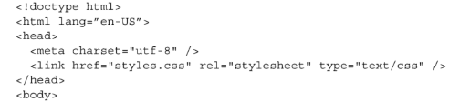

## CSS

### Intro

The Cascading Style Sheets, or CSS for short, is one of the core components of building a website, alongside HTML (Hypertext Markup Language) and JavaScript (JS). Together, these three technologies are often referred to as "the cornerstone of the World Wide Web."[^ebersbach01css]

CSS is the language used for styling HTML documents. It defines the visual appearance of HTML on various devices, such as screens, printers, or other display mediums.[^ebersbach02css] In other words, CSS is responsible for handling visuals like text color, background styles, buttons, user interface elements, and much more. These features are present on virtually all modern websites. It also enables interactive effects, such as hover states on buttons or cards, and optimizes visuals for different screen sizes—from small smartphones to large desktop monitors. Many people compare CSS to the skin on the HTML skeleton,[^ebersbach03css] or, as I like to say, the sweet icing on the cake.

### A Brief History of CSS

The concept of CSS emerged in the early 1990s to address the limitations of early web design. At that time, the web was primarily built with HTML for structure, and visual design capabilities were quite limited. The goal was to create a system that separated content (HTML) from presentation (CSS), allowing for more visually appealing websites.

In 1994, Håkon Wium Lie, a Norwegian web pioneer, and Bert Bos, a Dutch programmer, proposed the idea of CSS. Their specification introduced the idea of separating HTML as the structure for web content and CSS as the language for styling and formatting that content. This foundational idea became a critical step in the evolution of web design.[^ebersbach04css]

The first official CSS specification, CSS1, was published by the World Wide Web Consortium (W3C) in 1996, laying the foundation for modern web development with basic text colors, fonts and backgrounds. In 1998, CSS2 introduced new features, such as the "position" property for improved control over webpage layout and support for media types to optimize designs for different devices. In 2011, CSS2.1 was released, providing greater stability, improved browser compatibility, and enhanced accessibility across most browsers (except Internet Explorer).Currently, we use CSS3, which introduced a modular specification approach. This version brought transformative features like animations, gradients, flexbox, and many more tools for modern web design. Looking ahead, CSS4 is under development, with goals to enhance web design capabilities further, including responsive design improvements, advanced typography options, and a more robust grid system.[^ebersbach04css]

### How to apply CSS in HTML

As established, CSS is used for formatting the visual presentation of HTML. Here’s a visual example of how CSS is set up:  
[^ebersbach05css]

#### Let's break it down

- We start with the **selector**, which in this case is `h1`. In our CSS, we are modifying the `h1` selector from our HTML.
- Next, we define a **declaration block**, which contains the styles we want to apply to the selected element.
- A **property** refers to the specific style we want to modify (e.g., `color`, `background`, `width`).
- A **value** is the specific setting applied to a property (e.g., `color: red; background: yellow; width: 10px`).

In the visual example, we are applying styles to our `h1` selector. The declaration block sets the text color to red and the background color to yellow.[^ebersbach05css]

In order to stylized our website, we must make a connection between both HTML and CSS.
[^ebersbach06css]

This image represents the external method of linking a CSS file to an HTML file to style the website. This method is easier to manage when handling CSS declarations. *(You can also apply CSS internally, but it tends to be messier.)*

[^ebersbach01css]: Wikipedia. 2025. "CSS." Last modified January 21, 2025. https://en.wikipedia.org/wiki/CSS
[^ebersbach02css]: W3Schools, "CSS Introduction," accessed January 21, 2025, https://www.w3schools.com/css/css_intro.asp
[^ebersbach03css]: Nology Team, "HTML, CSS, and JavaScript: The Anatomy of a Website," last modified February 6, 2020, accessed January 21, 2025, https://nology.io/news/html-css-and-javascript-the-anatomy-of-a-website/
[^ebersbach04css]: Anupama Ra. "History of CSS: The Evolution of Web Design." AlmaBetter. Accessed January 28, 2025. https://www.almabetter.com/bytes/articles/history-of-css
[^ebersbach05css]: Eric Meyer and Estelle Weyl, CSS: The Definitive Guide (Sebastopol, CA: O'Reilly Media, 2023), 3
[^ebersbach06css]: Keith J. Grant, CSS in Depth, 2nd ed. (Shelter Island, NY: Manning Publications, 2023), 6.

BONUS: Last fall session, I created a website to help both students and curious learners learn the basics of CSS and HTML: https://hybrid.concordia.ca/hu_sia/GG-Web_developer/

## Other keywords that conects:
#### [Check the HTML here](./html.md)
#### [Check the PHP here](./php.md)

