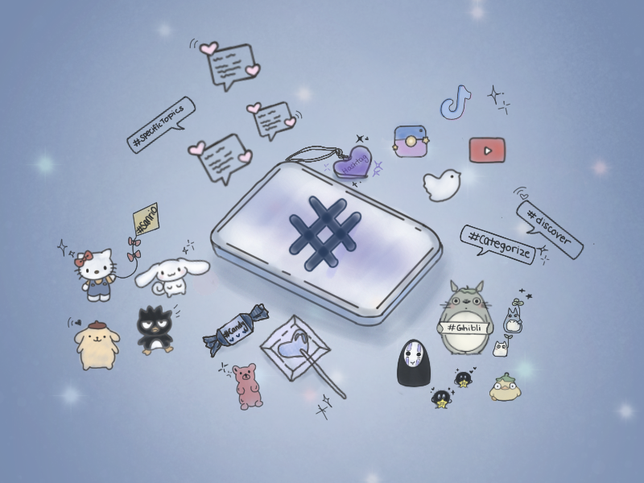

## Hashtag

A hashtag, denoted by the symbol “#”, is a metadata tag commonly use in the Internet culture, particularly on social media.[^Merriam-Webester24Hashtag]  It originated as a feature on a post on Twitterin August 2007 from a product designer named Chris Messina. The primary purpose was to provide user with an easy way to categorize, discover and participate in specific topics on social media.[^Hastags.org12Whatis#] In addition, Tweets containing hashtags can link to a specific timeline of other tweets with the same hashtag.[^WikströmHashtagOnTwitter] 

Hashtags are related to new media as it has significantly impacted the overall performance of social media content which can help small businesses, influencers, brands and many more to reach a bigger audience. A hashtag can contain multiple word without space, such as `#dogLover` and may also contain numbers. They can be added to social media posts, bios, comments, and other content. They are utilized across various platform, including Instagram, TikTok, YouTube, Facebook, Twitter and many more.[^SproutSocial23HashtagsWhatAreThey] 

By paying attention and researching trends, you can create a powerful tool to engage your audience and increase your social impact at no cost using hashtag. As it can create a community where answers and question can be freely exchange.[^OBrienDigitalMarketingInstitute] 

In addition, hashtags can be useful in assisting people in need. During the COVID-19 pandemic, Instagram hashtags helped young people at risk of poverty and social exclusion by fostering scientific education and promoting remote learning.[^PublicHealth22Instagram]

[^Merriam-Webester24Hashtag]: Merriam-Webster. 2024. “Hashtag.” https://www.merriam-webster.com/dictionary/hashtag. 

[^Hastags.org12Whatis#]: Hastags. 2012. “What is a (#) Hashtag?.” hashtags.org. https://www.hashtags.org/how-to/history/what-is-a-hashtag/.

[^SproutSocial23HashtagsWhatAreThey]: Sprout Social. 2023. “Hashtags: What they are and how to use them effectively.” https://sproutsocial.com/insights/what-is-hashtagging/.

[^WikströmHashtagOnTwitter]: Wikström, Peter. 2014. "#srynotfunny: Communicative Functions of Hashtags on Twitter": 1–44. SKY Journal of Linguistics, Vol. 27, p.127-152. https://www.linguistics.fi/julkaisut/SKY2014/Wikstrom.pdf.

[^PublicHealth22Instagram]: Int J Environ Res Public Health. 2022. "An Instagram Hashtag Fostering Science Education of Vulnerable Groups during the Pandemic." https://www.ncbi.nlm.nih.gov/pmc/articles/PMC8872541/.

[^OBrienDigitalMarketingInstitute]: O’Brien, Clodagh. 2023. “How to Use Hashtags Effectively on Social Media.” Digital Marketing Institute. https://digitalmarketinginstitute.com/blog/how-to-use-hashtags-in-social-media#:~:text=A%20hashtag%20is%20a%20word,your%20posts%20and%20encourage%20interaction.
