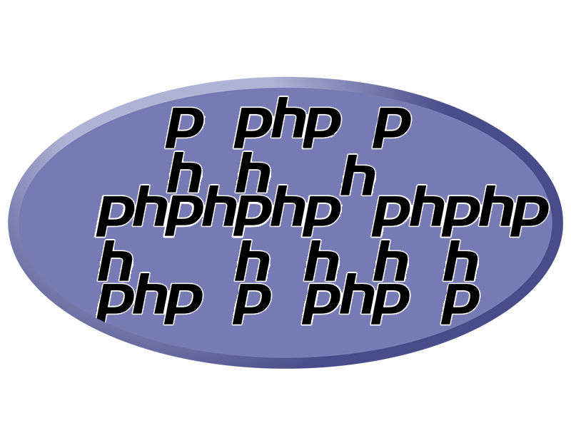

# PHP
## Hypertext Preprocessor

PHP, also known as Hypertext Preprocessor, is a general-purpose scripting language geared towards web development. Created by Rasmus Lerdorf in 1993 and released 2 years later, it meshes together parts of JavaScript and HTML together, alongside its own syntax, but while HTML is a markup language used for front-end development, PHP is a server-side scripting language used for dynamic website creation. It's influenced by the likes of Perl, C, C++, Java and JavaScript. PHP is an interpreted language, which means you do not have to compile it and create an executable file. Instead, PHP files are interpreted line by line by the web server running PHP. [^Busuic19thephpworkshop]

Despite its controversial view by some, it remains as one of the most popular language for back-end web development. It is used within various well-known websites, from Wordpress to Wikipedia to even Facebook[^Fireship21phpin100seconds]. While many try to forget its existence, it predates JavaScript, and during the early 90s, was one of the languages that revolutionized the web by making application development accessible to the average person.

The language is written in standard HTML using the <html> tags before and after. However, to access the php text, and have the code be rendered on the server, type `<?php [code here] ?>`.

Here would be the syntax for a basic set of rules in PHP: 
Variable: `$[variable] = 'Hello World';` 
Output: `echo $[variable];` 
function: `function ($variable1, $variable2) { }` 

As well, PHP supports object-oriented programming, or OOP, meaning that classes and inheritance both work within the language. Interfaces also work. Each class and interface is a type. There are also various types that PHP has built-in and that your class or interface might also incorporate.[^Edmonds21modernphp8]

PHP can be run within a simple editor of any choice within the commercial market, and its language is quite forgiving towards mistakes. While many people loathe PHP, calling it one of the worst programming languages in existence, others call it a secret king of web development, citing it as an incredibly reliable and steadfast programming language that has stood the test of time and is here to stay so long as its demand is there.

[^Busuic19thephpworkshop]:Busuioc, Alexandru. 2019. The Php Workshop : A New, Interactive Approach to Learning Php. Birmingham, UK: Packt Publishing. 
[^Fireship21phpin100seconds]:Fireship. “PHP in 100 Seconds,” October 22, 2021. https://www.youtube.com/watch?v=a7_WFUlFS94.
[^Edmonds21modernphp8]:Edmonds, Joseph, Lorna Mitchell, O’Reilly for Higher Education (Firm), and Safari, an O’Reilly Media Company. 2021. The Art of Modern Php 8 (version 1st edition.). 1st ed. Packt Publishing. 